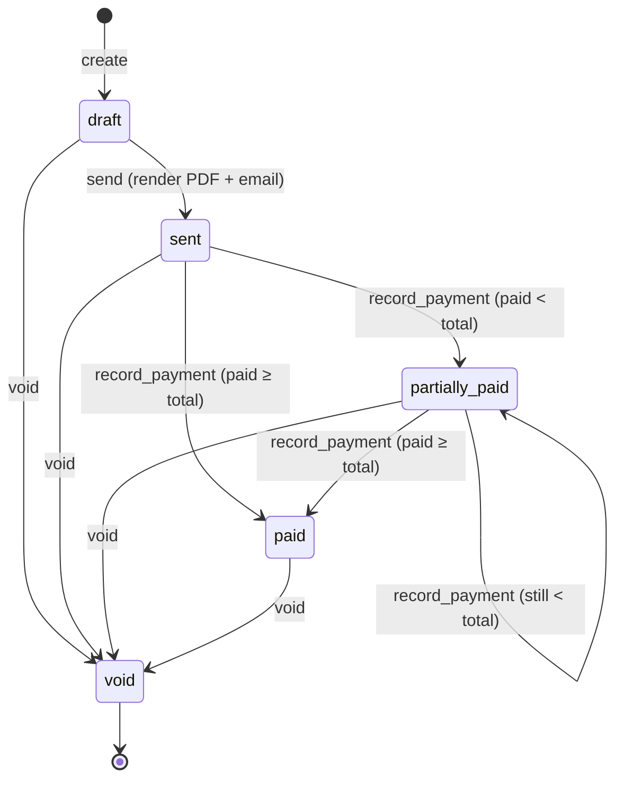
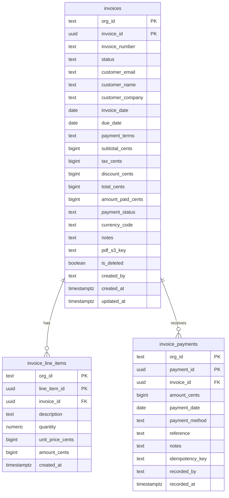
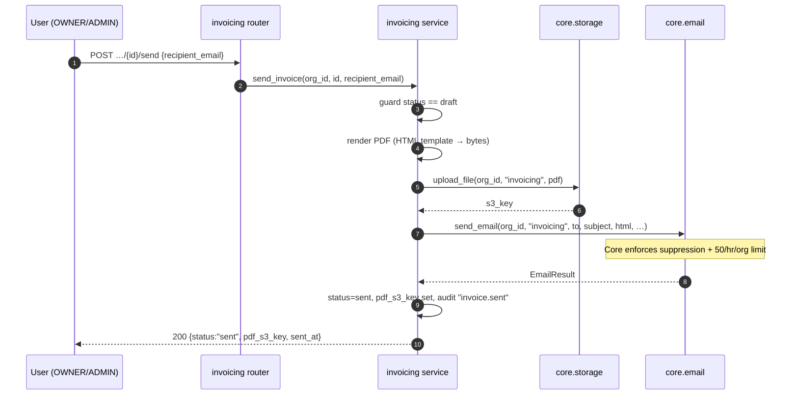

# A2Z Invoicing — Service Context & Build Plan (Phase 2)

> **⚠ Plan vs. code — this service is not built yet.** As of 2026-07-22
> `app/services/invoicing/` is an empty package stub (`__init__.py` only). This
> file is the *build plan*: what the product is (§1–§4), how it wires into Core
> (§5–§6), and how to build it (§7+). No code contradicts it yet; once code
> lands, a `docs/services/invoicing/` reference tree (Authority `_reference_`)
> becomes the current-state source of truth and this file becomes the historical
> design record — exactly the split used for Omni-Channel
> ([`docs/services/omnichannel/`](../../../docs/services/omnichannel/) vs.
> [`app/services/omnichannel/CLAUDE.md`](../omnichannel/CLAUDE.md)).

> **Read this first.** Root [`CLAUDE.md`](../../../CLAUDE.md) (Core conventions,
> golden rules, build order) applies in full. **Core is frozen.** Unlike
> Omni-Channel, Invoicing needs **nothing new from Core** — it consumes the
> frozen Core surface as-is (§6). If that ever changes, a Core change is
> **deliberate**: re-run the entire Core suite (>90% coverage bar on `app/core`,
> `ruff` + `mypy --strict`) before continuing (root `CLAUDE.md §13`, Phase 2
> rule). Invoicing is **not** part of Core: it lives in `app/services/invoicing/`
> inside the same modular monolith, imports Core, and Core never imports it
> (golden rule #3).

> **Scope revision (2026-07-22).** These product decisions were finalized with
> the product owner on 2026-07-22 and **supersede** the older 8-step outline in
> [`docs/phase2-invoicing.md`](../../../docs/phase2-invoicing.md) where they
> differ. **Cut from v1:** EventBridge event publishing (`invoice.*`), the
> AI-parse endpoint, bulk import, a separate customer entity, per-invoice
> currency, and line-item-level payment tracking. All are recorded as Phase 3+
> items in §15. v1 = manual invoice lifecycle: create a draft, send it by email
> with a PDF, record payments by hand, void when needed — every row org-scoped.

---

# PART I — WHAT INVOICING IS

## 1. The Product in One Paragraph

Small businesses need to bill their customers and get paid. **Invoicing** lets an
org create an invoice (line items, tax, discount, a customer to bill), send it as
a branded PDF over email, and track payment against it until it's settled or
voided. It is the platform's billing service — the third proof that Core
generalizes (after Core itself and Omni-Channel). It owns its own Postgres tables
and invoice state machine; everything else — who you are, which org you're in,
sending the email, storing the PDF, the audit trail, the invoice number — it gets
from Core.

## 1.1 Multi-Tenancy — companies, users, isolation (explicit)

Invoicing is multi-tenant by construction: a **company = an org**, Core's tenancy
unit. Every table carries `org_id` and every query filters on it (root golden
rule #2). There is no code path that reads another org's invoices, line items, or
payments. `org_id` is the first column of every primary key and every index (§7).
A user's membership and role in the org (from `core.membership`) gate every
operation (§4). Cross-org isolation gets a dedicated unit test per module,
mirroring Core's pattern (§11).

## 2. Core Concepts (the domain vocabulary)

- **Invoice** — the billable document. Has a formatted number
  (`INV-YYYY-NNNNNN`), a customer (billed inline), dates/terms, money totals in
  integer cents, a status, and a soft-delete flag. Owns many line items and many
  payments.
- **Line item** — one billable row on an invoice: description, quantity, unit
  price, and a denormalized `amount_cents = round(quantity × unit_price_cents)`.
- **Payment** — one recorded receipt against an invoice: amount, date, method,
  reference. Payments are invoice-level in v1 (not attributed to line items).
- **Status** — where the invoice is in its lifecycle: `draft`, `sent`,
  `partially_paid`, `paid`, `void` (§3.1).
- **Invoice number** — human-facing identifier, `INV-{year}-{6-digit}`. The
  numeric part comes from Core's atomic per-org counter (§6); the service formats
  it.

## 3. User Flows (what the product does, end to end)

1. **Create** — an owner/admin drafts an invoice: pick a customer (typed inline),
   add line items, set tax/discount/terms. It's assigned a number and saved as
   `draft`. Editable freely.
2. **Send** — the user triggers `send` with a recipient email. A fresh PDF is
   rendered, stored in S3, and emailed via Core (subject to Core's suppression
   list and the 50/hr/org email rate limit). Status → `sent`.
3. **Get paid** — as money arrives, the user records payments by hand. When the
   cumulative paid amount reaches the total, status → `paid`; before that, a
   partial payment moves it to `partially_paid`.
4. **Void** — at any point the user can void an invoice (customer canceled,
   mistake). `void` is terminal.

### 3.1 Invoice lifecycle (state machine)

Linear, no backtracking. `void` is terminal and reachable from any non-void
state.

- `draft → sent` is the only entry into the paid track; you cannot record a
  payment on a `draft`.
- There is **no** `sent → draft` recall in v1. Edits are allowed in place on any
  non-`void` invoice (§7.3) — the design owner chose "fully editable after send"
  — but the *status* never moves backwards.
- Illegal transitions (e.g. `void → sent`, `record_payment` on `draft`) raise
  `InvalidStateTransitionError` (409) and get a unit test each (§11).

## 4. Roles & Permissions

v1 is deliberately restrictive (product owner: "keep OWNER/ADMIN for Phase 2,
relax later"). Permissions are interpreted by the router from the role
`core.membership` returns; there is no RBAC service (root §14).

| Action | Required role |
|---|---|
| Create / edit / delete invoice | `OWNER` or `ADMIN` |
| Send invoice | `OWNER` or `ADMIN` |
| Record payment / void | `OWNER` or `ADMIN` |
| List / read invoice, read payments | any member (incl. `MEMBER`, `GUEST`) |

Phase 3+ may let a `MEMBER` create and manage their own invoices; not in v1.

---

# PART II — HOW IT WIRES INTO CORE

## 5. Reality check

Omni-Channel's build required promoting two **new** Core modules (`secrets`,
`realtime`) under an unfreeze protocol. **Invoicing requires no such thing** — the
frozen Core surface already covers everything it needs. This is the intended
outcome of the whole platform bet (root §1): the second service after
Omni-Channel ships purely as a Core *client*, no Core change.

The Postgres/Alembic foundation Invoicing needs already exists too, laid by
Omni-Channel: `sqlalchemy[asyncio]`, `asyncpg`, and `alembic` are in
`pyproject.toml`; a shared Postgres container already runs in
`docker-compose.yml` and CI; `infra/modules/rds/` + `infra/live/prod/rds/` are
codified (not yet applied). Invoicing adds its **own schema** (`invoicing`) on the
shared instance — it does not stand up new infra. See
[`docs/phase2-invoicing.md`](../../../docs/phase2-invoicing.md).

## 6. Core dependency map (call these; never reimplement)

| Core module | What Invoicing uses it for |
|---|---|
| `core.auth` | Validate the JWT, extract the current user (`sub`) on every request. |
| `core.membership` | Resolve the caller's role in `org_id`; enforce §4 permissions and org-scoping. |
| `core.audit.log_audit` | Append an audit event on **every mutation** (§10). Reads don't log. |
| `core.settings.get_next_invoice_number` | Atomic per-org monotonic integer for numbering (Design §2.6). See §6.1. |
| `core.storage` | Upload the invoice PDF (`service_type="invoicing"`, key `{org_id}/invoicing/…`, 1-year TTL per [`docs/retention.md`](../../../docs/retention.md)); mint 1-hour signed URLs. |
| `core.email.send_email` | Send the invoice email. Core already enforces the suppression list and the `email.send` 50/hr/org rate limit inside this call — Invoicing does **not** re-check them. |
| `core.exceptions.CoreError` | Base class for all Invoicing typed errors (§8). |

**Cross-service rule (non-negotiable):** if Invoicing ever needs to notify another
service, it publishes an EventBridge event via `core.events.publish_event` — never
a direct import. Core never imports `app/services/invoicing/`. (Event publishing
itself is **out of v1** — §15.)

### 6.1 Numbering: format on top of Core's counter

`core.settings.get_next_invoice_number(org_id)` returns a monotonic per-org
integer. Core is frozen, so this counter **does not reset annually**. Invoicing
formats it as `INV-{current_year}-{n:06d}` where the year is display-only and `n`
is continuous across years (e.g. `INV-2026-001054` may be followed months later by
`INV-2027-001055`). If a customer ever requires per-year reset, that's a
deliberate Core change (out of v1 scope).

---

# PART III — BUILD SPECIFICS

## 7. Data model (Postgres — `invoicing` schema)

Three tables, all in an `invoicing` Postgres schema on the shared instance,
every table keyed by `org_id` first. Money is stored as **integer cents**
(`BIGINT`) — never floats. Invoicing owns these tables; Core never touches them.

**Table notes**

- **`invoices`** — `PRIMARY KEY (org_id, invoice_id)`. `invoice_number` unique
  per org (`UNIQUE (org_id, invoice_number)`). `status ∈
  {draft,sent,partially_paid,paid,void}`; `payment_status ∈
  {unpaid,partially_paid,paid}` is denormalized for cheap "who owes me" queries.
  `total_cents = subtotal_cents + tax_cents − discount_cents`.
  `currency_code` inherited from the org's settings at create time (per-invoice
  override is Phase 3). `is_deleted` drives soft delete; all reads filter
  `is_deleted = false`.
- **`invoice_line_items`** — `PRIMARY KEY (org_id, line_item_id)`,
  `FOREIGN KEY (org_id, invoice_id) → invoices`. `amount_cents` denormalized from
  `quantity × unit_price_cents` for query/rendering speed.
- **`invoice_payments`** — `PRIMARY KEY (org_id, payment_id)`,
  `FOREIGN KEY (org_id, invoice_id) → invoices`. `payment_method` is `"manual"`
  in v1; the column plus `idempotency_key` (`UNIQUE (org_id, idempotency_key)`
  when present) make the table **webhook-ready** for Phase 3 Stripe/PayPal without
  a migration.

**Indexes** (B-tree; org-scoped first column):

- `invoices (org_id, created_at DESC)` — list newest-first (the default inbox view).
- `invoices (org_id, status)` — filter by status (e.g. all unpaid/overdue).
- `invoices (org_id, due_date)` — supports the Phase 3 overdue-reminder job.
- `invoice_line_items (org_id, invoice_id)` — fetch an invoice's lines.
- `invoice_payments (org_id, invoice_id)` — fetch an invoice's payments.

**Migrations:** Alembic, one baseline migration creating the `invoicing` schema
and the three tables, following the same chain discipline as Omni-Channel (single
linear head — see [`docs/migrations.md`](../../../docs/migrations.md)).

## 8. Errors (wired to Core's hierarchy)

Every Invoicing error extends `core.exceptions.CoreError` and carries a
`status_code`; the router maps it to HTTP (root §4, "Errors"). Core functions
already raise their own typed errors (suppression, rate limit) — Invoicing lets
those propagate unchanged.

| Error | Status | When |
|---|---|---|
| `InvoiceNotFoundError` | 404 | No such invoice in this org (or soft-deleted). |
| `InvoiceForbiddenError` | 403 | Caller lacks the role in §4. |
| `InvalidStateTransitionError` | 409 | Illegal lifecycle move (e.g. send an already-sent invoice, pay a draft, edit a void). |
| `InvoiceValidationError` | 400 | Bad input (negative quantity, empty line items, malformed email, total ≠ components). |
| `core.email.SuppressionListError` | 422 | Recipient on the org's suppression list (raised by Core, propagated). |
| `core.rate_limit.RateLimitError` | 429 | Email rate limit hit (raised by Core; sets `Retry-After`). |
| `core.storage.FileTooLargeError` | 413 | PDF exceeds the storage/email size cap (raised by Core). |

## 9. HTTP surface (`/v1/invoicing`)

Thin router (`app/routers/invoicing.py`) mounted in `app/main.py` under `/v1`,
requiring `Authorization: Bearer <jwt>`; all logic lives in the service package
(root §2). Errors follow the uniform `{detail, error}` shape (root §4).

**Invoice CRUD**

| Route | Method | Auth | Notes |
|---|---|---|---|
| `/v1/invoicing/orgs/{org_id}/invoices` | POST | OWNER/ADMIN | Create a `draft`; assigns the number; computes totals. → `201` `InvoiceDetail` |
| `/v1/invoicing/orgs/{org_id}/invoices` | GET | member | List (excl. soft-deleted), newest-first; `?status=` filter, `?skip=`/`?limit=` paging |
| `/v1/invoicing/orgs/{org_id}/invoices/{invoice_id}` | GET | member | → `InvoiceDetail` (incl. line items, 1-hour `pdf_signed_url` if a PDF exists) |
| `/v1/invoicing/orgs/{org_id}/invoices/{invoice_id}` | PATCH | OWNER/ADMIN | Edit fields/line items in place. Allowed on **any non-`void`** invoice; rejects `void` with 409. Recomputes totals. |
| `/v1/invoicing/orgs/{org_id}/invoices/{invoice_id}` | DELETE | OWNER/ADMIN | **Soft** delete (`is_deleted=true`), allowed on any state; idempotent |

**State transitions**

| Route | Method | Auth | Notes |
|---|---|---|---|
| `…/invoices/{invoice_id}/send` | POST | OWNER/ADMIN | `{recipient_email}`. Render PDF → store → email. Valid from `draft` (else 409). Status → `sent`. |
| `…/invoices/{invoice_id}/record-payment` | POST | OWNER/ADMIN | `{amount_cents, payment_date, payment_method?, reference?, notes?}`. Valid from `sent`/`partially_paid`/`paid`. Updates `amount_paid_cents`, `status`, `payment_status`. |
| `…/invoices/{invoice_id}/void` | POST | OWNER/ADMIN | `{reason}`. Valid from any non-`void`. Status → `void` (terminal). |
| `…/invoices/{invoice_id}/payments` | GET | member | List recorded payments for the invoice |

`InvoiceDetail` is the full response model (org_id, invoice_id, invoice_number,
status, customer_*, dates/terms, line_items[], the four money totals,
amount_paid_cents + payment_status + remaining_cents, currency_code, notes,
pdf_s3_key + pdf_signed_url, created_by/at, updated_at, is_deleted).

## 9.1 PDF + send flow

Fresh PDF on every `send` (the design owner chose "on send," not immutable-at-
create).

Whether the email carries the PDF as an attachment or as a 1-hour signed S3 URL is
an **open decision** (§14).

## 10. Audit & observability

Every mutation calls `core.audit.log_audit`; reads don't. Structured JSON logs
thread `request_id` (root §4) and never log full email bodies or PII beyond need.

| Event | Detail |
|---|---|
| `invoice.created` | `{invoice_id, invoice_number, created_by, total_cents}` |
| `invoice.updated` | `{invoice_id, changes}` |
| `invoice.deleted` | `{invoice_id}` |
| `invoice.sent` | `{invoice_id, recipient_email}` |
| `invoice.payment_recorded` | `{invoice_id, amount_cents, payment_method}` |
| `invoice.voided` | `{invoice_id, reason}` |

> These are **audit-log** entries, not EventBridge events. Publishing
> `invoice.*` on `a2z-bus` for other services to consume is **Phase 3+** (§15).

## 11. Testing & cross-org isolation

Mirror Core's bar and Omni-Channel's harness (moto + fakeredis + a Postgres test
DB): unit tests for the state machine (one per legal **and** illegal transition),
integration tests for each endpoint end to end, and a **cross-org isolation** test
per module proving a user in Org A cannot list, read, edit, send, pay, or
soft-delete Org B's invoices, and that Org A payments never touch Org B totals.
Target: `ruff` + `mypy --strict` clean, **>90% coverage** on
`app/services/invoicing/`, no Core-suite regressions.

## 12. Build order

Events and AI-parse are **removed** vs. the old outline (§ scope revision).

1. **Scaffolding** — flesh out `app/services/invoicing/` (`config`, `models`,
   `db`, `handlers`, `service`, `pdf`); no new deps (all present).
2. **Schema + migration** — Alembic baseline for the `invoicing` schema and the
   three tables (§7); every table `org_id`-keyed.
3. **Domain + state machine** — lifecycle as pure functions; typed errors (§8);
   a unit test per transition incl. illegal ones.
4. **CRUD router** — mount in `app/main.py`; consume `core.auth`,
   `core.membership`, `core.audit`, and `core.settings.get_next_invoice_number`.
5. **PDF generation** — render + `core.storage` upload (§9.1).
6. **Send** — `core.email.send_email` (suppression + rate limit already inside
   Core); status → `sent`.
7. **Manual payments** — `record_payment`, total/status reconciliation; `void`.
8. **Tests + isolation** — integration scenarios + the per-module cross-org tests
   (§11).

## 13. Out of scope for v1 — see §15

Listed once, in §15, so there's a single deferral list.

## 14. Open decisions (record before Step 5/6)

- **PDF library** — e.g. `weasyprint` (HTML→PDF) vs. a lighter templating lib.
  Pick before Step 5; note the dep addition.
- **Email delivery of the PDF** — attach the PDF to the email vs. include a
  1-hour signed S3 URL. Attachment is simplest for the customer; signed URL keeps
  the email small and leans on `core.storage`. Decide before Step 6.

## 15. Deferred to Phase 3+ (don't build now)

- **EventBridge events** — publishing `invoice.created/sent/paid/voided` on
  `a2z-bus`. (Omni-Channel already anticipates consuming `invoice.paid` — see its
  [known-issues](../../../docs/services/omnichannel/known-issues.md) — but there
  is no producer until this lands.)
- **AI-parse endpoint** — parsing supplier invoices/receipts into line items via
  `core.rate_limit`'s pre-registered `ai.parse` limits. Cut from v1 entirely.
- **Bulk import** (CSV/JSON), **customer entity** (v1 stores customer inline),
  **per-invoice currency** (v1 uses the org default), **line-item-level payment
  tracking** (v1 is invoice-level), **recurring invoices**, **overdue-reminder
  job**, **payment-processor webhooks** (schema is ready; wiring is Phase 3).

## 16. Definition of Done (v1)

- [ ] `app/services/invoicing/` implemented to §7–§10 signatures.
- [ ] `invoicing` schema + Alembic baseline; single linear migration head.
- [ ] All routes in §9 mounted and tested end to end.
- [ ] `ruff` + `mypy --strict` clean; **>90%** coverage on the package.
- [ ] Cross-org isolation proven per module (§11); no Core regressions.
- [ ] `docs/services/invoicing/` reference tree written (Authority `_reference_`)
      and this file demoted to historical design record, matching the
      Omni-Channel split.

## 17. Pointers

- Roadmap / status: [`docs/phase2-invoicing.md`](../../../docs/phase2-invoicing.md).
- Core spec (numbering, storage, email, errors): [`A2Z_Core_Design_TestPlan.md`](../../../A2Z_Core_Design_TestPlan.md) (§2.6 settings, §2.3 email, §2.4 storage, §3.2 Postgres tables, §6 errors).
- Process authority: root [`CLAUDE.md`](../../../CLAUDE.md).
- The other service, as a worked example of the same Core-client pattern: [`app/services/omnichannel/CLAUDE.md`](../omnichannel/CLAUDE.md) and [`docs/services/omnichannel/`](../../../docs/services/omnichannel/).
