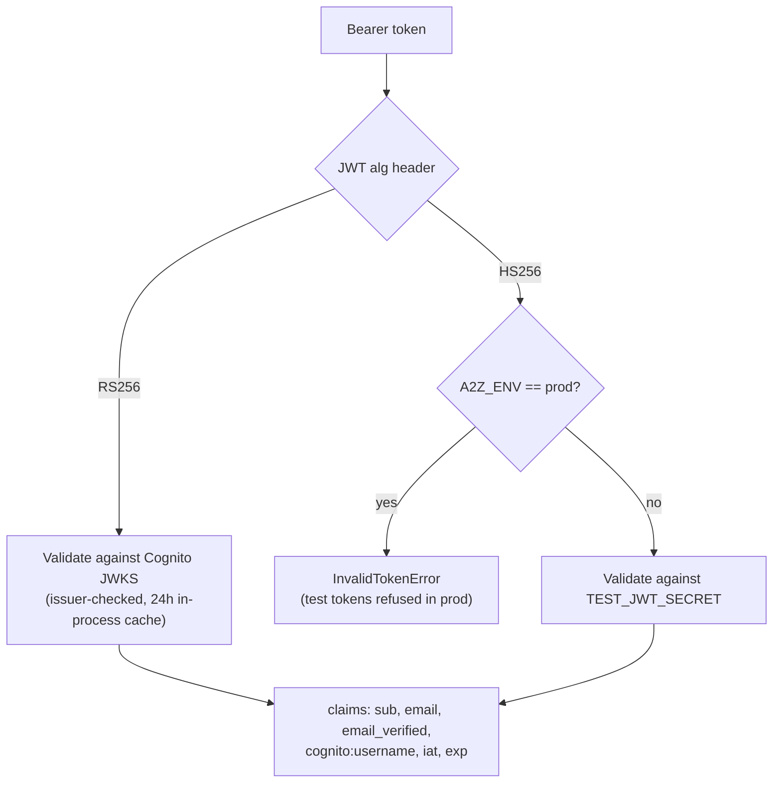
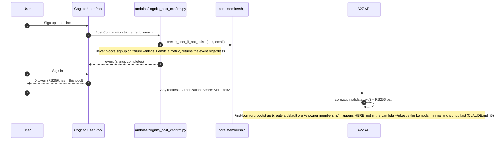
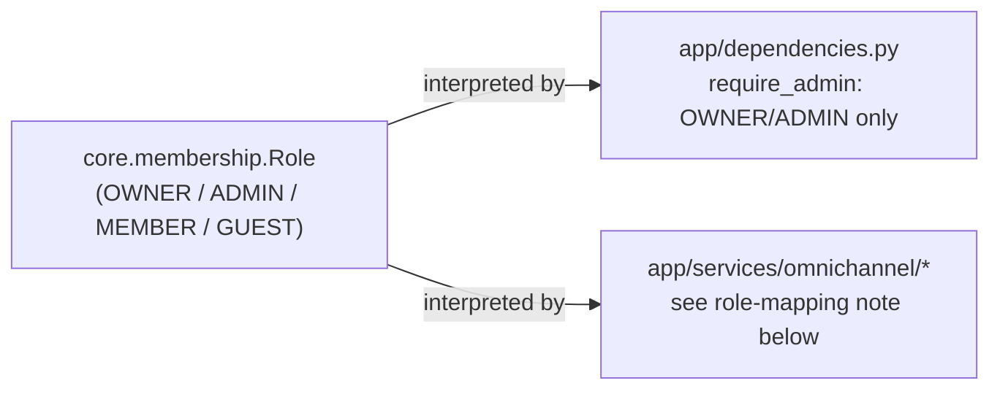
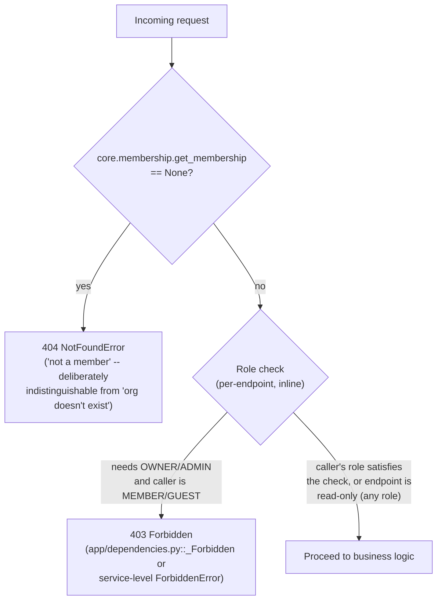

# Authentication & Authorization

> Part of the [documentation index](../README.md). See also: [request lifecycle](request-lifecycle.md), [`core.auth` reference](../core/auth.md), [`core.membership` reference](../core/membership.md).

Authentication (who is this?) and authorization (what can they do?) are
deliberately split between two different owners:

- **Authentication** is entirely `core.auth`'s job: validate a JWT, return
  claims. There is no session state anywhere in Core.
- **Authorization** is **not** a Core module. Core only stores and returns a
  role string (`core.membership.Role`); every caller (router, service)
  interprets that string itself with an inline `role in {...}` check.
  `CLAUDE.md` §14 is explicit: *no Permissions/RBAC service* — this is
  deliberate scope, not a gap.

## Two token shapes



- **Cognito RS256** — the only shape accepted when `A2Z_ENV == "prod"`.
  `core.auth._fetch_jwks()` pulls the pool's JWKS from
  `https://cognito-idp.{region}.amazonaws.com/{pool_id}/.well-known/jwks.json`
  and caches it **in-process** for 24h (not Redis — see
  [`core/auth.md`](../core/auth.md) for why). On an unknown `kid` (possible
  key rotation) it drops the cache and retries once before failing.
- **Test HS256** — minted by `core.auth.create_test_token(sub, email, ...)`,
  signed with `TEST_JWT_SECRET`. Used by every test and by local/dev tooling
  in place of a real Cognito pool. `validate_jwt` refuses HS256 tokens
  outright when `A2Z_ENV == "prod"`.

## Authentication flow (Cognito signup → first request)



Two deliberate decisions, both recorded in `CLAUDE.md` §5 and enforced by
the code:

1. **The Lambda never blocks signup.** `cognito_post_confirm.handler`
   wraps `create_user_if_not_exists` in a `try/except Exception` and always
   returns the event so Cognito completes signup even if Core is down. A
   reconciliation job (not yet built) is the intended backfill path for any
   row that got missed.
2. **Org bootstrap happens on first authenticated request, not in the
   Lambda.** The Lambda only creates the bare user row
   (`create_user_if_not_exists`); creating a default org and OWNER
   membership is left to application code the first time that user hits an
   authenticated endpoint (not yet wired to a specific router — a
   deliberate, documented gap, not an oversight).

## Authorization — role model

`core.membership.Role` defines four roles, stored per `(user_id, org_id)`
pair:

| Role | Meaning |
|---|---|
| `OWNER` | Created the org; implicitly has every permission |
| `ADMIN` | Trusted operator; can manage members/settings |
| `MEMBER` | Regular user |
| `GUEST` | Restricted; read-mostly in every caller that checks it |

Core exposes only `get_membership(user_id, org_id) -> Membership | None`;
**every** authorization decision is made by the caller:

```python
# app/dependencies.py
def require_admin(m: Membership) -> None:
    if m.role not in (Role.OWNER, Role.ADMIN):
        raise _Forbidden("Requires owner or admin role")
```



### Role-mapping gap (documented, not silently resolved)

Omni-Channel's own design doc (`app/services/omnichannel/CLAUDE.md` §4)
describes a **product-level** role grid using **Owner / Admin / Agent /
Viewer**. `core.membership.Role` only has **OWNER / ADMIN / MEMBER / GUEST**
— there is no `AGENT` or `VIEWER` enum value, because Core is generic and
deliberately has no concept of Omni-Channel's product roles. Omni-Channel's
own code maps between the two, consistently, in two places:

- `handlers.send_reply` and `routing.claim`/`routing.reassign`: **`MEMBER` →
  Agent, `GUEST` → Viewer** — i.e. anyone except `GUEST` can reply/claim;
  only `OWNER`/`ADMIN` can reassign or configure routing.
- `inbox.py` read paths: **every role** (including `GUEST`) can read, since
  §4's grid grants Viewer read access — reads only require membership, not
  a role check.

If a future service needs a genuinely different role vocabulary, that is a
service-level mapping problem, not a reason to add roles to
`core.membership.Role` (`CLAUDE.md` §14: no Permissions service).

## Authorization decision by endpoint (illustrative)



## Security considerations

- **Cross-org access is structurally impossible, not just checked.** Every
  Core function that touches data takes `org_id` and scopes its query by
  it (DynamoDB partition/sort key, S3 key prefix, Postgres `WHERE org_id =`).
  There is no code path that reads another org's data — see
  [data flow](data-flow.md).
- **JWTs are never logged.** `core.logging._REDACT_KEYS` masks any `extra=`
  key named `token`/`jwt`/`authorization`/`password`/`secret` as `"***"`
  even if a caller passes one by mistake.
- **Test tokens cannot leak into prod.** Both `create_test_token` and the
  HS256 validation path in `validate_jwt` raise `InvalidTokenError` outright
  when `Settings.is_prod` is true — this is checked at the point of use, not
  only at startup, so it holds even if `A2Z_ENV` changes at runtime in a
  long-lived process.
- **JWKS caching is in-process, not shared.** A 24h TTL is a deliberate
  trade (Cognito rotates signing keys rarely; avoids a second sync Redis
  client on the hot auth path) — see `core/auth.md` for the full rationale
  and its implication (each process instance re-fetches once per 24h,
  independently).
