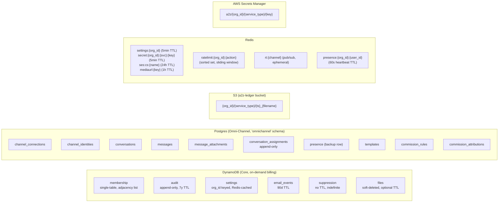
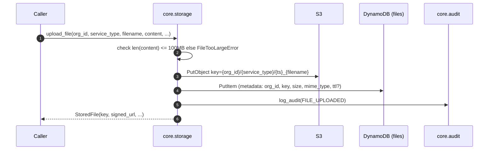
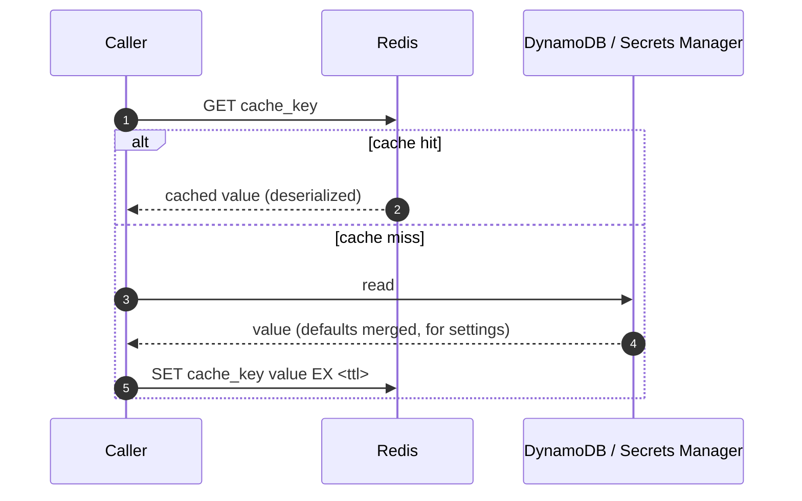
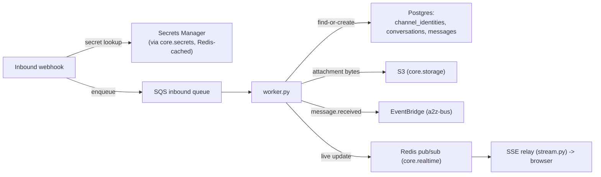

# Data Flow & Storage Architecture

> Part of the [documentation index](../README.md). See also: [architecture overview](overview.md), [Omni-Channel data model](../services/omnichannel/data-model.md), [retention policy](../retention.md).

## Storage systems and what lives where

## The org-scoping invariant

Golden rule #2 (`CLAUDE.md`) — *every data access is org-scoped* — is
implemented structurally, per store:

| Store | How org-scoping is enforced |
|---|---|
| DynamoDB `membership` | `PK = USER#{sub}` / `SK = ORG#{org_id}`; GSI1 inverts to list an org's members. No query omits one of these keys. |
| DynamoDB `audit` | `org_id` is the partition key of GSI1; `get_audit_events` requires `org_id` as a parameter — there is no scan-all path. |
| DynamoDB `settings` | `org_id` is the table's own partition key (1 item per org). |
| DynamoDB `email_events` / `suppression` / `files` | `org_id` is either the partition key or the leading GSI key on every read. |
| S3 | Every key is prefixed `{org_id}/{service_type}/...`. `storage._assert_org_scope` rejects any key not starting with the caller's own `{org_id}/` prefix — enforced on every download/metadata/delete call, even if a key is guessed. |
| Postgres (`omnichannel` schema) | Every table carries an `org_id` column; every query in `inbox.py`, `handlers.py`, `routing.py`, `worker.py` filters on it. There is no cross-org join. |
| Secrets Manager | Secret name is `a2z/{org_id}/{service_type}/{key}` — the org is baked into the resource name itself, not just a filter. |
| Redis | Every cache/rate-limit/presence/pub-sub key is namespaced `{prefix}:{org_id}:...`. |

Each Core module's reference doc under [`docs/core/`](../core/README.md)
states the specific cross-org isolation test that proves this for that
module (`CLAUDE.md` §4: "Add a unit test for every module asserting
cross-org access fails").

## Write path example: uploading a file

Reads (`download_file`, `get_file_metadata`, `delete_file`) all call
`_assert_org_scope(org_id, key)` before touching S3 or DynamoDB — this is
the one function on the cross-org-isolation critical path for storage.

## Read-through cache pattern (settings, secrets)

`core.settings.get_org_settings` and `core.secrets.get_secret` share the
same idiom: check Redis first, fall back to the source of truth on a miss,
populate the cache, return.

- `settings`: 5-minute TTL, key `settings:{org_id}`. Any write
  (`set_org_settings`, `get_next_invoice_number`) deletes the cache key
  before returning so the next read is never stale beyond the write's own
  latency.
- `secrets`: 5-minute TTL, key `secret:{org_id}:{service_type}:{key}`. This
  module **only reads** — nothing in Core rotates or writes a secret, so a
  rotation must delete the Redis key itself or accept up to 5 minutes of
  staleness (documented, accepted trade-off — `core/secrets.md`).
- `ses:cs:{name}` (SES config-set existence) has a 24h TTL — see
  [`core/email.md`](../core/email.md).
- `mediaurl:{s3_key}` (Omni-Channel signed attachment URLs) caches for 1h
  under a 2h signature so a cache hit never returns a near-expired URL —
  see [Omni-Channel's data model doc](../services/omnichannel/data-model.md).

## Cross-store data flow: Omni-Channel message ingestion

Omni-Channel is the one place DynamoDB, Postgres, S3, SQS, and Redis all
participate in a single flow. See
[message flow](../services/omnichannel/message-flow.md) for the full
sequence diagram; in storage terms:

## Retention & lifecycle

TTLs are set **at write time**, never by a scheduled cleanup job (`CLAUDE.md`
§11) — see [`docs/retention.md`](../retention.md) for the full table. This
keeps every store's growth bounded without any operational job to run or
monitor.
