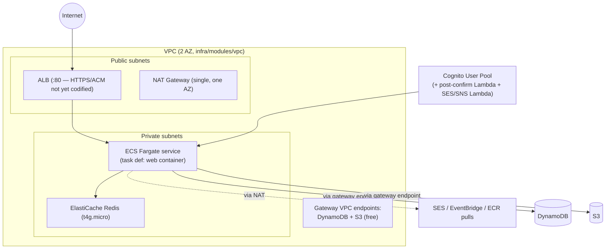
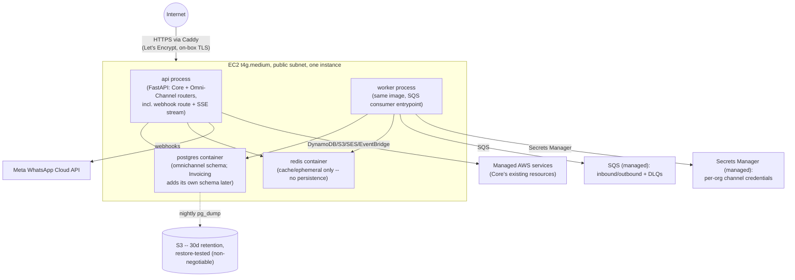

# Deployment Architecture

> Part of the [documentation index](../README.md). See also: [`infra/README.md`](../../infra/README.md) (apply instructions), [CI/CD](../ci-cd.md), [cost notes](../cost-notes.md).

There are **two deployment shapes described in this repository**, at
different levels of infra codification. This is a real, intentional split —
not drift — but it means "where does this run" has two different answers
depending which subsystem you mean.

1. **Core's control plane** — ECS Fargate behind an ALB, fully codified in
   `infra/modules/{vpc,iam,redis,cognito,ecs}` + `infra/live/prod/*`.
2. **Omni-Channel's MVP** — a single EC2 instance running the same container
   image plus Postgres/Redis as sibling containers, per
   `app/services/omnichannel/CLAUDE.md` §12. The `ec2-app` /
   `secretsmanager-channels` / `ses-receipt-rules` Terraform modules that
   shape describes are **not yet in `infra/modules/`** — only
   `sqs-omnichannel` has been codified so far (see the table below).

## 1. Core control-plane target architecture (ECS Fargate)

- **One image, one task family** (`CLAUDE.md` §2/§14): the same Docker image
  serves the "web" container; a future "worker" container overrides the
  `CMD`. Built by the repo's single `Dockerfile` (multi-stage,
  `python:3.12-slim`, non-root, stdlib `HEALTHCHECK` against `/health`).
- **Networking cost posture** (`infra/modules/vpc`, `docs/cost-notes.md`):
  one NAT gateway in one AZ (~$32/mo floor, not per-AZ), free gateway
  endpoints for DynamoDB/S3 (the bulk of Core's traffic), no paid interface
  endpoints at MVP volume.
- **IAM** (`infra/modules/iam`): least-privilege task role scoped to the
  exact table/bucket/bus names in `app/config.py`, plus separate roles for
  each Lambda.
- **Not yet codified** (`infra/README.md`): the ALB's `:443` listener + ACM
  certificate (serves `:80` only today), Route53 records, and RDS Postgres
  (arrives with Phase 2 Invoicing — though see the note below, the `rds`
  Terraform module already exists ahead of that phase actually starting).

## 2. Omni-Channel MVP: single EC2 instance

- **Why one box, not Fargate/RDS/ElastiCache for Omni-Channel's MVP**: cost.
  ≈$35–45/mo all-in vs ≈$130/mo for the distributed shape — same
  application code, different Terragrunt, deferred deliberately
  (`app/services/omnichannel/CLAUDE.md` §12).
- **Managed services stay managed even at MVP** — they're usage-based
  (~$0 at this volume) *and* they're the seams that make later
  distribution cheap: DynamoDB, S3, SES, EventBridge, **SQS** (the
  webhook-ack/worker seam), **Secrets Manager** (no credential migration
  needed later).
- **Deliberately deferred to the distribution phase**: ECS/Fargate for this
  service, RDS, ElastiCache, ALB, NAT + interface VPC endpoints, AppSync,
  per-channel webhook Lambdas.
- **Known MVP trade-off, accepted in writing**: single point of failure — a
  reboot takes down webhook endpoints (providers retry with backoff, so
  brief deploys are fine; extended downtime loses messages). Postgres
  durability is the operator's job: nightly `pg_dump` to S3 with a
  **tested** restore is called "non-negotiable" — and, as of the last
  Omni-Channel status update, this specific item is still **unchecked**
  (no AWS account to exercise it against yet). See
  [Omni-Channel known limitations](../services/omnichannel/known-issues.md).

## What's actually codified in `infra/` today

This differs slightly from both target pictures above — infra evolves ahead
of and behind the application code in different places. Current state:

| Module (`infra/modules/`) | Live composition (`infra/live/prod/`) | Backs |
|---|---|---|
| `dynamodb` | ✅ | Core's 6 tables |
| `s3` | ✅ | Ledger bucket |
| `eventbridge` | ✅ | `a2z-bus` |
| `ses` | ✅ | SNS notifications topic + domain identity |
| `vpc` | ✅ | Core's Fargate network |
| `iam` | ✅ | Task/execution/Lambda roles |
| `redis` | ✅ | ElastiCache (Core control-plane target — **not** what Omni-Channel's MVP EC2 box uses; that Redis is an on-box container) |
| `cognito` | ✅ | User pool, SPA client, both Lambdas + trigger/SNS wiring |
| `ecs` | ✅ | ECR, Fargate task/service, ALB (`:80`) |
| `rds` | ✅ | Provisioned ahead of Phase 2 actually starting — see note below |
| `sqs-omnichannel` | ✅ | Omni-Channel's inbound/outbound queues + DLQs |
| `ec2-app` | ❌ not yet created | Omni-Channel's MVP box (§12) |
| `secretsmanager-channels` | ❌ not yet created | Per-org channel credential provisioning |
| `ses-receipt-rules` | ❌ not yet created | Inbound email → S3 receipt rule |

> **Documentation drift, worth knowing about:** `infra/modules/rds/` and its
> `infra/live/prod/rds/` composition already exist — provisioned ahead of
> [`docs/phase2-invoicing.md`](../phase2-invoicing.md), which still describes
> "new `infra/modules/rds/`" as a Phase 2 to-do, and ahead of
> `app/services/omnichannel/CLAUDE.md` §12, which explicitly defers RDS to
> Omni-Channel's future "distribution phase." Nothing currently deploys
> against it (Omni-Channel's Postgres runs in a container per `docker-compose.yml`/CI,
> not RDS). Treat the module as pre-built infrastructure for whichever phase
> needs managed Postgres first, not as evidence that phase has started.

## CI/CD

See [`docs/ci-cd.md`](../ci-cd.md) for the full pipeline. In one line:
`.github/workflows/ci.yml` lints/type-checks, runs the test suite with a
real Postgres service container plus in-process moto/fakeredis mocks for
everything else, enforces two independent 90% coverage gates
(`app/core`, `app/services/omnichannel`), builds the Docker image, and
validates every Terraform module — but does not apply infra or deploy.

## Local development

`docker-compose.yml` brings up LocalStack (DynamoDB/S3/SES/SNS/EventBridge),
Redis, and Postgres. `scripts/create_local_resources.py` mirrors exactly
what Terragrunt provisions in AWS (tables + GSIs, the S3 bucket, the event
bus, Omni-Channel's SQS queues + DLQs, a sample SES config set) so
integration tests and local runs have something real-ish to hit. See the
root [`README.md`](../../README.md) for the exact commands.
