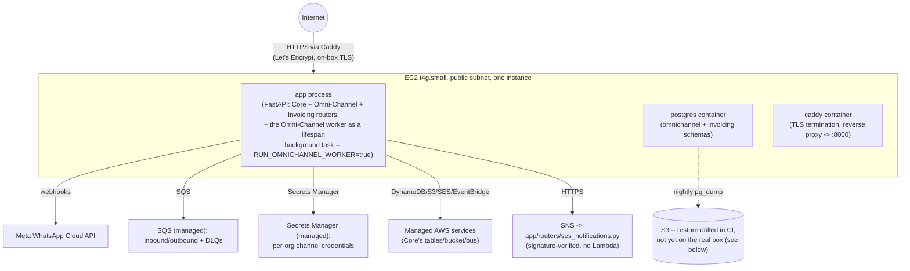

# Deployment Architecture

> Part of the [documentation index](../README.md). See also: [`infra/README.md`](../../infra/README.md) (apply instructions), [single-box-mvp.md](single-box-mvp.md) (what changed and why), [CI/CD](../ci-cd.md), [cost notes](../cost-notes.md).
> **Authority:** _reference_ — describes current code; if the two disagree, the code wins.

There is now **one deployment shape**: a single EC2 instance running the
whole platform (Core + Omni-Channel + Invoicing, one FastAPI process). This
replaced an earlier split — an ECS Fargate control plane for Core plus a
separate single-EC2 MVP shape for Omni-Channel — described in an earlier
revision of this doc; that split is history now, not something to
reconcile. See [single-box-mvp.md](single-box-mvp.md) for the full
rationale and what moved (Redis → in-process state, two Lambdas → in-app,
the never-built Omni-Channel worker process → a lifespan task in this same
process).

## Target architecture

```mermaid
flowchart TB
    Internet(("Internet")) -->|"HTTPS via Caddy\n(Let's Encrypt, on-box TLS)"| EC2
    subgraph EC2["EC2 t4g.small, public subnet, one instance"]
        API["app process\n(FastAPI: Core + Omni-Channel + Invoicing routers,\n+ the Omni-Channel worker as a lifespan\nbackground task -- RUN_OMNICHANNEL_WORKER=true)"]
        PGC["postgres container\n(omnichannel + invoicing schemas)"]
        Caddy["caddy container\n(TLS termination, reverse proxy -> :8000)"]
    end
    API -->|"webhooks"| Meta["Meta WhatsApp Cloud API"]
    API -->|"SQS"| SQSMgd["SQS (managed): inbound/outbound + DLQs"]
    API -->|"Secrets Manager"| SM["Secrets Manager (managed):\nper-org channel credentials"]
    API -->|"DynamoDB/S3/SES/EventBridge"| Managed["Managed AWS services\n(Core's tables/bucket/bus)"]
    API -->|"HTTPS"| SNSNotif["SNS -> app/routers/ses_notifications.py\n(signature-verified, no Lambda)"]
    PGC -.->|"nightly pg_dump"| S3Backup[("S3 -- restore drilled in CI,\nnot yet on the real box (see below)")]
```

- **One image, one process family** (`CLAUDE.md` §2/§14): the repo's single
  `Dockerfile` (multi-stage, `python:3.12-slim`, non-root, stdlib
  `HEALTHCHECK` against `/health`) runs `uvicorn --workers 1` — pinned,
  not a default; see [single-box-mvp.md](single-box-mvp.md)'s
  "Single-process is load-bearing" section for why `--workers 2` would
  silently break both the realtime broker and the rate limiter.
- **Networking cost posture** (`infra/modules/vpc`,
  [cost notes](../cost-notes.md)): one public subnet, one AZ, no NAT
  gateway (the box has its own public IP), free gateway endpoints for
  DynamoDB/S3.
- **IAM** (`infra/modules/iam`): one least-privilege EC2 instance role
  covering everything the single process touches — Dynamo/S3/SES/
  EventBridge/SQS/Secrets Manager/ECR-pull. No Lambda roles; there are no
  Lambdas.
- **Managed services stay managed** — they're usage-based (~$0 at this
  volume) and are the seams that would make a future distribution cheap:
  DynamoDB, S3, SES, EventBridge, SQS, Secrets Manager.
- **Known trade-off, accepted in writing**: single point of failure — a
  reboot takes down webhook endpoints (providers retry with backoff, so
  brief deploys are fine; extended downtime loses messages). Postgres
  durability is the operator's job: a nightly `pg_dump` to S3 exists
  alongside a `restore-postgres.sh` companion, and
  `tests/integration/backup/test_restore_drill.py` proves both scripts
  work end to end in CI — but **nobody has drilled a restore against the
  deployed box itself**, since no AWS account exists yet to deploy one.
  See [`../../DEPLOYMENT.md`](../../DEPLOYMENT.md)'s backup runbook for
  that procedure; still the single highest-risk open item, tracked in
  `app/services/omnichannel/CLAUDE.md` §16.

## What's actually codified in `infra/` today

| Module (`infra/modules/`) | Live composition (`infra/live/prod/`) | Backs |
|---|---|---|
| `dynamodb` | ✅ | Core's 6 tables |
| `s3` | ✅ | Ledger bucket |
| `eventbridge` | ✅ | `a2z-bus` (publisher only — no subscribers yet, see [event-driven-architecture.md](event-driven-architecture.md)) |
| `ses` | ✅ | SNS notifications topic + domain identity |
| `ecr` | ✅ | The one image repo |
| `vpc` | ✅ | One public subnet, one AZ, one SG |
| `iam` | ✅ | The one EC2 instance role |
| `cognito` | ✅ | User pool + SPA client only — no Lambda |
| `ec2-simple` | ✅ | The box: app + Postgres + Caddy via docker-compose |
| `ses-notifications-subscription` | ✅ | SNS → HTTPS subscription to the box's webhook route |
| `sqs-omnichannel` | ✅ | Omni-Channel's inbound/outbound queues + DLQs |

Deleted, not "not yet codified": `ecs`, `redis`, `rds` — see
[single-box-mvp.md](single-box-mvp.md) for what replaced each.

## CI/CD

See [`docs/ci-cd.md`](../ci-cd.md) for the full pipeline. In one line:
`.github/workflows/ci.yml` lints/type-checks, runs the test suite with a
real Postgres service container plus in-process moto mocks for everything
else, enforces three independent 90% coverage gates (`app/core`,
`app/services/omnichannel`, `app/services/invoicing`), builds the Docker
image, and validates every Terraform module — but does not apply infra or
deploy.

## Local development

`docker-compose.yml` brings up LocalStack (DynamoDB/S3/SES/SNS/EventBridge)
and Postgres — no Redis. `scripts/create_local_resources.py` mirrors
exactly what Terragrunt provisions in AWS (tables + GSIs, the S3 bucket,
the event bus, Omni-Channel's SQS queues + DLQs, a sample SES config set)
so integration tests and local runs have something real-ish to hit. See the
root [`README.md`](../../README.md) for the exact commands.
