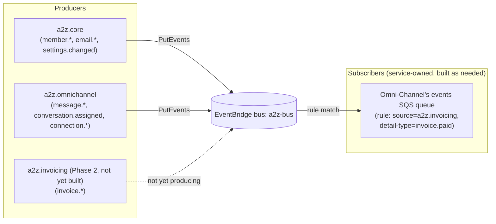
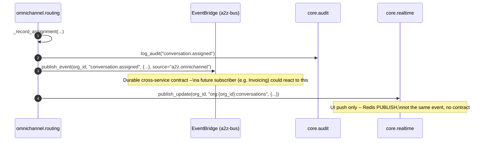
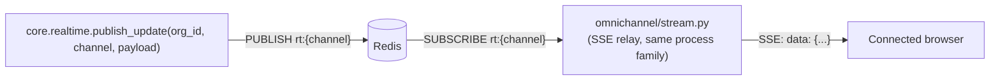

# Event-Driven Architecture

> Part of the [documentation index](../README.md). See also: [event catalog](../events.md), [`core.events` reference](../core/events-module.md), [Omni-Channel message flow](../services/omnichannel/message-flow.md).
> **Authority:** _reference_ — describes current code; if the two disagree, the code wins.

A2Z uses **two independent event mechanisms** that are easy to conflate but
serve different purposes. Confusing them is a documented footgun
(`docs/events.md`), so this page draws the line explicitly before diving into
either.

| | EventBridge (`core.events.publish_event`) | Redis pub/sub (`core.realtime.publish_update`) |
|---|---|---|
| Purpose | Cross-service domain events — a durable, auditable contract | UI push to connected browsers |
| Consumers | Other services' subscribers (EventBridge rules → SQS) | The service's own SSE relay, in the same process family |
| Durability | Delivered via AWS EventBridge; a rule can retry/DLQ | None — a slow/absent subscriber simply misses it (`PUBLISH` doesn't queue) |
| Naming | Dotted `event_type` (`message.received`) as `detail-type` | Freeform `channel` string (`org:{org_id}:conversations`) |
| Who should rely on it | Any future service | Nobody outside the browser relay — no subscriber contract |

## EventBridge — cross-service domain events

- **Single custom bus**: `a2z-bus` (`app.config.settings().event_bus_name`).
- **`source`** namespaces the producer: `a2z.core`, `a2z.omnichannel`, and
  (once built) `a2z.invoicing`.
- **`detail-type`** is the dotted `event_type` string (e.g. `message.received`).
- **`detail`** always carries `org_id`, injected by `publish_event` itself —
  a subscriber can always scope by org without inspecting a nested field.
- **Core owns only the publisher.** Subscribers are entirely service-owned:
  an EventBridge rule + the consuming service's own SQS queue + worker code
  (`CLAUDE.md` §6; `app/services/omnichannel/CLAUDE.md` §6.3).
- **Fire-and-forget from the caller's perspective, but not silently
  dropped**: `publish_event` `await`s `PutEvents` and raises `EventError` on
  failure or a rejected entry — it does not swallow errors.

See [`docs/events.md`](../events.md) for the full, current event catalog
(every `event_type` in production, who produces it, and its key `detail`
fields) — that document is the single source of truth for the wire
contract; this page explains the mechanism.

### Full producer → consumer sequence (assignment example)

## Redis pub/sub — realtime UI fan-out

- **Channel naming is caller-defined**, but every Omni-Channel caller scopes
  it to an org or user: `org:{org_id}:conversations`,
  `user:{user_id}:notifications`.
- **The `rt:` key prefix is a Core/consumer contract, not exported code.**
  `core.realtime.publish_update` prepends `rt:` before publishing;
  `omnichannel/stream.py::_channel_key` duplicates that same prefix rather
  than importing it, specifically because the SSE relay is MVP-only glue
  that disappears when the service distributes onto AppSync — exporting a
  constant from Core for a throwaway artifact was judged not worth a Core
  change. A round-trip test (`test_stream.py`) locks the two together so
  any drift fails loudly instead of silently breaking realtime delivery.
- **Transport swaps, contract doesn't**: at MVP this is Redis pub/sub → SSE;
  at distribution scale it becomes an AppSync GraphQL mutation with the
  exact same `publish_update(org_id, channel, payload)` signature. Callers
  never change (`app/services/omnichannel/CLAUDE.md` §6.2, §5.4).

## Where each mechanism is used today

| Trigger | EventBridge event | Realtime channel |
|---|---|---|
| Member added/removed/role changed | `member.added` / `member.removed` / `member.role_changed` | — |
| Org settings changed | `settings.changed` | — |
| Email bounced/complained | `email.bounced` / `email.complained` | — |
| Inbound message persisted | `message.received` | `org:{org_id}:conversations` (+ assignee's `user:{id}:notifications` if already assigned) |
| Outbound message sent | `message.sent` | `org:{org_id}:conversations` |
| Conversation claimed/reassigned/auto-assigned | `conversation.assigned` | `org:{org_id}:conversations` + `user:{assignee}:notifications` |
| Invoice requested from a conversation | `conversation.invoice_requested` (**not yet published** — see below) | — |
| Invoice paid (Phase 2, Invoicing) | `invoice.paid` (**producer doesn't exist yet**) | — |

**Not yet produced:** `conversation.invoice_requested` is designed but
unpublished — it exists to tell Invoicing to create a draft, and Invoicing
doesn't exist yet. Commission attribution (`app/services/omnichannel/CLAUDE.md`
§5.5) is deferred for the same reason: there is no `invoice.paid` producer to
subscribe to. The Postgres tables for commission ship in the schema today so
this becomes subscriber-only work once Phase 2 lands.

## Rate limiting is not an event mechanism, but shares the "cross-cutting Core facility" shape

`core.rate_limit.check_and_increment` doesn't publish anything — it's listed
here only to distinguish it from the two mechanisms above, since all three
are sometimes lumped together as "Core plumbing." See
[`core/rate-limit.md`](../core/rate-limit.md).
