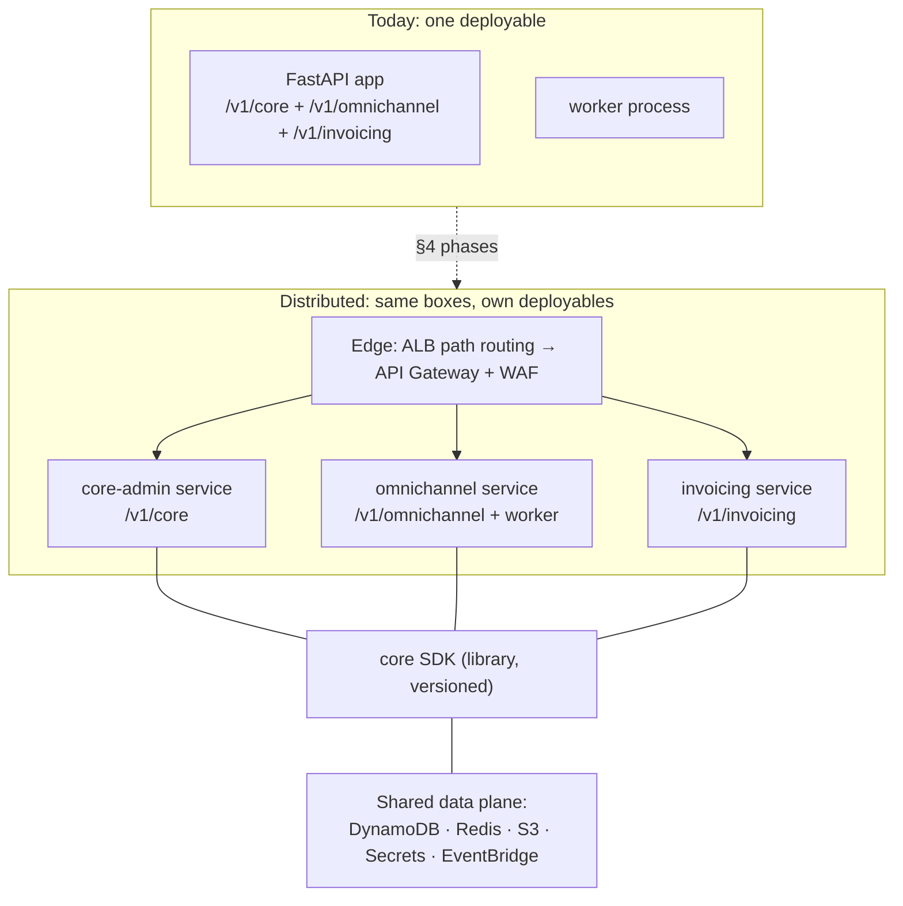

# Distribution Plan: A2Z as Microservices (Future View)

> **Authority:** _record_ — a dated decision/log, not a live description of current code.

**Status:** Forward-looking plan, **not scheduled work**. The modular
monolith is the right architecture today
([overview — why a monolith](overview.md#why-a-monolith-not-microservices)),
and nothing in this document changes that. This doc exists so that
(a) decisions made today keep the split cheap, (b) when a trigger in §2
fires, the path is already designed instead of improvised, and (c) readers
have a second mental model of the system: not "one app," but "several
services that happen to share a process for now."

**Related:** [deployment](deployment.md) ·
[event-driven architecture](event-driven-architecture.md) ·
[zero trust for APIs](../zero-trust.md) · [events catalog](../events.md) ·
`CLAUDE.md` §14 (current scope).

---

## 1. The reframe: the monolith is already a distributed system in one process

The most important fact about this plan is how little of it is new design.
The golden rules were chosen so that **the Python package boundaries are
already service boundaries**:

- Services never import each other — cross-service communication is
  **EventBridge events only**. That rule is identical in-process and
  distributed; the event catalog (`docs/events.md`) is already the
  inter-service wire contract.
- Core never imports from services, so Core has no hidden dependency on any
  product's code.
- **All meaningful state is already external.** Nothing correctness-critical
  lives in process memory: membership/audit/settings/email-events are in
  DynamoDB, files in S3, rate-limit windows and caches in Redis, credentials
  in Secrets Manager, Omni-Channel domain data in Postgres. Two processes
  importing the same `core/` package already share state safely — the
  web/worker split proves it in production shape today.
- The app tier is stateless; routers are thin; every AWS client reads its
  endpoint from config.

So "distributing A2Z" is not a rewrite. It is **changing how the existing
boxes are packaged and deployed**, plus authenticating the network hops that
appear. The boxes themselves — and their contracts — don't move.

## 2. When to split (triggers, not fashion)

Do **not** split because microservices are the default elsewhere. Split a
piece out when one of these is observed, and split **only the piece the
trigger names**:

| Trigger | What it justifies |
|---|---|
| Two services need conflicting deploy cadences (e.g. Omni-Channel ships daily, Invoicing is frozen for an audit period) | Separate deployables (Phase D2) for those services |
| One service's scaling profile dominates (e.g. webhook ingestion spikes force scaling the whole monolith) | Extract that service, or just its worker, to its own task family (Phase D1–D2) |
| A deploy or crash in one service takes down another in production | Process isolation (Phase D1) |
| Team structure: more than ~2 teams blocked on one repo/pipeline | Per-service pipelines (Phase D2) |
| A Core capability needs central coordination a library can't give (e.g. a single connection-holding realtime gateway) | Extract *that capability* as a network service (Phase D3) — not all of Core |
| Compliance requires isolation of one domain's compute (e.g. payments) | Extract that service with its own account/role boundary |

If no trigger has fired, the monolith stays — every phase below has a real
cost (latency, ops burden, distributed failure modes) that is only worth
paying against an observed problem.

## 3. The central design decision: Core stays a library

When people say "extract Core," there are two very different options:

- **Option A — Core as a shared SDK (chosen).** Each service deploys with
  the `core/` packages inside its own image and talks directly to the shared
  data plane (DynamoDB, Redis, S3, Secrets Manager, EventBridge). "In-process
  Core calls" (golden rule #1) stays true *within each deployable*.
- **Option B — Core as a network service.** One deployment owns all Core
  logic; services call it over HTTP/gRPC.

**Option A is the plan.** Because Core's state is already external and
org-scoped, a library gives the same shared behavior with no new network
hop, no new availability dependency, and no serialization tax on hot paths
(`get_membership` p99 < 50ms would not survive an extra hop with margin).
Option B's costs buy nothing today — Core functions are thin, typed wrappers
over AWS services that already *are* the centralized network services.

Option B is reserved, per capability, for the rare Core module where
central runtime coordination matters (§4, Phase D3). The likely candidates:

- **`realtime`** — at distribution scale, client connections concentrate in
  a dedicated gateway (the AppSync path already anticipated in `CLAUDE.md`),
  not in every service.
- **`email` sending** — if global SES reputation/throughput management ever
  needs one throttling authority, a small sender service (or an SQS queue in
  front of a sender worker) can own the actual `SendEmail` call while the
  `core.email` API stays the facade services import.

Everything else (`auth`, `membership`, `audit`, `settings`, `rate_limit`,
`events`, `storage`, `secrets`) stays a library indefinitely — their
"centralization" is the data plane itself (e.g. rate limiting is already
globally consistent across any number of deployables because the sliding
window lives in one Redis).

## 4. The phased path

Each phase is independently valuable, reversible in cost terms, and stops
being executed the moment triggers stop firing. **D0 is worth doing
regardless of whether distribution ever happens.**

### Phase D0 — Harden the seams inside the monolith (no deployment change)

- **Mechanically enforce the import rules.** Add an import-boundary check to
  CI (e.g. `import-linter`): `core` must not import `services.*`; no
  `services.X` may import `services.Y`; routers import only their own
  service + `core`. Today this is convention; make it a failing build.
- **Deny-by-default at the app shell** and the startup route-policy audit
  (see [zero trust §6](../zero-trust.md)) — when routers later move to their
  own deployables, each inherits a shell that is safe by construction.
- **Treat `docs/events.md` as a schema registry.** Every event producer
  documents its payload shape there *at the PR that adds it*; consumers
  code against the doc, not against the producer's source. Add contract
  tests that validate published payloads against the documented shapes —
  these tests become the inter-service compatibility gate after the split.
- **Keep config 12-factor.** Any new setting goes through `config.py`/env,
  never a hardcoded assumption that all routers share a process.

### Phase D1 — Split processes, keep one codebase and image

The web/worker split already demonstrates the pattern: same image, different
entrypoint, different task family. Extend it:

- Run **one ECS task family per service router group**, all from the same
  image, selected by entrypoint/env (`SERVE_ROUTERS=omnichannel`).
- ALB **path-based routing** maps `/v1/omnichannel/*` to the omnichannel
  target group, `/v1/core/*` to core-admin, etc. Clients see no change.
- Each task family gets its **own IAM task role**, scoped to Core's shared
  tables plus that service's own resources and nothing of any other
  service's (the per-task-family split already on the
  [zero-trust roadmap](../zero-trust.md#7-maturity-roadmap-trigger-driven)).
- Independent autoscaling per family — this alone resolves the "one
  service's load scales everything" trigger without touching the codebase.

### Phase D2 — Independent deployables

- **Per-service images and pipelines.** The repo can stay a monorepo (path
  filters build only what changed) — repo-split is a team-structure
  decision, not an architectural one.
- **The Core SDK becomes a versioned internal package** (private registry or
  monorepo pinning). Semver; frozen modules only minor-bump; a breaking Core
  change follows the existing unfreeze protocol *plus* a compatibility
  window in which the previous major keeps working against the shared data
  plane (the DynamoDB additive-migration rules in
  [migrations.md](../migrations.md) already define exactly this discipline
  for data; the SDK applies it to code).
- **Data ownership becomes exclusive and IAM-enforced:** each service's
  tables/queues/buckets are writable only by that service's role. Another
  service that wants the data consumes **events**, never the tables. Core's
  shared tables remain accessible to all services *through the SDK's APIs
  only* — and since the SDK is the only code holding the key schemas, the
  practical enforcement is the same org-scoping discipline plus IAM
  condition keys where DynamoDB supports them (`dynamodb:LeadingKeys`).
- **Observability goes distributed:** the `X-Request-Id` convention becomes
  W3C trace context (OTel/X-Ray) propagated across HTTP hops *and* stamped
  into EventBridge detail metadata, so a webhook → event → consumer chain
  is one trace. Structured-log shape and the audit table don't change; log
  streams gain a `service` dimension.
- **Local dev:** `docker-compose` grows one container per service; LocalStack
  and Redis stay shared, mirroring production's shared data plane.

### Phase D3 — Extract specific Core capabilities (only on their own triggers)

Per §3: `realtime` to a connection gateway (AppSync or a dedicated
WebSocket/SSE service), possibly `email` sending behind a queue. Each
extraction keeps the existing `core.X` function signatures as the facade —
services should not notice whether `core.realtime.publish` fans out via
local Redis pub/sub or a remote gateway. That facade stability is the test
of a correct extraction.

## 5. What each concern becomes

| Concern | Today (monolith) | Distributed |
|---|---|---|
| Routing | All routers mounted in `app/main.py` | ALB path routing (D1) → API Gateway + WAF at the edge (per zero-trust roadmap) |
| AuthN | Shared `CurrentUser` dependency | Unchanged per service (each verifies JWTs itself — zero trust means no service trusts the gateway's word alone); optional gateway JWT authorizer as defense in depth |
| Service-to-service calls | Forbidden (imports) — events only | **Still forbidden.** Events remain the only channel; if a synchronous cross-service call ever becomes unavoidable, it gets SigV4/mTLS per [zero-trust §7](../zero-trust.md#7-maturity-roadmap-trigger-driven) and a written justification here |
| AuthZ | `require_member`/`require_admin` per route | Unchanged — ships inside the Core SDK |
| Rate limiting | Central Redis sliding window | Unchanged and *automatically global* across deployables (same Redis, same keys) |
| Settings/secrets caching | Redis read-through | Unchanged; cache TTLs already bound staleness across processes |
| Cross-service events | EventBridge, org_id in every payload | Unchanged — this is the seam the whole plan leans on; contract tests (D0) guard it |
| Audit | One DynamoDB table, `log_audit` in SDK | Unchanged; add `service` attribute to entries |
| Data ownership | Package discipline | IAM-enforced exclusivity per service role (D2) |
| Correlation | `X-Request-Id` middleware | Trace context propagated over HTTP and inside event metadata (D2) |
| Deploy unit | One image, web + worker entrypoints | Task family per service (D1) → image per service (D2) |
| Local dev | One app container + LocalStack + Redis | One container per service, same shared LocalStack/Redis |
| CI | One pipeline | Path-filtered per-service pipelines + shared SDK pipeline (D2) |
| Testing | Unit/integration per module; cross-org tests | Same, plus event contract tests (D0) and per-service smoke tests against the shared data plane |

## 6. Zero trust across the split

The [zero trust API policy](../zero-trust.md) was written to survive this
plan, and its governing rule for distribution is: *"it used to be
in-process" is not a trust argument.* Concretely, at each phase:

- **D1:** task-family IAM roles narrow per service; nothing else changes —
  path-routed traffic still terminates at the same authenticated routers.
- **D2:** every service independently verifies JWTs (the SDK makes this
  free); the edge gateway/WAF is additive, never the sole check. No service
  accepts a request because "it came from inside."
- **Any synchronous inter-service hop (discouraged, see §5 table):**
  authenticated service identity (SigV4 or mTLS) is a *precondition of
  shipping the hop*, not a fast-follow.
- **Events:** consumers validate and re-scope by the `org_id` in the payload
  — a compromised producer can emit garbage but cannot make a consumer act
  outside the event's org.

## 7. What deliberately does not change

- **Org-scoping** is architecture-independent and non-negotiable in every
  phase.
- **The Core module APIs** (`Design §2` signatures) are the stable facade;
  distribution changes their packaging, never their contracts.
- **Single region** stays until a business reason says otherwise —
  distribution and multi-region are orthogonal, and conflating them
  multiplies risk.
- **No RBAC service, no billing engine** — `CLAUDE.md` §14's scope
  exclusions are unaffected by how the system is deployed.

## 8. Explicit non-goals

- **Not a rewrite** — any phase requiring a service's business logic to
  change (beyond entrypoint/config) is being done wrong.
- **Not a big-bang** — phases apply per service, on that service's trigger.
  A2Z can run indefinitely with, say, Omni-Channel split out (D2) and
  everything else in the monolith (D0).
- **Not Core-as-a-network-service** — Option B (§3) is rejected as a general
  direction; only named capabilities with named triggers get extracted.
- **Not an excuse for synchronous coupling** — going distributed does not
  legalize service-to-service HTTP calls; the events-only rule is the reason
  this plan is cheap, and it outlives the monolith.
