# System Architecture Overview

> Part of the [documentation index](../README.md). See also: [request lifecycle](request-lifecycle.md), [auth & authorization](auth-and-authorization.md), [data flow](data-flow.md), [event-driven architecture](event-driven-architecture.md), [deployment](deployment.md).

## What this system is

A2Z Core is **not a microservice**. It is a set of in-process Python packages
(`app/core/`) imported by services inside a single FastAPI **modular
monolith**. One process (plus a worker process for Omni-Channel) serves every
A2Z product. There is no network hop between a service and Core — a "call to
Core" is a Python function call.

Two things exist in this repository today:

1. **Core** (`app/core/`) — the shared platform layer: auth, tenancy, email,
   storage, audit, settings, events, rate limiting, secrets, and realtime
   fan-out. Frozen (see [Core module reference](../core/README.md)).
2. **Omni-Channel** (`app/services/omnichannel/`) — the first (and, as of
   this writing, only) product service built on Core: a multi-tenant unified
   inbox for WhatsApp/email/SMS conversations. See
   [Omni-Channel service docs](../services/omnichannel/README.md).

Invoicing (`app/services/invoicing/`) is a placeholder package — see
[`docs/phase2-invoicing.md`](../phase2-invoicing.md) for its kickoff plan.

## Golden rules (drive every design decision below)

1. Every Core call is in-process — no network hop between services and Core.
2. Every data access is **org-scoped**. No query, ever, without an `org_id`.
3. Core never imports from `services/`. Services import from `core/`, never
   the reverse.
4. Services talk to each other only via **EventBridge events**, never direct
   imports.
5. No secrets in code or env vars where avoidable — IAM task roles in AWS,
   `core.secrets` (Secrets Manager) for per-org/per-service credentials.
6. Everything significant gets an **audit log** entry and structured log line.

## Component map

```mermaid
flowchart TB
    subgraph Client["Clients"]
        Browser["Browser / API client"]
        Meta["Meta WhatsApp Cloud API"]
        SES_IN["Inbound email (SES receipt rule)"]
    end

    subgraph Monolith["A2Z modular monolith (ECS Fargate / single EC2)"]
        direction TB
        FastAPI["FastAPI app (app/main.py)"]
        subgraph Routers["Thin HTTP routers"]
            HealthR["routers/health.py"]
            CoreAdminR["routers/core_admin.py"]
            OmniR["routers/omnichannel.py"]
        end
        subgraph Core["app/core/* (platform layer)"]
            Auth["auth.py"]
            Membership["membership.py"]
            Audit["audit.py"]
            Settings["settings.py"]
            RateLimit["rate_limit.py"]
            Events["events.py"]
            Storage["storage.py"]
            Email["email.py"]
            Secrets["secrets.py"]
            Realtime["realtime.py"]
            Clients["clients.py (boto3/redis/httpx singletons)"]
        end
        subgraph OmniService["app/services/omnichannel/*"]
            Handlers["handlers.py / routing.py / inbox.py"]
            Webhooks["webhooks.py"]
            Worker["worker.py (separate process)"]
            Adapters["adapters/ (email, whatsapp, sms)"]
        end
        FastAPI --> Routers
        CoreAdminR --> Core
        OmniR --> OmniService
        OmniService --> Core
        Worker --> Core
        Worker --> OmniService
    end

    subgraph AWS["AWS managed services"]
        DDB[("DynamoDB\nmembership/audit/settings/\nemail-events/suppression/files")]
        S3[("S3\nledger bucket")]
        SES["SES"]
        SNSsvc["SNS"]
        EB["EventBridge (a2z-bus)"]
        SM["Secrets Manager"]
        SQS["SQS (omnichannel in/out + DLQs)"]
        Cognito["Cognito User Pool"]
    end

    subgraph DataPlaneOther["Non-AWS backing stores"]
        Redis[("Redis\ncache, rate limits, pub/sub, presence")]
        Postgres[("Postgres\nomnichannel schema")]
    end

    subgraph Lambdas["Out-of-band Lambdas"]
        PostConfirm["cognito_post_confirm.py"]
        SesNotif["ses_notifications.py"]
    end

    Browser -->|HTTPS + Bearer JWT| FastAPI
    Meta -->|Webhook POST| OmniR
    SES_IN --> S3
    S3 -->|event notification| SQS

    Clients --> DDB
    Clients --> S3
    Clients --> SES
    Clients --> EB
    Clients --> SM
    Clients --> SQS
    Clients --> Redis
    OmniService --> Postgres

    Cognito -->|Post Confirmation trigger| PostConfirm
    PostConfirm --> Membership
    SES -->|Bounce/Complaint via SNS| SNSsvc --> SesNotif
    SesNotif --> Email
    Auth -->|JWKS fetch, 24h cache| Cognito
```



## Layer responsibilities

| Layer | Lives in | Responsibility | Never does |
|---|---|---|---|
| Routers | `app/routers/*.py` | Parse HTTP request, call `core`/service, map typed errors to responses | Business logic, direct AWS calls |
| Core | `app/core/*.py` | Org-scoped platform primitives: auth, tenancy, storage, email, audit, settings, events, rate limiting, secrets, realtime | Import from `app/services/*` |
| Service (Omni-Channel) | `app/services/omnichannel/*.py` | Product domain logic: conversations, routing, channel adapters | Import another service's code directly (events only) |
| Lambdas | `app/lambdas/*.py` | Out-of-band AWS-triggered handlers (Cognito, SES/SNS) that must never block on Core | Long-running work — they call one Core function and return |
| Worker | `app/services/omnichannel/worker.py` | Long-running SQS consumer process (same container image, different entrypoint) | Serve HTTP |

## Why a monolith, not microservices

Golden rule #1 (in-process Core calls) is a deliberate cost/complexity
trade-off documented in `CLAUDE.md`: one FastAPI process, one deploy unit, no
service-to-service network auth to build. Services are logically separated by
Python package boundaries and the "events only" cross-service rule, not by
network boundaries. Revisit only if Core is ever extracted into its own
deployable (not currently planned).

## Repository map

```
app/
├── main.py, config.py, dependencies.py, aws_resources.py
├── core/            # platform layer — see docs/core/README.md
├── services/
│   ├── omnichannel/ # see docs/services/omnichannel/README.md
│   └── invoicing/   # placeholder — see docs/phase2-invoicing.md
├── routers/         # thin HTTP layer
└── lambdas/         # Cognito + SES/SNS out-of-band handlers
infra/               # Terragrunt/Terraform — see infra/README.md
scripts/             # local provisioning + Lambda packaging
tests/               # unit / integration / load — see docs/testing.md
docs/                # this documentation tree
```

## Where to go next

- New to the codebase? Start with [request lifecycle](request-lifecycle.md), then [auth & authorization](auth-and-authorization.md).
- Building on Core? See the [Core module reference](../core/README.md).
- Working on Omni-Channel? See the [service docs](../services/omnichannel/README.md).
- Deploying or provisioning infra? See [deployment architecture](deployment.md) and [`infra/README.md`](../../infra/README.md).
