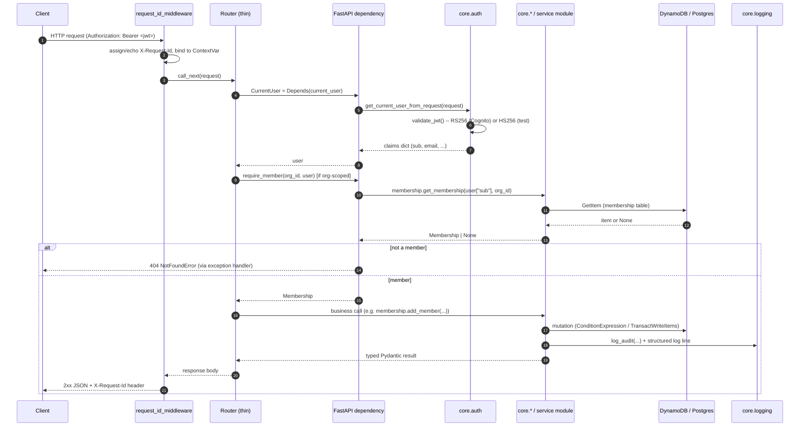
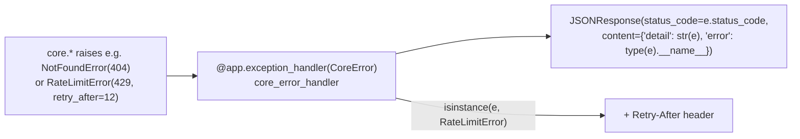

# Request Lifecycle

> Part of the [documentation index](../README.md). See also: [architecture overview](overview.md), [auth & authorization](auth-and-authorization.md).
> **Authority:** _reference_ — describes current code; if the two disagree, the code wins.

This document traces a single HTTP request from the client through the
FastAPI app to a Core/service call and back, including the error-mapping
convention every endpoint relies on.

## End-to-end sequence (a typical authenticated write)

## Steps in detail

1. **`request_id_middleware`** (`app/main.py`) runs for every request. It
   reads `X-Request-Id` from the client or mints a `uuid4().hex`, binds it to
   a `ContextVar` (`app.core.logging.request_id_var`), and echoes it back on
   the response. Every structured log line emitted during the request
   includes this id, so a single request's logs can be grepped end to end
   even across `core.*` calls.
2. **Routing** — routers (`app/routers/*.py`) are intentionally thin: parse
   the request/body into a Pydantic model, resolve FastAPI dependencies,
   call exactly one `core`/service function, return its result. No business
   logic lives in a router (`CLAUDE.md` §2).
3. **`CurrentUser` dependency** (`app/dependencies.py`) calls
   `core.auth.get_current_user_from_request`, which validates the bearer
   JWT (see [auth & authorization](auth-and-authorization.md)) and returns
   the claims dict. Every authenticated router parameter is typed
   `Annotated[dict[str, Any], Depends(current_user)]`.
4. **`require_member` / `require_admin`** — for org-scoped endpoints, a
   second dependency loads the caller's `Membership` via
   `core.membership.get_membership` and raises `NotFoundError` (404) if the
   caller isn't in the org. Role checks (`require_admin`) are hardcoded
   `role in {OWNER, ADMIN}` comparisons — there is no RBAC service
   (`CLAUDE.md` §14).
5. **Business call** — the router calls into `core.*` (membership, email,
   settings, ...) or an Omni-Channel service module (`handlers`, `routing`,
   `inbox`). These functions are the only place that talk to DynamoDB, S3,
   SES, EventBridge, Postgres, or Redis.
6. **Persistence + side effects** — a mutation typically, in order: performs
   its DynamoDB/Postgres write, calls `core.audit.log_audit(...)`, and
   (where applicable) `core.events.publish_event(...)` and/or
   `core.realtime.publish_update(...)`. See
   [event-driven architecture](event-driven-architecture.md).
7. **Response** — the function returns a typed Pydantic model or dataclass;
   FastAPI serializes it to JSON.

## Error handling — one exception hierarchy, one handler

Every Core/service function raises a typed subclass of `CoreError`
(`app/core/exceptions.py`) — never a bare `Exception`, never an error dict.
Each subclass carries its own `status_code`. A single global handler in
`app/main.py` maps any `CoreError` to an HTTP response:

This means **routers never write `try/except` around Core calls** — the
error hierarchy and the one handler are the entire contract. See
[`app/core/exceptions.py`](../../app/core/exceptions.py) for the full
hierarchy and each module's reference doc under [`docs/core/`](../core/README.md)
for what each function can raise.

## Omni-Channel's two extra lifecycles

Omni-Channel adds two request shapes that don't fit the "HTTP in, HTTP out"
pattern above:

- **Inbound webhooks** (`POST /v1/omnichannel/webhooks/{channel_type}/{connection_id}`)
  — verified and enqueued, not processed synchronously. See
  [message flow](../services/omnichannel/message-flow.md).
- **The SSE stream** (`GET /v1/omnichannel/orgs/{org_id}/stream`) — a
  long-lived streaming response, not a request/response cycle. See
  [routing, presence & realtime](../services/omnichannel/routing-and-realtime.md).

## Health checks

`GET /health` (`app/routers/health.py`) is the one endpoint with no auth and
no business logic: it pings DynamoDB (`ListTables`) and Redis (`PING`) and
returns `200` only if both succeed, else `503`. This is what the ECS target
group and Docker `HEALTHCHECK` probe.
