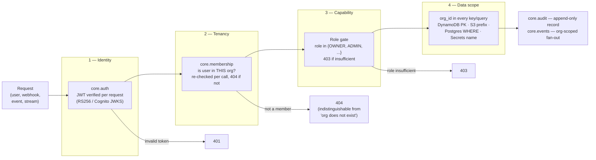
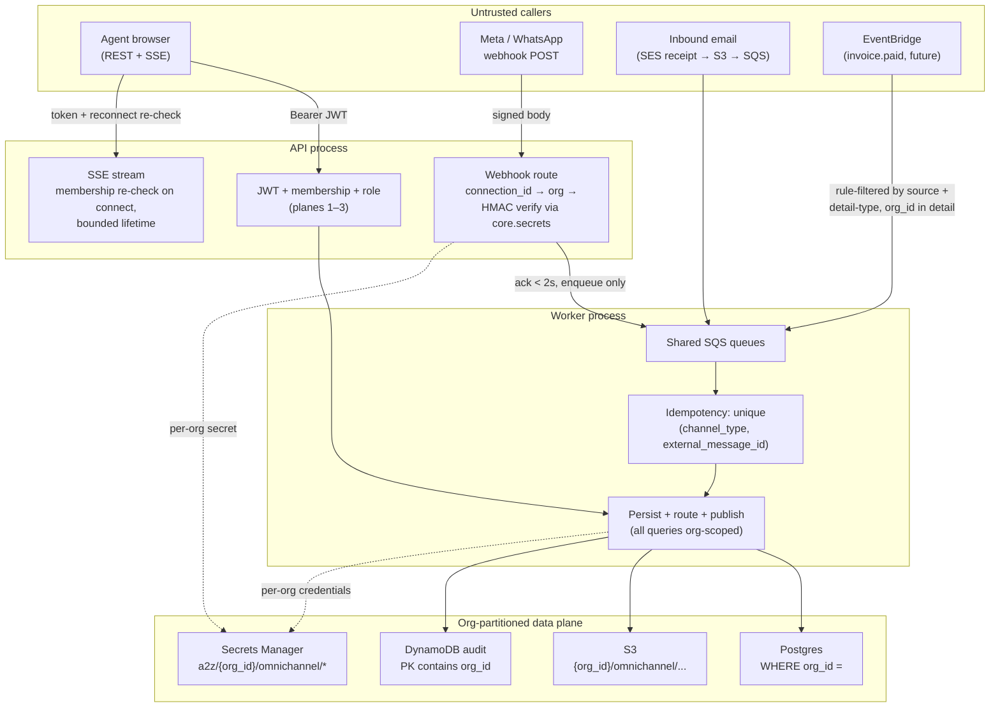
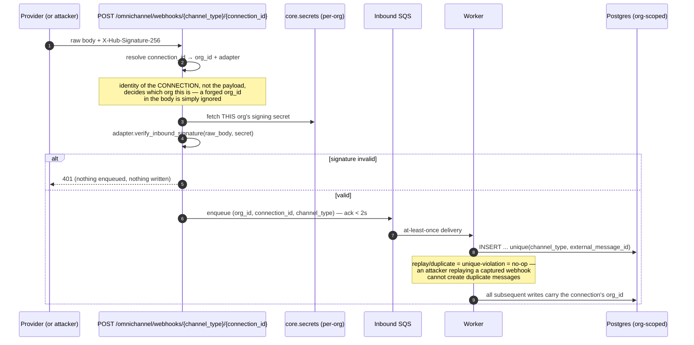
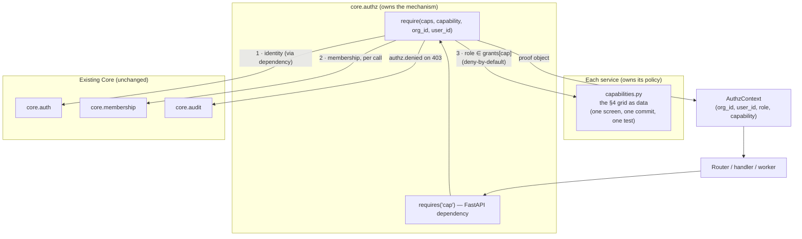

# Zero Trust Permissions in A2Z

> Part of the [documentation index](../README.md). See also:
> [auth & authorization](auth-and-authorization.md),
> [request lifecycle](request-lifecycle.md),
> [data flow](data-flow.md).
>
> **Status:** Parts 1–2 describe what is *already built and tested*. Part 3
> (the `core.authz` shared library) is a **design proposal** — adopting it is
> a deliberate Core unfreeze under the same protocol used for
> `core.secrets`/`core.realtime` (`app/services/omnichannel/CLAUDE.md` §6.2).

---

## 1. What "Zero Trust" means for A2Z

Classic Zero Trust doctrine (NIST SP 800-207) says: **never trust, always
verify** — no request is trusted because of *where it comes from* (the
network, a previous request, a co-located process). Every access is
authenticated, authorized against the specific resource, scoped to the
smallest possible blast radius, and logged.

A2Z is a **modular monolith**, not a service mesh, so the usual Zero Trust
machinery (mTLS between services, network micro-segmentation, service
identity certificates) mostly doesn't apply — root `CLAUDE.md` §14 is
explicit that there is *no service-to-service network auth* because there is
no network between services. Instead, A2Z implements Zero Trust at the
**request and data layer**, which is where the tenants (orgs) actually meet
each other:

| Zero Trust tenet (NIST 800-207) | A2Z realization |
|---|---|
| Verify identity on every access | `core.auth.validate_jwt` runs on **every** HTTP request — no sessions, no "already authenticated" state anywhere. RS256/Cognito only in prod; test tokens structurally refused (`is_prod` checked at point of use). |
| Least-privilege, per-resource authorization | `core.membership.get_membership(user_id, org_id)` is re-checked **per call** — membership is never cached into the token, so revocation takes effect on the next request. Role gates (`role in {...}`) sit in front of every mutation. |
| Assume breach → minimize blast radius | **Org scoping is structural, not checked**: `org_id` lives in the DynamoDB partition/sort key, the S3 key prefix, the Postgres `WHERE org_id =`, the Secrets Manager name (`a2z/{org_id}/{service}/{key}`), and the Redis key namespace. A bug that skips a role check still cannot read another org's data — there is no code path that can. |
| Continuous verification, not perimeter login | Long-lived connections re-verify: the SSE stream re-checks membership on **every reconnect**, and caps stream lifetime (default 5 min) so a revoked member's live access has a bounded tail. |
| All resource access is authenticated per-source | Machine callers verify too: inbound webhooks are HMAC-verified per connection **before any processing** (`X-Hub-Signature-256` against the org's own secret from `core.secrets`); EventBridge subscribers trust only bus + `source` + `detail-type` filters and re-scope by the `org_id` in the detail. |
| Monitor and log everything | Every mutation writes an append-only `core.audit` entry (7-year TTL); structured JSON logs thread a `request_id`; JWTs/secrets are redacted by `core.logging` even if a caller passes them by mistake. |
| Limit the rate of abuse | `core.rate_limit` sliding windows per `(org_id, action)` — a compromised credential can't be turned into a spam cannon. |

**The one trust boundary A2Z deliberately keeps:** code inside the process
trusts other code inside the process (root `CLAUDE.md` §14). Zero Trust here
protects **tenants from each other and from stolen credentials**, not Core
from a hostile service module. That is the correct threat model for a
single-team monolith; revisit only if Core is ever extracted.

### The four verification planes

Every request that reaches data crosses all four planes, in order. Failing
any plane short-circuits with a typed `CoreError` — deny by default.



Two deliberate details worth noticing:

- **Non-membership returns 404, not 403** — an outsider cannot even learn
  that an org exists. That is Zero Trust's "minimize what an unauthenticated
  probe can enumerate" applied to the tenancy plane.
- **Plane 4 is not a check, it's the shape of the query.** Planes 1–3 can in
  principle have bugs; plane 4 cannot be bypassed by forgetting an `if`,
  because the `org_id` is part of the key itself. Every module carries a
  cross-org isolation test proving it (root `CLAUDE.md` §4, Omni-Channel
  DoD §16).

---

## 2. Zero Trust in Omni-Channel, entry point by entry point

Omni-Channel is the stress test for this model because it has **five
different kinds of caller**, and only one of them is a logged-in human.
Each entry point gets the full treatment — nothing is trusted because it
"came from inside."



### 2.1 Agent REST calls (human, interactive)

Every handler runs the same ladder, inline (see
[auth & authorization](auth-and-authorization.md) for the role-vocabulary
mapping — Core's `MEMBER`/`GUEST` ↔ the product's Agent/Viewer):

| Capability | Gate in code |
|---|---|
| Read inbox / thread | membership only — every role, incl. `GUEST` (`inbox._require_member`) |
| Send reply | any role except `GUEST` (`handlers.send_reply`) |
| Claim conversation | any role except `GUEST`; claiming someone else's = 409, it's a reassign (`routing.claim`) |
| Reassign | `OWNER`/`ADMIN` only, and the new assignee's membership is itself verified (`routing.reassign`) |
| Connect channels / routing config | `OWNER`/`ADMIN` only (`connections._require_admin`, `routing`) |

Note the reassign check verifies **both** parties — the actor's role *and*
that the target is a real member of this org. Zero Trust applies to the
object of an action, not just its subject.

### 2.2 Inbound webhooks (machine, hostile-by-default)

The webhook route is the most exposed surface in the platform — a public
HTTPS endpoint that Meta (or anyone who finds the URL) can POST to. The
route trusts **nothing** in the payload:



Three Zero Trust properties fall out of this shape:

1. **Org identity comes from the route, not the payload.** The
   `connection_id` in the URL resolves to exactly one org and its secret;
   the body cannot claim to be another tenant.
2. **Per-org secrets mean per-org blast radius.** Leaking one org's app
   secret lets an attacker forge webhooks *for that org only*.
3. **Idempotency is a security control**, not just correctness: replayed
   deliveries (provider retries *or* attacker replays) collapse to a no-op
   on the `(channel_type, external_message_id)` unique constraint.

### 2.3 The SSE realtime stream (long-lived connection)

Long-lived connections are where perimeter models rot — a token validated
once at connect time can outlive the permission it proved. Omni-Channel's
stream (`stream.py`) treats the connection itself as untrusted over time:

- Membership is re-checked **on every connect and reconnect**; a revoked
  member's next reconnect gets a 404 and the stream never opens.
- `max_lifetime_seconds` (default 5 min) force-closes even healthy streams,
  so revocation has a hard upper bound on live access — continuous
  verification by bounded lifetime rather than mid-stream re-auth.
- The subscription is pinned to `org:{org_id}:...` and
  `user:{user_id}:...` channels derived server-side from the verified
  identity — a client cannot subscribe to another org's channel names.

### 2.4 The worker and cross-service events (machine, internal)

The worker consumes SQS messages and EventBridge-fed queues. Even here —
"inside" — the Zero Trust habits hold:

- Every queue message carries `org_id`, and every DB write the worker makes
  is scoped by it; the worker holds no "global" query path.
- Cross-service events (`invoice.paid`, when Invoicing lands) are consumed
  only through an EventBridge **rule** filtered on `source` +
  `detail-type`, and the handler re-scopes by the `org_id` in the detail.
  Services never import each other (root golden rule #4) — the event bus is
  the only door, and it's a narrow one.
- Failed sends retry a bounded number of times then DLQ with an alarm —
  a poisoned message can't wedge the pipeline (availability is a Zero Trust
  concern too: assume bad input will arrive).

### 2.5 Credentials (the machine-to-provider edge)

Outbound calls to WhatsApp/SES use **per-org, per-service** credentials
resolved at use time from `core.secrets`
(`a2z/{org_id}/omnichannel/{key}`, 5-min Redis TTL). No org's provider
token ever exists in config, env vars, or another org's code path; the IAM
task role — not embedded keys — grants the process its AWS access. Secret
*values* are never logged (`core.logging` redaction + `core.secrets` logs
only org/service/key/hit-miss).

---

## 3. Proposal — `core.authz`: one small library to make every service Zero Trust by construction

### 3.1 The problem worth solving (and the one that isn't)

Today, planes 1–2 are already centralized (`core.auth`,
`core.membership`), and plane 4 is structural. The gap is **plane 3**: role
gates are inline `role in {...}` checks, hand-copied across
`app/dependencies.py`, `handlers.py`, `routing.py`, `connections.py`,
`inbox.py`. That was a deliberate choice (root `CLAUDE.md` §14: *no
Permissions/RBAC service*) and the reasoning still holds — but "no RBAC
**service**" and "no shared **library**" are different claims. The current
shape has real Zero-Trust costs that grow with every new service:

1. **Deny-by-default is per-author discipline, not a property.** A new
   endpoint that forgets its role check silently allows every member. The
   safest failure mode — *forgot to declare → nobody gets in* — is
   unreachable with inline checks.
2. **The permission grid lives only in prose.** Omni-Channel §4 has a
   beautiful capability table; the code has scattered `if`s that each
   independently re-derive it (and had to independently rediscover the
   MEMBER→Agent, GUEST→Viewer mapping). Invoicing will copy this pattern
   with its own subtle variations.
3. **Denials are invisible.** A 403 today leaves no audit trail — yet
   "who keeps trying to do what they can't" is exactly the signal a Zero
   Trust posture wants recorded.
4. **The ladder ordering (auth → membership → role → audit) is convention,
   not code.** Every service re-implements the sequence; nothing stops one
   from checking the role before the membership, or skipping the audit.

What we are **not** solving: no policy engine, no permission DB, no admin
UI for roles, no dynamic grants, no network hop. `core.authz` is ~150 lines
that make the existing convention *the path of least resistance* — the same
"promote, don't duplicate" move that created `core.secrets` and
`core.realtime`.

### 3.2 Design

One module, `app/core/authz.py`, three concepts:

**a) A capability registry per service** — the §4 grid, as data:

```python
# app/services/omnichannel/capabilities.py  (each service owns its own)
from app.core.authz import CapabilityMap
from app.core.membership import Role

CAPABILITIES: CapabilityMap = CapabilityMap(
    service="omnichannel",
    grants={
        # capability                  → roles allowed (deny-by-default: unlisted role = no)
        "conversation.read":          {Role.OWNER, Role.ADMIN, Role.MEMBER, Role.GUEST},
        "conversation.reply":         {Role.OWNER, Role.ADMIN, Role.MEMBER},
        "conversation.claim":         {Role.OWNER, Role.ADMIN, Role.MEMBER},
        "conversation.reassign":      {Role.OWNER, Role.ADMIN},
        "channel.manage":             {Role.OWNER, Role.ADMIN},
        "routing.configure":          {Role.OWNER, Role.ADMIN},
        "commission.rules.manage":    {Role.OWNER},
        "commission.read_all":        {Role.OWNER, Role.ADMIN},
        "commission.read_own":        {Role.OWNER, Role.ADMIN, Role.MEMBER},
    },
)
```

This file **is** the §4 permission table — reviewable in one screen,
diffable in one commit, testable as data. The Owner/Admin/Agent/Viewer ↔
`Role` vocabulary mapping lives here once instead of being re-derived in
every handler.

**b) One enforcement function** — the whole ladder, in order, atomically:

```python
# app/core/authz.py (sketch — full docstrings/perf targets per Core's bar)

@dataclass(frozen=True)
class AuthzContext:
    """Proof that the ladder ran. Handlers take this instead of raw ids."""
    org_id: str
    user_id: str
    role: Role
    capability: str

async def require(
    caps: CapabilityMap,
    capability: str,
    org_id: str,
    user_id: str,
) -> AuthzContext:
    """Run the full Zero Trust ladder for one capability.

    1. Membership: get_membership(user_id, org_id) — None → NotFoundError
       (404; non-members can't learn the org exists).
    2. Capability: unknown capability → UnknownCapabilityError (500 — a
       programmer error, failed CLOSED, caught by tests on day one).
    3. Role: role not in caps.grants[capability] → ForbiddenError (403)
       **after** writing an audit entry (action="authz.denied") — denials
       are signals, not noise.

    Raises: NotFoundError, ForbiddenError, UnknownCapabilityError.
    Performance: < 50ms p99 (one get_membership + optional audit write).
    """
```

**c) A FastAPI dependency factory** for routers, so the common case is one
line and unauthorized requests die before the handler body runs:

```python
# router usage — the endpoint declares its capability; everything else is derived
@router.post("/orgs/{org_id}/conversations/{conversation_id}/reassign")
async def reassign(
    org_id: str,
    conversation_id: str,
    body: ReassignBody,
    ctx: Annotated[AuthzContext, Depends(requires("conversation.reassign"))],
):
    await routing.reassign(ctx, conversation_id, body.new_assignee_id)
```



### 3.3 Reuse first — what existing pieces carry this, and why Cognito stays the identity plane

`core.authz` introduces **zero new infrastructure**: no new table, no new
AWS service, no new dependency. Every plane rides something that already
exists and is already tested:

| Need | Reused component (already built) | New code |
|---|---|---|
| Identity / token issuance | **Cognito** — user pool, hosted sign-in, JWKS, post-confirmation Lambda, RS256 validation in `core.auth` | none |
| Who belongs to which org, as what | `core.membership` (DynamoDB `a2z-core-membership`) — the role store that already exists, with its <50ms p99 target | none |
| Denial trail | `core.audit` (append-only, 7-year TTL) — one more `ActionType` | none |
| Deny-by-default + ladder ordering | — | the ~150-line `authz.py` |
| Policy storage | git — `capabilities.py` is code, versioned by PR | one data file per service |
| Denial alerting (optional) | CloudWatch metric filter on `authz.denied` log lines — same pipeline §11 metrics already use | none |

**Cognito was evaluated for the authorization plane too** — it has three
native mechanisms, and each was rejected for a specific, recorded reason
rather than overlooked:

| Cognito feature | What it offers | Why it doesn't fit A2Z |
|---|---|---|
| **Cognito Groups** (`cognito:groups` claim) | Pool-wide group membership stamped into the token | Groups are **per user pool**, i.e. per platform — they cannot express *per-org* roles. A2Z's whole model is that one user is `ADMIN` in org A and `GUEST` in org B simultaneously; that fact lives in `core.membership`, keyed `(user_id, org_id)`, and Cognito has no org dimension to hang it on. |
| **Custom claims via pre-token-generation Lambda** | Bake roles/org list into the JWT at issue time | This *caches authorization inside the identity token* — the exact anti-pattern Zero Trust warns about. A revoked or downgraded member keeps their old role until token expiry (up to an hour). A2Z's per-call `get_membership` lookup makes revocation take effect on the **next request**; trading that away to save a <50ms DynamoDB read is a bad trade, and the doc's §3.6 non-goal ("no roles in the JWT") locks it in. |
| **Amazon Verified Permissions** (Cedar policies) | AWS-managed, fine-grained policy engine | It is precisely the external "Permissions service" root `CLAUDE.md` §14 forbids: a network hop on every authorization decision, per-request pricing, and a second policy language (Cedar) to keep in sync with the code. A2Z's grids are four roles × a dozen capabilities per service — a dict, not a policy engine problem. Revisit only if customers ever demand custom roles. |

So the division of labor stays what it already is, used to the fullest:
**Cognito owns plane 1** (identity — signup, sign-in, token issuance, key
rotation, the post-confirmation trigger), and **`core.membership` owns the
org/role facts** for planes 2–3. `core.authz` adds no store of its own —
it is a thin, ordered composition of `core.membership` + `core.audit` that
already exist.

### 3.4 Why this stays inside the §14 line

| §14 prohibition | `core.authz` |
|---|---|
| No Permissions/RBAC **service** | In-process library; zero network hops, zero new storage. |
| Core stores only the role string; **interpretation is the caller's** | Preserved exactly: each service ships its own `capabilities.py`. Core provides the *mechanism* (ladder ordering, deny-by-default, denial audit); the *policy* never leaves the service. `Role` gains no new values. |
| Hardcoded role checks are fine | They still are — `require` is the same `role in {...}` check, executed in one place with the membership lookup and audit it was always supposed to travel with. |

Non-HTTP callers (worker, Lambdas, tests) call `require(...)` directly —
it's a plain async function; the FastAPI dependency is sugar, not the API.
Machine entry points that have no user (webhooks, SQS) are **out of scope
by design**: their Zero Trust story is signatures + idempotency + org
scoping (§2.2, §2.4), not roles, and pretending otherwise would blur two
different trust models.

### 3.5 What every service gets for free

- **Deny-by-default**: an endpoint whose capability isn't in the map fails
  closed (and a unit test can assert every routed capability is declared).
- **One-screen security review**: "what can a Viewer do in Invoicing?" is a
  read of `capabilities.py`, not a grep across handlers.
- **Denial audit**: `authz.denied` entries make privilege-probing visible.
- **The ladder can't be reordered or half-applied**: membership always
  precedes the role check; 404-for-non-members is uniform everywhere.
- **A proof object**: handlers that take `AuthzContext` instead of raw
  `org_id`/`user_id` are visibly post-authorization — an unauthorized code
  path can't be constructed without going out of your way.
- **Invoicing (Phase 2) ships its grid in one file on day one** instead of
  re-growing the inline pattern.

### 3.6 Adoption path (if approved)

Follow the established unfreeze protocol, then migrate opportunistically:

1. **Core unfreeze (one deliberate change):** `app/core/authz.py` +
   `UnknownCapabilityError` + module-table row in root `CLAUDE.md` + docs.
   Core's bar: unit + integration tests, >90% coverage, docstrings with
   perf targets, a cross-org test (member of org A, capability in org B →
   404), a deny-by-default test (undeclared capability → 500, never allow),
   a denial-audit test. Full Core suite green; re-freeze.
2. **Omni-Channel migration, mechanical:** add `capabilities.py`
   (transcribing §4 verbatim), replace the five inline check sites, delete
   the local `_require_admin`/`_require_member` helpers. Behavior-neutral —
   the existing 179-test suite is the regression harness; the only
   intentional behavior change is that 403s start writing audit entries.
3. **Invoicing** adopts it from day one (`docs/phase2-invoicing.md` gets a
   pointer).
4. `app/dependencies.py::require_admin` migrates last (core-admin router).

Rollback story: because policy is per-service data and the mechanism is
pure functions over existing Core modules, reverting is deleting one file
per service and restoring the inline checks — no data migration ever.

### 3.7 Explicit non-goals (so this doesn't grow into what §14 forbids)

- No per-user permission overrides, no custom roles, no permission storage —
  policy is code, versioned in git, changed by PR.
- No wildcard/hierarchical capabilities (`conversation.*`) — enumerate
  them; the grids are small and the point is that they're readable.
- No cross-service capability checks — a service checks only its own map.
- No attempt to put roles in the JWT — membership stays a per-call lookup
  precisely so revocation is immediate (the Zero Trust reason).
- No enforcement inside Core data modules — plane 4 (structural org
  scoping) remains the data layer's defense; `authz` is plane 3 only.

---

## 4. Gap register (honest current state)

| Gap | Severity | Covered by |
|---|---|---|
| Role checks duplicated/inline; deny-by-default not structural | Medium | §3 proposal |
| 403 denials not audited | Medium | §3 proposal (free with `require`) |
| Role vocabulary mapping (MEMBER→Agent, GUEST→Viewer) re-derived per call site | Low | §3 — lives once in `capabilities.py` |
| SSE revocation tail up to `max_lifetime_seconds` after membership removal | Low (bounded, documented) | Accepted trade-off (§2.3); shrink the constant if needed |
| Secrets rotation staleness ≤5 min (Redis TTL) | Low (documented) | `core/secrets.md`; delete-on-rotate available |
| First-login org bootstrap not yet wired | Known gap | [auth & authorization](auth-and-authorization.md) |
| In-process module boundary is trusted (no intra-process isolation) | Deliberate (root `CLAUDE.md` §14) | Revisit only if Core is extracted |
