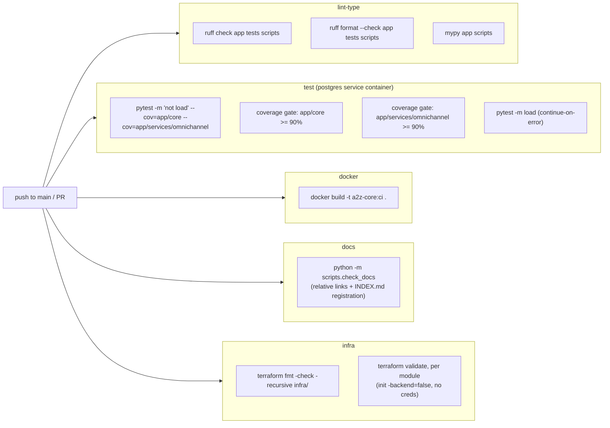

# CI/CD

> Part of the [documentation index](README.md). Source: [`.github/workflows/ci.yml`](../.github/workflows/ci.yml). See also: [testing](testing.md), [deployment architecture](architecture/deployment.md).
> **Authority:** _reference_ — describes current code; if the two disagree, the code wins.

## Pipeline overview



Triggers: `push` to `main`, and every `pull_request`.

## Job details

### `lint-type`

`ruff check`, `ruff format --check`, `mypy` (strict mode, per
`pyproject.toml`) over `app/`, `tests/`, `scripts/`. Nothing merges without
this passing — it's also a dependency of the `docker` job.

### `test`

Runs with a real `postgres:16-alpine` service container (the **one**
exception to the moto/fakeredis-only test posture — see
[testing](testing.md#how-the-suite-runs-without-any-real-aws)) because
Omni-Channel's Postgres layer has no in-process emulator. Everything else
(DynamoDB, S3, SES, SNS, EventBridge, Secrets Manager, SQS, CloudWatch,
Redis) is mocked in-process via moto/fakeredis — no other service
containers needed.

Two independent coverage gates read from the **same** coverage run
(`app/core` and `app/services/omnichannel`, each ≥90%) — deliberately
separate reports so a dip in one package can't hide behind a healthy
number in the other. The load-test step is `continue-on-error: true`:
advisory, not a merge blocker, since absolute latency numbers are jittery
on shared runners.

### `docker`

Builds the production image (`docker build -t a2z-core:ci .`) — verifies
the multi-stage `Dockerfile` builds cleanly. Depends on `lint-type` passing
first. Does **not** push the image anywhere or deploy it.

### `docs`

Runs `python -m scripts.check_docs` — a stdlib-only, dependency-free gate
(no `pip install`, so it's fast). It fails the build on **(1)** any broken
relative link in a tracked Markdown file, or **(2)** a `docs/` page that
isn't linked from [`docs/INDEX.md`](INDEX.md). This is what keeps the index
honest: a new doc can't be added and silently orphaned, and a renamed/moved
doc can't leave a dangling link. It does **not** check external URLs or
in-page `#anchor` targets — only that relative paths resolve on disk. See
[scripts](scripts.md#check_docspy) for local usage.

### `infra`

`terraform fmt -check -recursive infra/`, then `terraform validate` against
**every module individually** (`infra/modules/*/`), each with
`init -backend=false -input=false` — no state backend or AWS credentials
needed, since this only validates HCL syntax and internal consistency, not
that a real `apply` would succeed. `infra/live/*` compositions are not
separately validated in CI (they use `dependency` blocks with
`mock_outputs` specifically so `validate`/`plan` can run before a first
real apply — see [`infra/README.md`](../infra/README.md)).

## What CI does **not** do

- **No deploy step.** CI validates and builds; it does not `terragrunt
  apply`, push a Docker image to ECR, or update any running ECS
  service/EC2 instance. Deployment is a manual, deliberate action (see
  [deployment architecture](architecture/deployment.md) and
  [`infra/README.md`](../infra/README.md)).
- **No Lambda packaging check.** `scripts/build_lambda.sh` (producing
  `dist/lambda.zip`) is not run in CI — it's invoked manually before a
  Cognito module apply.

## Local reproduction

```bash
pip install -e ".[dev]"
ruff check app tests scripts && ruff format --check app tests scripts && mypy app scripts
python -m scripts.check_docs  # broken links + INDEX.md registration
docker compose up -d          # postgres, redis, localstack (for manual/integration runs)
pytest -m "not load" --cov=app/core --cov=app/services/omnichannel --cov-report=term-missing
docker build -t a2z-core:local .
terraform fmt -check -recursive infra/
```
