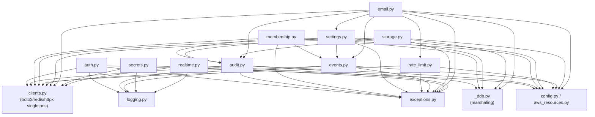

# Core Module Reference

> Part of the [documentation index](../README.md). See also: [architecture overview](../architecture/overview.md).
> **Authority:** _reference_ — describes current code; if the two disagree, the code wins.

`app/core/` is the platform layer every A2Z service imports in-process.
**Core is frozen** (`CLAUDE.md` §15/§16): all modules below meet the Phase 1
bar (unit + integration tests, >90% coverage, cross-org isolation proven,
`ruff` + `mypy --strict` clean) and changes are deliberate, not incremental.

## Module index

| Module | Owns | Backing store | Doc |
|---|---|---|---|
| `auth.py` | JWT validation, claims, test-token factory | Cognito JWKS (in-process 24h cache) | [`auth.md`](auth.md) |
| `membership.py` | User → Org → Role tenancy model | DynamoDB `a2z-core-membership` | [`membership.md`](membership.md) |
| `audit.py` | Append-only compliance/debug event log | DynamoDB `a2z-core-audit` | [`audit.md`](audit.md) |
| `settings.py` | Org config, cached reads, invoice counter | DynamoDB `a2z-core-settings` + Redis | [`settings.md`](settings.md) |
| `rate_limit.py` | Sliding-window rate limiting | Redis | [`rate-limit.md`](rate-limit.md) |
| `events.py` | Cross-service domain events | EventBridge (`a2z-bus`) | [`events-module.md`](events-module.md) |
| `storage.py` | Org-scoped file storage | S3 + DynamoDB `a2z-core-files` | [`storage.md`](storage.md) |
| `email.py` | Multi-tenant sending via SES | SES + DynamoDB `email-events`/`suppression` | [`email.md`](email.md) |
| `secrets.py` | Per-org/per-service credential access | Secrets Manager + Redis | [`secrets.md`](secrets.md) |
| `realtime.py` | Fan-out to connected clients | Redis pub/sub (MVP) | [`realtime.md`](realtime.md) |
| `clients.py`, `logging.py`, `exceptions.py`, `_ddb.py`, `config.py`, `aws_resources.py` | Shared plumbing every module above depends on | — | [`shared-infrastructure.md`](shared-infrastructure.md) |

## Dependency graph

This is exactly the build order from `CLAUDE.md` §13 Phase 1: modules are
listed shallowest-dependency-first, and `email.py` is last because it
composes the most (settings + suppression + rate_limit + audit + events).

## Cross-cutting conventions (apply to every module)

- **Async everywhere I/O happens.** Every function that touches AWS,
  Postgres, or Redis is `async def`. Sync boto3 calls are wrapped in
  `clients.run_aws(...)` (`asyncio.to_thread`) so they never block the
  event loop.
- **Typed errors only.** Every module raises a subclass of `CoreError`
  (`app/core/exceptions.py`) — never a bare `Exception`, never an error
  dict. See [`shared-infrastructure.md`](shared-infrastructure.md#error-hierarchy).
- **Org-scoped or it doesn't exist.** See
  [data flow](../architecture/data-flow.md#the-org-scoping-invariant) for
  the per-store enforcement mechanism.
- **Audit mutations, not reads.** Every module that mutates state calls
  `core.audit.log_audit(...)` in the same function, before returning.
- **One place builds clients.** `core/clients.py` is the only file that
  constructs a boto3, Redis, or httpx client — see
  [`shared-infrastructure.md`](shared-infrastructure.md).

## Extending Core

Core is frozen, but not immutable — `secrets.py` and `realtime.py` were
added later via a documented "unfreeze protocol"
(`app/services/omnichannel/CLAUDE.md` §6.2): meet the same bar as every
other module (tests, coverage, cross-org isolation, docstrings with
performance targets), update the module table in root `CLAUDE.md`, re-run
the *entire* Core suite green, then re-freeze. Do not add a service-specific
shortcut directly to Core outside this protocol — see `CLAUDE.md` §13
Phase 2 rule.
