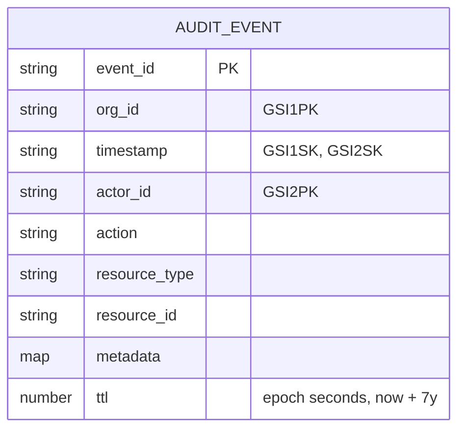

# `core.audit` — Append-Only Audit Log

> Part of the [Core module reference](README.md). Source: [`app/core/audit.py`](../../app/core/audit.py). See also: [data flow](../architecture/data-flow.md), [retention policy](../retention.md).
> **Authority:** _reference_ — describes current code; if the two disagree, the code wins.

## Purpose & responsibilities

The compliance/debugging record every Core mutation writes to. Append-only:
items are never updated or deleted (they expire via TTL instead). Every
other module that mutates state calls `log_audit(...)` before returning.

## Internal architecture

Single DynamoDB table (`a2z-core-audit`), base key `event_id` (a `uuid4`),
with two GSIs for the two query shapes that matter:



- **GSI1** (`org_id`, `timestamp`) — "all events for this org, newest first"
  — the only query shape `get_audit_events` uses; `org_id` is a required
  parameter, so there is no code path that scans across orgs.
- **GSI2** (`actor_id`, `timestamp`) exists in the table schema
  (`app/aws_resources.py`) for a future "all actions by this actor" query,
  though `get_audit_events` today only queries GSI1.

## Public API

| Function | Signature | Notes |
|---|---|---|
| `log_audit` | `(org_id, actor_id, action: ActionType \| str, resource_type, resource_id, metadata=None) -> AuditEvent` | Single `PutItem`. < 50ms target |
| `get_audit_events` | `(org_id, action_type=None, actor_id=None, resource_id=None, from_time=None, to_time=None, limit=100) -> list[AuditEvent]` | GSI1 query, optional filters, newest-first. < 500ms target |

`action` accepts either a Core-defined `ActionType` enum member or **any
service-defined dotted string** — the log is not closed to Core's own
action vocabulary; Omni-Channel's `routing.py` logs
`"conversation.assigned"` as a plain string, for example.

`ActionType` values defined today: `ORG_CREATED`, `MEMBER_ADDED`,
`MEMBER_ROLE_CHANGED`, `MEMBER_REMOVED`, `EMAIL_SENT`, `EMAIL_BOUNCED`,
`EMAIL_COMPLAINED`, `EMAIL_UNSUPPRESSED`, `FILE_UPLOADED`, `FILE_DELETED`,
`SETTINGS_CHANGED`.

## Configuration

| Variable | Default | Meaning |
|---|---|---|
| `DDB_AUDIT_TABLE` | `a2z-core-audit` | Physical table name |

Retention is hardcoded to 7 years (`_AUDIT_RETENTION = timedelta(days=365*7)`)
per `CLAUDE.md` §11 — not currently configurable per org or environment.

## Dependencies

`core.clients`, `core._ddb`, `core.exceptions` (`AuditError`),
`core.logging`. No dependency on any other Core module with business logic
— everything else depends on *this* one.

## Data model

```python
class AuditEvent(BaseModel):
    event_id: str; org_id: str; timestamp: datetime; actor_id: str
    action: str; resource_type: str; resource_id: str
    metadata: dict[str, Any] = {}
```

## Error handling

| Error | Status | Raised when |
|---|---|---|
| `AuditError` | 500 | The `PutItem`/`Query` call fails for any reason |

`log_audit`/`get_audit_events` re-raise any underlying exception (including
non-`ClientError` ones) as `AuditError` — callers never see a raw boto3
exception from this module.

## Security considerations

- **`org_id` is mandatory** on both read and write — there is no function
  signature that permits an org-less audit read.
- **TTL, not a cleanup job**: every item gets `ttl = now + 7 years` at write
  time; DynamoDB expires it for free (`docs/retention.md`). No scheduled job
  exists or is needed.
- Audit rows are never mutated post-write — even a later status change
  (e.g. an email later bouncing) is logged as a **new** row
  (`EMAIL_BOUNCED`) rather than editing the original `EMAIL_SENT` row.

## Example usage

```python
from app.core.audit import log_audit, get_audit_events, ActionType

await log_audit(org_id, actor_id, ActionType.MEMBER_ADDED, "user", new_user_id, {"role": "admin"})

recent = await get_audit_events(org_id, action_type=ActionType.MEMBER_ADDED, limit=20)
```

## Extension points

- New action types: add to `ActionType`, or just pass a service-defined
  dotted string — no registration required. Document new event *types* (if
  they're also published as EventBridge events) in
  [`docs/events.md`](../events.md); audit action strings and EventBridge
  `event_type`s happen to match today (e.g. both use `"member.added"`) but
  are two independent systems — see
  [event-driven architecture](../architecture/event-driven-architecture.md).
- GSI2 (`actor_id`/`timestamp`) is provisioned but unused by any current
  function — a future "actions by this actor" query can be added without an
  infra change.

## Known limitations

- No structured way to query by `resource_type` alone (only via the
  `FilterExpression` on `action`/`actor_id`/`resource_id`, which scans the
  GSI1 partition rather than using an index) — fine at current audit
  volumes, would need its own GSI at larger scale.
