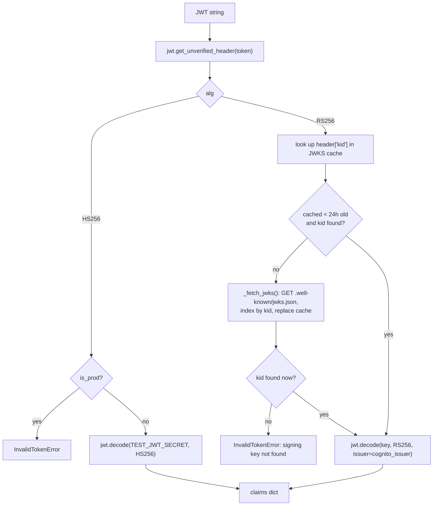

# `core.auth` — Authentication

> Part of the [Core module reference](README.md). Source: [`app/core/auth.py`](../../app/core/auth.py). See also: [auth & authorization architecture](../architecture/auth-and-authorization.md).
> **Authority:** _reference_ — describes current code; if the two disagree, the code wins.

## Purpose & responsibilities

Validates a bearer JWT and returns its claims. Nothing more — no sessions,
no authorization decisions (see
[auth & authorization](../architecture/auth-and-authorization.md) for why
that split exists).

## Internal architecture



The JWKS cache is a **module-level tuple** `(fetched_at, keys_by_kid)`, not
Redis — see the "Why in-process, not Redis" note below.

## Public API

| Function | Signature | Notes |
|---|---|---|
| `validate_jwt` | `(token: str) -> dict[str, Any]` | Dispatches to the RS256 or HS256 path by the token's `alg` header |
| `get_current_user_from_request` | `(request: Any) -> dict[str, Any]` | Extracts `Authorization: Bearer <token>` from any object with `.headers`, then calls `validate_jwt` |
| `create_test_token` | `(sub: str, email: str, *, expires_in: int = 3600, email_verified: bool = True) -> str` | Mints an HS256 token; raises in prod |

Claims returned: `sub`, `email`, `email_verified`, `cognito:username`,
`token_use`, `iat`, `exp`.

## Configuration / environment variables

| Variable | Default | Meaning |
|---|---|---|
| `COGNITO_USER_POOL_ID` | `""` | Used to build `cognito_issuer` and the JWKS URL |
| `COGNITO_REGION` | `us-east-1` | Region component of `cognito_issuer` |
| `TEST_JWT_SECRET` | `local-development-only-not-a-real-secret` | HS256 signing key for test tokens |
| `A2Z_ENV` | `local` | When `"prod"`, HS256 tokens are refused on both mint and validate |

## Dependencies

`app.config.settings`, `app.core.exceptions` (`InvalidTokenError`,
`MissingTokenError`), `app.core.logging`, `python-jose`. No dependency on
any other `core/*` module — the shallowest module in the dependency graph.

## Data model

No persisted model — this module is pure validation logic plus an
in-process cache. Claims are returned as a plain `dict[str, Any]`.

## Error handling

| Error | Status | Raised when |
|---|---|---|
| `MissingTokenError` | 401 | No token / no `Authorization` header |
| `InvalidTokenError` | 401 | Malformed header, bad signature, expired, unknown `kid`, or an HS256 token presented in prod |

## Security considerations

- **RS256 only in prod.** `validate_jwt` checks the token's own `alg` header
  and routes HS256 tokens to `_validate_test_token`, which raises
  immediately if `settings().is_prod`. Test tokens cannot be forged into
  passing as Cognito tokens because they use different keys and algorithms.
- **Issuer is checked** (`issuer=settings().cognito_issuer`) on the RS256
  path — a JWT from a different Cognito pool (or a different AWS account)
  fails validation even if it happens to be well-formed RS256.
- **Audience is deliberately not verified** (`verify_aud: False`) — the
  design accepts any client of the same user pool; app-client-specific
  checks, if ever needed, are the caller's job.
- **JWTs are never logged** — see
  [`shared-infrastructure.md`](shared-infrastructure.md) redaction rules.

### Why the JWKS cache is in-process, not Redis

Documented trade-off, not an oversight: Cognito rotates signing keys rarely,
an in-memory 24h cache keeps the hot auth path free of a network hop, and it
avoids introducing a second (synchronous) Redis client just for this. The
cost: each process instance maintains its own cache and independently
re-fetches once per 24h (or immediately on an unknown `kid`, treated as a
possible rotation) — there is no cross-instance cache coherence, which is
fine because JWKS fetches are cheap and infrequent, not because it doesn't
matter.

## Example usage

```python
from app.core import auth

# In a FastAPI dependency (see app/dependencies.py):
def current_user(request: Request) -> dict[str, Any]:
    return auth.get_current_user_from_request(request)

# In tests:
token = auth.create_test_token("auth0|test-user", "test@example.com")
claims = auth.validate_jwt(token)
assert claims["sub"] == "auth0|test-user"
```

## Extension points

- Adding a claim consumers need: nothing to change here — `validate_jwt`
  already returns every claim Cognito puts on the token; callers just read
  more keys from the dict.
- A cross-instance JWKS cache (Redis-backed) is a deferred optimization if
  the in-process 24h TTL ever proves insufficient — not currently planned.

## Known limitations

- No refresh-token handling — this module only validates access/ID tokens
  presented on a request; refresh flows are a client-side (or future
  API-Gateway-level) concern.
- No revocation check beyond `exp` — a Cognito-side user disablement is not
  reflected until the token naturally expires (this is standard JWT
  behavior, not specific to this implementation).
