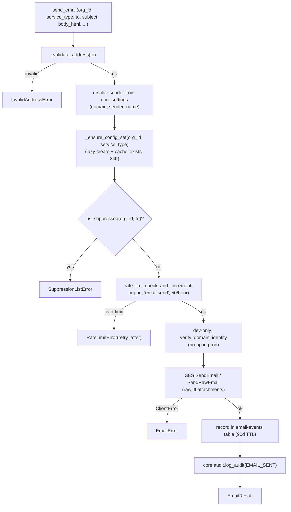
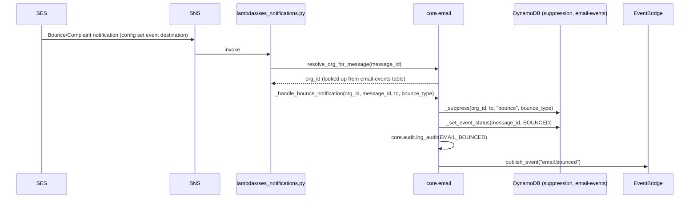

# `core.email` — Multi-Tenant Email via SES

> Part of the [Core module reference](README.md). Source: [`app/core/email.py`](../../app/core/email.py). See also: [data flow](../architecture/data-flow.md), [event-driven architecture](../architecture/event-driven-architecture.md).

## Purpose & responsibilities

Sends email on behalf of an org via SES, with per-org sending-reputation
isolation, suppression-list enforcement, and rate limiting. This is the
module every channel that sends email goes through — including Omni-Channel's
email adapter, which never calls boto3 SES directly.

## Internal architecture — `send_email` pipeline



Bounces and complaints arrive **out of band** via SES → SNS →
`app/lambdas/ses_notifications.py`, which calls back into this module's
`_handle_bounce_notification` / `_handle_complaint_notification`:



## Public API

| Function | Signature | Notes |
|---|---|---|
| `send_email` | `(org_id, service_type: ServiceType, to, subject, body_html, body_text=None, attachments=None, reply_to=None, metadata=None) -> EmailResult` | Full pipeline above. < 500ms target (waits for SES acceptance) |
| `get_email_status` | `(message_id) -> EmailStatus` | < 50ms |
| `resolve_org_for_message` | `(message_id) -> str \| None` | Used by the SNS Lambda to scope a bounce back to its org |
| `get_suppression_list` | `(org_id) -> dict[str, list[str]]` | `{"bounced": [...], "complained": [...]}`. < 100ms |
| `unsuppress_email` | `(org_id, email) -> None` | Removes an address from suppression; logs `EMAIL_UNSUPPRESSED` |

`ServiceType` enum: `INVOICING`, `OMNICHANNEL`, `APPOINTMENTS`, `EXPENSES` —
the sender address is always `{service_type}@{domain}`.

`EmailStatus` enum: `QUEUED`, `SENT`, `DELIVERED`, `BOUNCED`, `COMPLAINED`,
`REJECTED`.

## Configuration

| Variable | Default | Meaning |
|---|---|---|
| `SES_NOTIFICATIONS_TOPIC_ARN` | `None` (unset) | SNS topic each lazily-created config set's Bounce/Complaint event destination points at. Unset = bounce tracking silently skipped (logged, not an error) — fine for bare local dev without SNS |
| `DDB_EMAIL_EVENTS_TABLE` | `a2z-core-email-events` | Delivery tracking, 90-day TTL |
| `DDB_SUPPRESSION_TABLE` | `a2z-core-suppression` | No TTL — indefinite |

Rate limit (`email.send`: 50/hour/org) comes from
`app.config.RATE_LIMITS`, not a local constant — see
[`core/rate-limit.md`](rate-limit.md).

## Dependencies

`core.settings` (sender domain/name), `core.rate_limit`, `core.audit`,
`core.events`, `core.clients`, `core._ddb`, `core.exceptions`. The module
with the most Core-internal dependencies — deliberately built last in
Phase 1 (`CLAUDE.md` §13) because it composes everything else.

## Data model

```python
@dataclass
class EmailResult:
    message_id: str; status: EmailStatus; timestamp: datetime
    external_message_id: str
```

Email-events table row: `message_id` (PK), `org_id`, `timestamp`, `to`,
`service_type`, `status`, `subject`, `metadata`, `ttl`.

Suppression table row: `org_id` + `email` (composite key), `reason`
(`"bounce"` or `"complaint"`), `timestamp`, `bounce_type` (nullable),
`service_type` (**nullable, always `None` today** — see the scope decision
below).

## Error handling

| Error | Status | Raised when |
|---|---|---|
| `InvalidAddressError` | 400 | `to` doesn't match a plausible email regex |
| `SuppressionListError` | 400 | `to` is on the org's suppression list |
| `RateLimitError` | 429 | Org exceeded 50 sends/hour |
| `EmailError` | 400 | Any SES failure, unknown `message_id` in `get_email_status`, or a failed SES event-destination attachment |

## Security considerations

- **Per-org SES config set** (`{org_id}-{service_type}`) isolates each
  org's sending reputation — one org's bounces/complaints can't affect
  another's deliverability standing within SES.
- **Suppression is checked before every send** — a hard-bounced or
  complained address is blocked from receiving further mail for that org
  until explicitly unsuppressed.
- **Suppression scope is per-org, shared across that org's services, by
  deliberate design** (`CLAUDE.md` §8): the table's `service_type` column
  is nullable and currently always written as `None` — this is intentional
  headroom for narrowing to per-service suppression later, **not** a bug to
  "fix" by populating it. A hard-bounced address is bad everywhere for that
  business, is the reasoning.
- **Local/dev-only domain auto-verification**: outside prod, `send_email`
  calls `verify_domain_identity` before sending so sends succeed against
  moto/LocalStack without a manual step. In prod this never runs — the
  org's domain is verified once at onboarding, not on every send.
- `_DEFAULT_DOMAIN = "example.com"` is the fallback sender domain for an
  org that hasn't configured its own — see
  [`docs/omnichannel-decisions.md`](../omnichannel-decisions.md) decision
  #3 for the planned (not yet implemented) 30-day grace-period behavior
  around this fallback.

## Example usage

```python
from app.core.email import send_email, ServiceType

result = await send_email(
    org_id, ServiceType.INVOICING, "customer@example.com",
    subject="Your invoice is ready", body_html="<p>...</p>",
)
```

## Extension points

- New `ServiceType` values: add to the enum — the sender address and
  config-set name derive from it automatically.
- Attachments: `send_email(..., attachments=[{"filename", "content",
  "mime_type"}])` switches to `SendRawEmail` with a MIME-multipart body
  automatically — no separate function.

## Known limitations

- No templating — services render their own HTML/text and pass it in;
  `CLAUDE.md` §14 states this explicitly as out of Core's scope.
- `get_email_status`/bounce resolution depend on the email-events row still
  existing; since it has a 90-day TTL, a bounce notification for a message
  older than that resolves `org_id` to `None` and is logged as
  `ses.notification.unresolved` rather than processed — an accepted gap for
  very late bounces.
