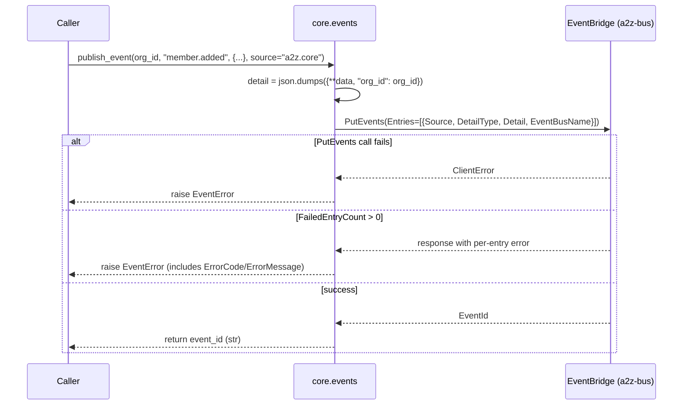

# `core.events` — Cross-Service Domain Events (Publisher)

> Part of the [Core module reference](README.md). Source: [`app/core/events.py`](../../app/core/events.py). See also: [event-driven architecture](../architecture/event-driven-architecture.md), [event catalog](../events.md).

> **Naming note**: this doc covers the `core.events` *module* (the
> EventBridge publisher). For the full catalog of event types currently in
> production, see [`docs/events.md`](../events.md). For how this relates to
> `core.realtime` (a completely different mechanism, easy to conflate), see
> [event-driven architecture](../architecture/event-driven-architecture.md).

## Purpose & responsibilities

The single function every Core module and service calls to publish a
domain event to EventBridge. Core owns only the publisher — subscribers are
built by whichever service needs to react to an event, in that service's
own code and infra.

## Internal architecture



## Public API

```python
async def publish_event(
    org_id: str, event_type: str, data: dict[str, Any], *, source: str = "a2z.core",
) -> str
```

| Param | Meaning |
|---|---|
| `org_id` | Always injected into `detail` — subscribers can scope by org without inspecting nested fields |
| `event_type` | Dotted string, becomes `DetailType` (e.g. `"member.added"`) |
| `data` | JSON-serializable payload; `default=str` handles non-JSON-native types (e.g. `datetime`) |
| `source` | Producer namespace: `"a2z.core"` (default), `"a2z.omnichannel"`, or (once built) `"a2z.invoicing"` |

Returns the EventBridge-assigned `EventId`.

## Configuration

| Variable | Default | Meaning |
|---|---|---|
| `EVENT_BUS_NAME` | `a2z-bus` | The one custom bus every event goes to |

## Dependencies

`core.clients` (`eventbridge()`), `core.exceptions` (`EventError`),
`core.logging`. No dependency on any other Core business-logic module —
`membership.py`, `settings.py`, and `email.py` all depend on *this*.

## Data model

No persisted model. The wire shape is: `Source`, `DetailType`, `Detail`
(a JSON string — `{**data, "org_id": org_id}`), `EventBusName`.

## Error handling

| Error | Status | Raised when |
|---|---|---|
| `EventError` | 500 | `PutEvents` itself raises a `ClientError`, or the call succeeds but EventBridge rejects the entry (`FailedEntryCount > 0`) |

This is **fire-and-forget from the business-logic flow's perspective** in
the sense that a caller typically doesn't branch on the return value, but
it is **not silently dropped on failure** — the `await` is real and
`EventError` propagates like any other `CoreError`.

## Security considerations

- `org_id` is always present in `detail`, by construction — there is no
  call shape that publishes an event without an org scope.
- The event payload is only as safe as what the caller passes in `data` —
  this module does not redact or validate payload contents; callers should
  not put secrets in event payloads (none currently do).

## Example usage

```python
from app.core.events import publish_event

event_id = await publish_event(
    org_id, "member.role_changed",
    {"user_id": user_id, "old_role": "member", "new_role": "admin"},
)
```

## Extension points

Adding a new event type requires no code change here — call
`publish_event` with a new `event_type` string and add a row to
[`docs/events.md`](../events.md). Building a *subscriber* for an event is
entirely the consuming service's responsibility: an EventBridge rule
(`source` + `detail-type` match) targeting that service's own SQS queue,
plus worker code to consume it — see
[Omni-Channel's cross-service rule](../services/omnichannel/message-flow.md#cross-service-events)
for the one subscriber built so far (a rule for `a2z.invoicing` /
`invoice.paid`, currently pointed at nothing since Invoicing doesn't exist).

## Known limitations

- No batching — `publish_event` always sends one `PutEvents` entry per
  call, even though the API supports up to 10 per request. Not a bottleneck
  at current event volumes.
- No local dead-letter/retry beyond what `PutEvents`'s own AWS SDK retry
  config provides (`core.clients`'s bounded `max_attempts=3`); a
  persistently failing publish surfaces as an `EventError` to the caller,
  who must decide whether to fail the whole request or log-and-continue
  (every current caller lets it propagate).
