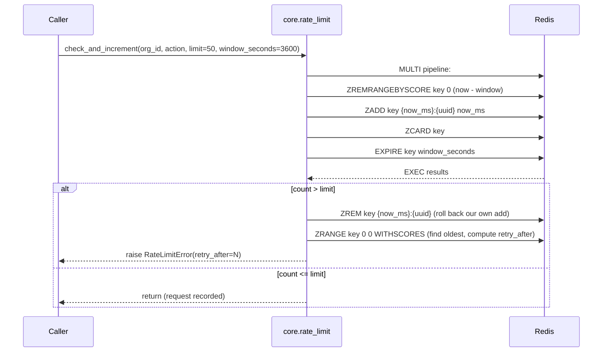

# `core.rate_limit` — Sliding-Window Rate Limiting

> Part of the [Core module reference](README.md). Source: [`app/core/rate_limit.py`](../../app/core/rate_limit.py).

## Purpose & responsibilities

A general-purpose, per-org (or per-org-per-action) rate limiter backed by
Redis. Originally built to enforce email's "50/hour/org" limit, but
deliberately generic — any action can register a limit in
`app.config.RATE_LIMITS` and call this module.

## Internal architecture

A Redis **sorted set** per `{org_id, action}`, one member per recent
request, scored by timestamp in milliseconds:



The "add then check, roll back on over-limit" approach keeps the whole
operation atomic enough (via a Redis pipeline in `transaction=True` mode)
without a Lua script — deliberately, so it also runs correctly against
**fakeredis** in tests, which doesn't support custom Lua scripts as
faithfully as a real Redis server.

## Public API

| Function | Signature | Notes |
|---|---|---|
| `check_and_increment` | `(org_id, action, *, limit: int, window_seconds: int) -> None` | Raises `RateLimitError` if over limit; otherwise returns and the request is recorded. < 10ms target |
| `limits_for` | `(action: str) -> tuple[int, int]` | Looks up `(limit, window_seconds)` from `app.config.RATE_LIMITS`; raises `KeyError` if unregistered |

Key format: `ratelimit:{org_id}:{action}`.

## Configuration

Limits are **not** parameters callers invent per call site — they come from
one registry:

```python
# app/config.py
RATE_LIMITS: dict[str, tuple[int, int]] = {
    "email.send": (50, 3600),             # 50 / hour / org
    "ai.parse.user": (30, 60),            # 30 / min / user (future: Invoicing)
    "ai.parse.org": (500, 86400),         # 500 / day / org (future: Invoicing)
    "omnichannel.whatsapp.send": (80, 1), # Meta pair-rate ceiling
}
```

`CLAUDE.md` §7 requires this centralization specifically so services don't
scatter hardcoded literals — see
[Omni-Channel's `handlers.send_reply`](../services/omnichannel/message-flow.md)
for a caller that reads `RATE_LIMITS` directly rather than calling
`limits_for` (both patterns exist in the codebase; both end up reading the
same registry).

## Dependencies

`core.clients` (`redis_client()`), `core.exceptions` (`RateLimitError`).
No dependency on any other Core business-logic module.

## Data model

No persisted model — state lives entirely in the Redis sorted set, which
self-expires (`EXPIRE key window_seconds` on every call) if a key goes
idle.

## Error handling

| Error | Status | Raised when |
|---|---|---|
| `RateLimitError` | 429 | The window already holds `>= limit` entries; carries `retry_after` (seconds, computed from the oldest in-window entry's age) |

`RateLimitError` is a **direct** `CoreError` subclass, not nested under
`EmailError` — see
[`shared-infrastructure.md`](shared-infrastructure.md#error-hierarchy) for
why that's deliberate. The FastAPI exception handler
(`app/main.py::core_error_handler`) sets the `Retry-After` HTTP header from
`exc.retry_after` automatically for any `RateLimitError`.

## Security considerations

- **Org-scoped by construction** — the Redis key always includes `org_id`;
  one org's traffic can never exhaust another org's quota.
- The sliding window (not a fixed bucket) means a burst right at a window
  boundary can't double the effective rate — old entries age out
  continuously via `ZREMRANGEBYSCORE`, not in one reset step.

## Example usage

```python
from app.core import rate_limit

limit, window = rate_limit.limits_for("email.send")
await rate_limit.check_and_increment(org_id, "email.send", limit=limit, window_seconds=window)
# raises RateLimitError if the org already sent 50 emails in the last hour
```

## Extension points

Adding a new rate-limited action is a one-line registry addition in
`app/config.py::RATE_LIMITS` — no code change in this module itself.

## Known limitations

- Per-process retry math (`_retry_after`) reads the same Redis key it just
  wrote to, so it's consistent across processes, but the sorted-set
  approach means very high-cardinality actions (many distinct
  `{org_id, action}` pairs, each with its own key) create one Redis key
  per pair — acceptable at current scale, worth knowing before using this
  for something with millions of distinct scopes.
