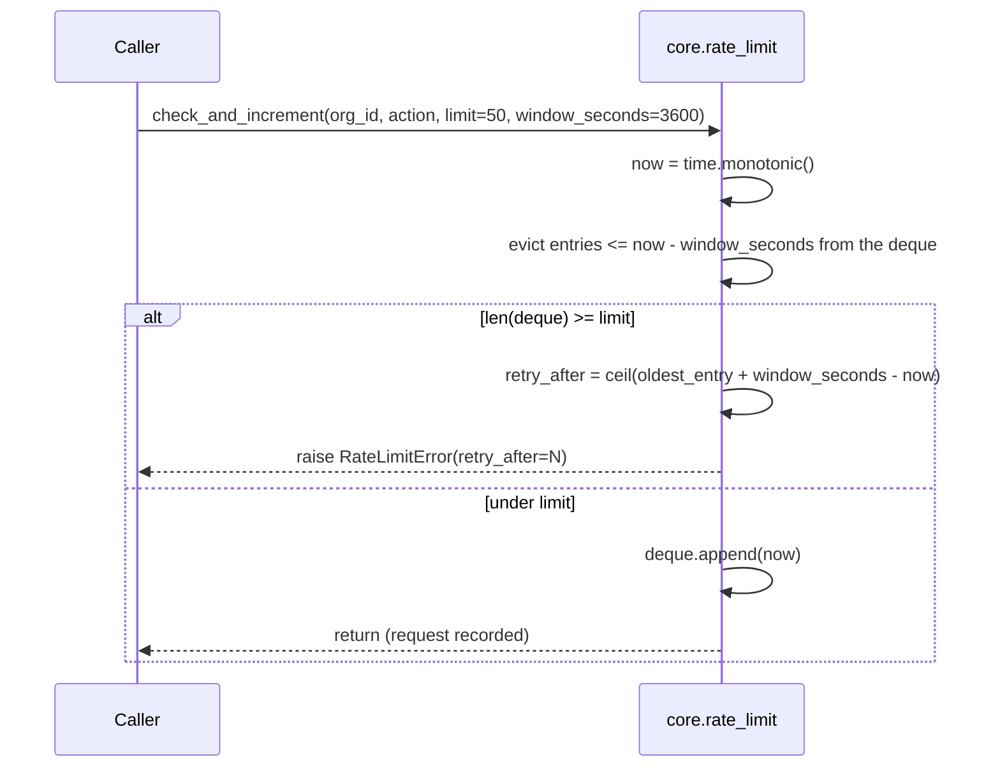

# `core.rate_limit` — Sliding-Window Rate Limiting

> Part of the [Core module reference](README.md). Source: [`app/core/rate_limit.py`](../../app/core/rate_limit.py). See also: [single-box-mvp.md](../architecture/single-box-mvp.md).
> **Authority:** _reference_ — describes current code; if the two disagree, the code wins.

## Purpose & responsibilities

A general-purpose, per-org (or per-org-per-action) rate limiter. Originally
built to enforce email's "50/hour/org" limit, but deliberately generic — any
action can register a limit in `app.config.RATE_LIMITS` and call this
module.

## Internal architecture

Single-box MVP ([single-box-mvp.md](../architecture/single-box-mvp.md)):
an in-process `dict[tuple[str, str], deque[float]]`, one `deque` of
monotonic timestamps per `{org_id, action}` — no Redis, no network hop.
This is only correct because there is exactly one process ever running
this code; see that doc's "Single-process is load-bearing" section.


```mermaid
sequenceDiagram
    participant Caller
    participant RL as core.rate_limit

    Caller->>RL: check_and_increment(org_id, action, limit=50, window_seconds=3600)
    RL->>RL: now = time.monotonic()
    RL->>RL: evict entries <= now - window_seconds from the deque
    alt len(deque) >= limit
        RL->>RL: retry_after = ceil(oldest_entry + window_seconds - now)
        RL-->>Caller: raise RateLimitError(retry_after=N)
    else under limit
        RL->>RL: deque.append(now)
        RL-->>Caller: return (request recorded)
    end
```

There is no "add optimistically, then roll back on overflow" dance here —
that existed only to make the read+write atomic across a Redis pipeline
network hop. On a single event loop with no `await` in the critical
section, checking the limit before recording is sufficient; there's
nothing to roll back.

## Public API

| Function | Signature | Notes |
|---|---|---|
| `check_and_increment` | `(org_id, action, *, limit: int, window_seconds: int) -> None` | Raises `RateLimitError` if over limit; otherwise returns and the request is recorded. < 10ms target (in practice, microseconds — no I/O) |
| `limits_for` | `(action: str) -> tuple[int, int]` | Looks up `(limit, window_seconds)` from `app.config.RATE_LIMITS`; raises `KeyError` if unregistered |
| `reset` | `() -> None` | Clears all in-process state. Tests only (`tests/conftest.py`'s autouse `_reset_core_state` fixture) |

State key: `(org_id, action)` tuple — no string formatting, no key prefix.

## Configuration

Limits are **not** parameters callers invent per call site — they come from
one registry:

```python
# app/config.py
RATE_LIMITS: dict[str, tuple[int, int]] = {
    "email.send": (50, 3600),             # 50 / hour / org
    "ai.parse.user": (30, 60),            # 30 / min / user (future: Invoicing)
    "ai.parse.org": (500, 86400),         # 500 / day / org (future: Invoicing)
    "omnichannel.whatsapp.send": (80, 1), # Meta pair-rate ceiling
}
```

`CLAUDE.md` §7 requires this centralization specifically so services don't
scatter hardcoded literals — see
[Omni-Channel's `handlers.send_reply`](../services/omnichannel/message-flow.md)
for a caller that reads `RATE_LIMITS` directly rather than calling
`limits_for` (both patterns exist in the codebase; both end up reading the
same registry).

## Dependencies

`app.config` (`RATE_LIMITS`), `core.exceptions` (`RateLimitError`). No
dependency on any other Core business-logic module, and — deliberately —
none on `core.clients` anymore; there's no client to build.

## Data model

No persisted model — state lives entirely in the in-process `dict`, pruned
lazily (a key's deque is deleted once it empties on a subsequent call, so
memory doesn't grow unbounded across every org/action pair that was ever
touched once).

## Error handling

| Error | Status | Raised when |
|---|---|---|
| `RateLimitError` | 429 | The window already holds `>= limit` entries; carries `retry_after` (seconds, computed from the oldest in-window entry's age) |

`RateLimitError` is a **direct** `CoreError` subclass, not nested under
`EmailError` — see
[`shared-infrastructure.md`](shared-infrastructure.md#error-hierarchy) for
why that's deliberate. The FastAPI exception handler
(`app/main.py::core_error_handler`) sets the `Retry-After` HTTP header from
`exc.retry_after` automatically for any `RateLimitError`.

## Security considerations

- **Org-scoped by construction** — the state key always includes `org_id`;
  one org's traffic can never exhaust another org's quota.
- The sliding window (not a fixed bucket) means a burst right at a window
  boundary can't double the effective rate — old entries age out
  continuously on every call, not in one reset step.

## Example usage

```python
from app.core import rate_limit

limit, window = rate_limit.limits_for("email.send")
await rate_limit.check_and_increment(org_id, "email.send", limit=limit, window_seconds=window)
# raises RateLimitError if the org already sent 50 emails in the last hour
```

## Extension points

Adding a new rate-limited action is a one-line registry addition in
`app/config.py::RATE_LIMITS` — no code change in this module itself.

## Known limitations

- **Single-process only** — see
  [single-box-mvp.md](../architecture/single-box-mvp.md). Running more than
  one process (`--workers 2`, or a separate worker process) would give each
  its own budget per `{org_id, action}`, silently doubling every configured
  limit, including provider pair-rate ceilings like
  `omnichannel.whatsapp.send`. Do not add a second process without
  revisiting this module first.
- High-cardinality actions (many distinct `{org_id, action}` pairs) each
  hold their own `deque` in memory for as long as they're active —
  acceptable at current scale, worth knowing before using this for
  something with millions of distinct scopes.
