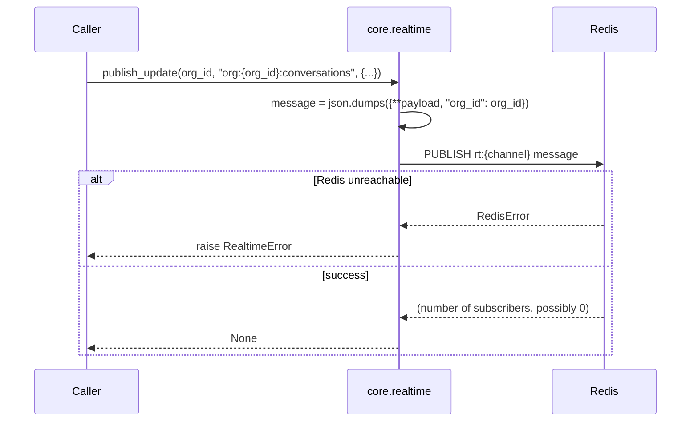

# `core.realtime` — Fan-Out to Connected Clients

> Part of the [Core module reference](README.md). Source: [`app/core/realtime.py`](../../app/core/realtime.py). See also: [event-driven architecture](../architecture/event-driven-architecture.md), [Omni-Channel realtime inbox](../services/omnichannel/routing-and-realtime.md).

## Purpose & responsibilities

Publishes a real-time update that connected clients (browsers) should see —
new message, assignment change, delivery status tick. **Not** a durable,
cross-service event mechanism; see
[event-driven architecture](../architecture/event-driven-architecture.md)
for the explicit contrast with `core.events`.

## Internal architecture



`PUBLISH` never blocks on a receiver — if nobody is subscribed to
`rt:{channel}` right now, the message is simply not delivered to anyone
(no queueing, no replay). This is deliberate: realtime updates are a
"nice-to-have if you're watching," not a guaranteed-delivery channel.

## Public API

```python
async def publish_update(org_id: str, channel: str, payload: dict[str, Any]) -> None
```

| Param | Meaning |
|---|---|
| `org_id` | Injected into the payload as defense-in-depth; callers should *also* scope `channel` itself to the org (e.g. `f"org:{org_id}:conversations"`) so a subscriber can never cross an org boundary by construction |
| `channel` | Logical fan-out channel name (caller-defined) |
| `payload` | JSON-serializable update body |

The actual Redis key is `rt:{channel}` — the `rt:` prefix is this module's
contract with any relay that subscribes (see the note on duplication in
[event-driven architecture](../architecture/event-driven-architecture.md#redis-pubsub--realtime-ui-fan-out)).

## Configuration

No dedicated environment variable — uses the shared `REDIS_URL` client from
`core.clients.redis_client()`.

## Dependencies

`core.clients`, `core.exceptions` (`RealtimeError`), `core.logging`. No
dependency on any other Core business-logic module.

## Data model

No persisted model — this is a pure pub/sub publish call. There is no
history; a client that wasn't subscribed when an update was published never
sees it.

## Error handling

| Error | Status | Raised when |
|---|---|---|
| `RealtimeError` | 502 | The publish itself failed (Redis unreachable or misconfigured) — **not** raised for "nobody was listening," which is a normal outcome |

## Security considerations

- Org-scoping is **advisory at this layer**: `publish_update` injects
  `org_id` into the payload but does not itself enforce that `channel` is
  org-scoped — that discipline is entirely the caller's. Every current
  caller (Omni-Channel's `worker.py`/`routing.py`) follows the
  `org:{org_id}:...` / `user:{user_id}:...` convention, but this module
  cannot detect a caller that doesn't.
- No authentication happens here — by the time a caller reaches
  `publish_update`, authorization for the underlying action (e.g. "can this
  user see this conversation") has already been checked upstream. The
  *subscriber* side (e.g. the SSE relay) is responsible for re-checking
  membership before letting a browser subscribe to an org's channel — see
  [Omni-Channel's realtime inbox](../services/omnichannel/routing-and-realtime.md).

## Example usage

```python
from app.core.realtime import publish_update

await publish_update(
    org_id, f"org:{org_id}:conversations",
    {"type": "message.received", "conversation_id": conv_id, "message_id": msg_id},
)
```

## Extension points

The contract (`publish_update(org_id, channel, payload)`) is designed to
outlive its current transport. At MVP the transport is Redis pub/sub,
relayed to browsers as Server-Sent Events by a service-owned process (not
Core — see [routing & realtime](../services/omnichannel/routing-and-realtime.md)).
At distribution scale, the transport becomes an AppSync GraphQL mutation
signed with SigV4 (via the `boto3_session()` singleton already provisioned
in `core.clients` for this purpose) — **callers never change**, only the
implementation inside this one function.

## Known limitations

- No delivery guarantee, no replay, no history — by design. If a feature
  ever needs "catch me up on what I missed while disconnected," that is a
  different mechanism (e.g. a read API like Omni-Channel's `inbox.py`), not
  this one.
- No fan-out batching — one `PUBLISH` per `publish_update` call.
