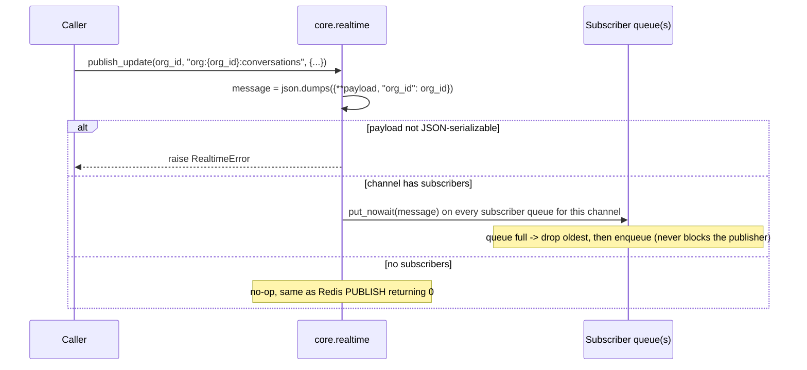

# `core.realtime` — Fan-Out to Connected Clients

> Part of the [Core module reference](README.md). Source: [`app/core/realtime.py`](../../app/core/realtime.py). See also: [event-driven architecture](../architecture/event-driven-architecture.md), [Omni-Channel realtime inbox](../services/omnichannel/routing-and-realtime.md), [single-box-mvp.md](../architecture/single-box-mvp.md).
> **Authority:** _reference_ — describes current code; if the two disagree, the code wins.

## Purpose & responsibilities

Publishes a real-time update that connected clients (browsers) should see —
new message, assignment change, delivery status tick. **Not** a durable,
cross-service event mechanism; see
[event-driven architecture](../architecture/event-driven-architecture.md)
for the explicit contrast with `core.events`.

## Internal architecture

Single-box MVP ([single-box-mvp.md](../architecture/single-box-mvp.md)):
the transport is an in-process publish/subscribe broker — a plain
`dict[str, set[asyncio.Queue[str]]]` mapping channel key to subscriber
queues, no Redis, no network hop. This is only correct because the whole
platform (API + the Omni-Channel worker, which runs as a lifespan
background task in the same process) is one Python process on one event
loop — see that doc's "Single-process is load-bearing" section before
assuming this scales to a second process.


```mermaid
sequenceDiagram
    participant Caller
    participant RT as core.realtime
    participant Sub as Subscriber queue(s)

    Caller->>RT: publish_update(org_id, "org:{org_id}:conversations", {...})
    RT->>RT: message = json.dumps({**payload, "org_id": org_id})
    alt payload not JSON-serializable
        RT-->>Caller: raise RealtimeError
    else channel has subscribers
        RT->>Sub: put_nowait(message) on every subscriber queue for this channel
        Note over Sub: queue full -> drop oldest, then enqueue (never blocks the publisher)
    else no subscribers
        Note over RT: no-op, same as Redis PUBLISH returning 0
    end
```

Publishing never blocks on a subscriber, and never awaits between snapshotting
the subscriber set and enqueueing — so a slow or stalled browser tab can never
back-pressure the publisher (the worker, or a request handler). If a
subscriber's queue is full (default cap 100), the oldest undelivered message
is dropped to make room — acceptable because SSE here is a latest-state feed
and the browser reconnects on focus/lifetime-cap, never expecting replay.

## Public API

```python
async def publish_update(org_id: str, channel: str, payload: dict[str, Any]) -> None

def subscribe(*channels: str) -> AbstractAsyncContextManager[Subscription]
# Subscription.get(timeout_seconds: float | None = None) -> str | None
```

| Param | Meaning |
|---|---|
| `org_id` | Injected into the payload as defense-in-depth; callers should *also* scope `channel` itself to the org (e.g. `f"org:{org_id}:conversations"`) so a subscriber can never cross an org boundary by construction |
| `channel` | Logical fan-out channel name (caller-defined; the `rt:` transport prefix is applied internally and never seen by callers) |
| `payload` | JSON-serializable update body |

`subscribe(*channels)` is an async context manager (not a generator), so it
maps cleanly onto a caller's `try/finally` teardown and survives the
`GeneratorExit` a browser disconnect produces. `Subscription.get(timeout_seconds)`
returns `None` on timeout rather than raising — mirroring
`redis.asyncio.client.PubSub.get_message(timeout=...)`'s old contract, which
the SSE relay (`stream.py`) depends on to emit a heartbeat.

## Configuration

None — no client to configure. `reset()` clears all subscriber state; used
only by tests (`tests/conftest.py`'s autouse `_reset_core_state` fixture).

## Dependencies

`core.exceptions` (`RealtimeError`), `core.logging`. No dependency on any
other Core business-logic module, and — deliberately — none on `core.clients`
anymore; there's no client to build.

## Data model

No persisted model — this is a pure in-memory publish/subscribe call. There
is no history; a client that wasn't subscribed when an update was published
never sees it, and nothing survives a process restart.

## Error handling

| Error | Status | Raised when |
|---|---|---|
| `RealtimeError` | 502 | The payload isn't JSON-serializable — **not** raised for "nobody was listening," which is a normal outcome |

## Security considerations

- Org-scoping is **advisory at this layer**: `publish_update` injects
  `org_id` into the payload but does not itself enforce that `channel` is
  org-scoped — that discipline is entirely the caller's. Every current
  caller (Omni-Channel's `worker.py`/`routing.py`) follows the
  `org:{org_id}:...` / `user:{user_id}:...` convention, but this module
  cannot detect a caller that doesn't.
- No authentication happens here — by the time a caller reaches
  `publish_update`, authorization for the underlying action (e.g. "can this
  user see this conversation") has already been checked upstream. The
  *subscriber* side (e.g. the SSE relay) is responsible for re-checking
  membership before letting a browser subscribe to an org's channel — see
  [Omni-Channel's realtime inbox](../services/omnichannel/routing-and-realtime.md).

## Example usage

```python
from app.core.realtime import publish_update, subscribe

await publish_update(
    org_id, f"org:{org_id}:conversations",
    {"type": "message.received", "conversation_id": conv_id, "message_id": msg_id},
)

async with subscribe(f"org:{org_id}:conversations") as sub:
    message = await sub.get(timeout_seconds=15.0)  # None on idle timeout
```

## Extension points

The contract (`publish_update(org_id, channel, payload)` /
`subscribe(*channels)`) is designed to outlive its current transport. If
this platform ever needs to distribute across more than one process again,
swap the transport behind these two functions (Postgres `LISTEN`/`NOTIFY`
was considered and rejected for Core specifically — see
[single-box-mvp.md](../architecture/single-box-mvp.md) — an AppSync
GraphQL mutation, or simply reintroducing a shared Redis, are the other
candidates) — **callers never change**, only the implementation inside
these two functions.

## Known limitations

- No delivery guarantee, no replay, no history — by design. If a feature
  ever needs "catch me up on what I missed while disconnected," that is a
  different mechanism (e.g. a read API like Omni-Channel's `inbox.py`), not
  this one.
- No cross-process fan-out — see
  [single-box-mvp.md](../architecture/single-box-mvp.md). A publish from a
  second process would never reach a subscriber in this one.
- Bounded per-subscriber queue (default 100) with drop-oldest overflow — a
  subscriber that falls far enough behind loses its oldest undelivered
  updates rather than the publisher ever blocking.
