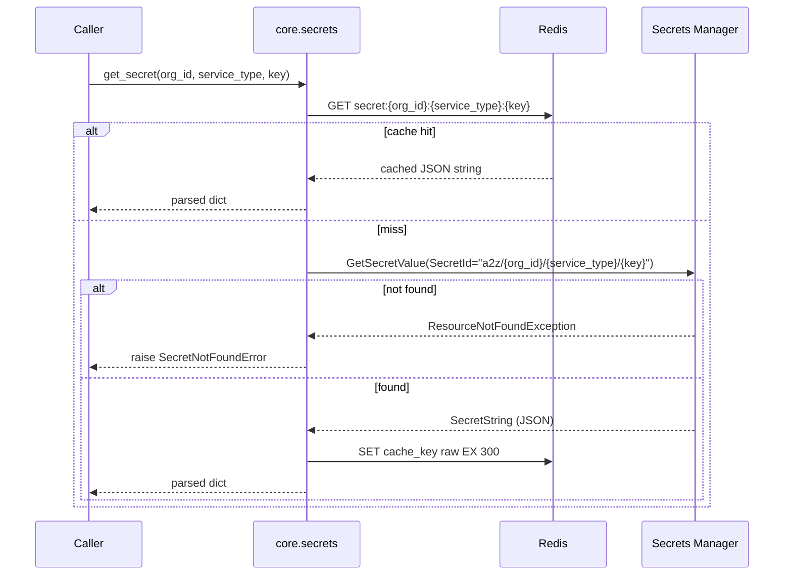

# `core.secrets` — Per-Org/Per-Service Credentials

> Part of the [Core module reference](README.md). Source: [`app/core/secrets.py`](../../app/core/secrets.py). See also: [data flow](../architecture/data-flow.md), [Omni-Channel adapters](../services/omnichannel/adapters.md).
> **Authority:** _reference_ — describes current code; if the two disagree, the code wins.

## Purpose & responsibilities

Read and write access to per-org, per-service credentials stored in AWS
Secrets Manager (e.g. an org's WhatsApp Business API token), cached in Redis
using the same idiom `core.settings` already established. Added to Core as
part of the documented "unfreeze protocol" when Omni-Channel needed it (see
[Core module reference: extending Core](README.md#extending-core)); the
write path (`put_secret`) followed once channel connect became
self-service. Rotation is still not Core's concern.

## Internal architecture



## Public API

```python
async def get_secret(org_id: str, service_type: str, key: str) -> dict[str, Any]
async def put_secret(org_id: str, service_type: str, key: str, value: dict[str, Any]) -> None
```

Secret name convention: `a2z/{org_id}/{service_type}/{key}` — e.g.
`a2z/acme-jewelry-4f2a1c9d/omnichannel/whatsapp`.

`put_secret` is the **self-service write path** (added 2026-07-18): a
service's connect-a-channel flow calls it with credentials a user just
submitted (e.g. a WhatsApp token pasted into a form), so no engineer needs
AWS console/CLI access to onboard an org. It upserts — a
`ResourceNotFoundException` on `put_secret_value` falls back to
`create_secret` — and **invalidates** the Redis cache key on write (rather
than write-through), so the next `get_secret` repopulates from AWS and
can't drift from what was stored.

## Configuration

Cache TTL is hardcoded to 300s (`_CACHE_TTL_SECONDS`), matching
`core.settings`'s convention. No environment variable controls it.

## Dependencies

`core.clients` (`secretsmanager()`, `redis_client()`), `core.exceptions`
(`SecretNotFoundError`), `core.logging`. No dependency on any other Core
business-logic module.

## Data model

No persisted model — a secret's value is an opaque JSON object
(`dict[str, Any]`), shape defined entirely by whatever wrote it (e.g. a
WhatsApp credential bundle might be
`{"access_token": "...", "phone_number_id": "...", "app_secret": "..."}`).

## Error handling

| Error | Status | Raised when |
|---|---|---|
| `SecretNotFoundError` | 404 | `get_secret` finds no secret at `a2z/{org_id}/{service_type}/{key}` (`ResourceNotFoundException`/`InvalidRequestException` from Secrets Manager) |
| `SecretsError` | 500 | `put_secret`'s underlying `put_secret_value`/`create_secret` call failed |

On the **read** path, any non-"not found" `ClientError` from Secrets
Manager (throttling, access denied, …) propagates unwrapped rather than as
a typed `CoreError` — a documented gap, not a design choice; see Known
limitations. The **write** path (`put_secret`) does wrap failures in
`SecretsError`.

## Security considerations

- **Secret values are never logged** — only `org_id`, `service_type`,
  `key`, and cache hit/miss are logged (`secret.cache_hit`/`secret.cache_miss`).
- **Org-scoping is in the resource name itself**, not just a query filter —
  the secret name `a2z/{org_id}/{service_type}/{key}` makes a cross-org read
  structurally impossible without also having that org's `org_id` string.
- **Rotation staleness window, accepted**: `put_secret` invalidates the
  Redis cache key (`secret:{org_id}:{service_type}:{key}`) it wrote, so a
  read immediately after a write through this module is never stale. But
  Core has no rotate path — an *external* rotation (someone rotating the
  secret in AWS directly) is responsible for deleting that cache key itself.
  Absent that, a read may be stale for up to 5 minutes after such a rotation
  — a documented, accepted trade-off (`app/services/omnichannel/CLAUDE.md`
  §6.2), not a bug.

## Example usage

```python
from app.core import secrets

creds = await secrets.get_secret(org_id, "omnichannel", "whatsapp")
# {"access_token": "...", "phone_number_id": "...", "app_secret": "..."}
```

## Extension points

Any service can call `get_secret`/`put_secret` for any `service_type`/`key`
pair — there is no registration step. **Rotation** (scheduled re-issuance of
a credential) remains explicitly out of Core's scope (`CLAUDE.md` §14: no
Permissions/admin service in Core) and would live in the owning service or a
future dedicated admin surface.

## Known limitations

- **Not the AWS Secrets Manager Caching Client.** A deliberate deviation
  from Omni-Channel's original external plan, which called for
  `aws-secretsmanager-caching` — that library is sync-only and would add a
  dependency duplicating the Redis-TTL idiom Core already uses elsewhere.
  Documented in the module docstring so it isn't "fixed" back to that
  library later.
- Non-"not found" Secrets Manager errors (throttling, access denied, etc.)
  are not currently wrapped in a typed `CoreError` — they propagate as raw
  `ClientError`, inconsistent with every other Core module's convention.
