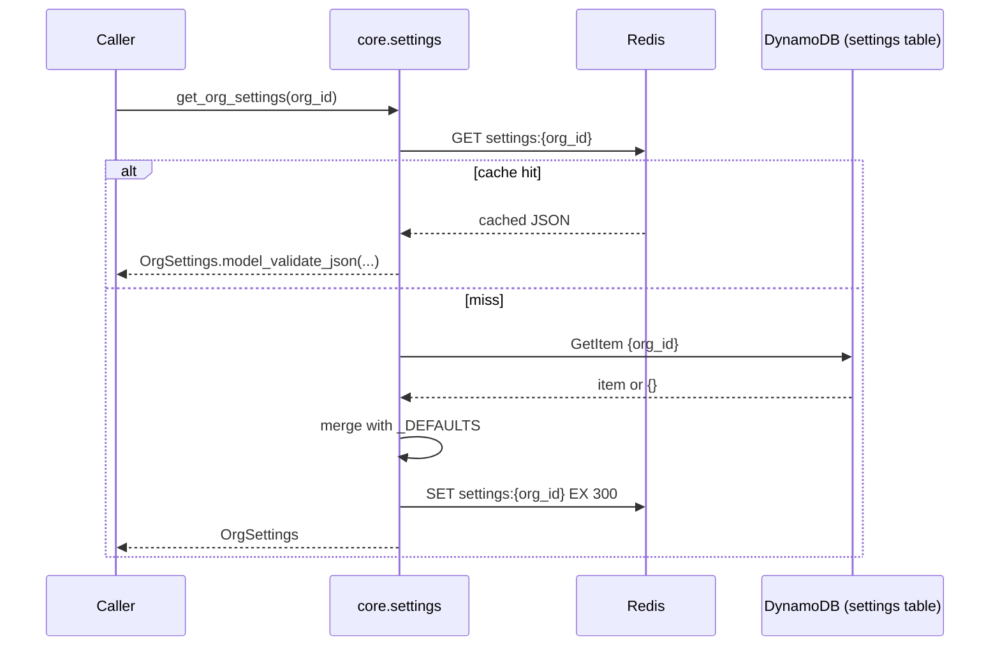

# `core.settings` — Org Configuration

> Part of the [Core module reference](README.md). Source: [`app/core/settings.py`](../../app/core/settings.py). See also: [data flow](../architecture/data-flow.md).
> **Authority:** _reference_ — describes current code; if the two disagree, the code wins.

## Purpose & responsibilities

Per-org configuration (timezone, currency, domain, sender name, plan tier,
and a free-form `metadata` escape hatch), cached for fast reads, plus an
atomic invoice-number counter used by (future) Invoicing.

## Internal architecture



Writes (`set_org_settings`, `get_next_invoice_number`) update DynamoDB
**then delete** the Redis key — the next read repopulates it, so a write is
never followed by a stale cached read of its own effect.

## Public API

| Function | Signature | Notes |
|---|---|---|
| `get_org_settings` | `(org_id) -> OrgSettings` | Redis (5min TTL) → DynamoDB fallback, defaults merged in. < 50ms target |
| `set_org_settings` | `(org_id, changes: dict, changed_by) -> OrgSettings` | Validates field names against `_MUTABLE_FIELDS`; raises `SettingsError` on an unknown field or empty `changes` |
| `get_next_invoice_number` | `(org_id, prefix) -> str` | Atomic DynamoDB `ADD` — no gaps, no collisions, even under concurrent callers |

**Mutable fields**: `timezone`, `currency`, `locale`, `domain`,
`invoice_number_prefix`, `next_invoice_number`, `plan_tier`, `sender_name`,
`metadata`. Any other key in `changes` raises `SettingsError`.

**Documented deviation from `A2Z_Core_Design_TestPlan.md` §2.6**:
`get_next_invoice_number` is `async` here though the design shows it sync —
it performs a DynamoDB write, so per the "async for all I/O" convention
(`CLAUDE.md` §4) it must not block the event loop.

## Configuration

| Variable | Default | Meaning |
|---|---|---|
| `DDB_SETTINGS_TABLE` | `a2z-core-settings` | Physical table name |
| `REDIS_URL` | `redis://localhost:6379/0` | Cache backend |

Cache TTL is hardcoded to 300s (`_CACHE_TTL_SECONDS`), not currently
configurable per environment.

## Dependencies

`core.audit` (`settings.changed` logged on every write), `core.events`
(`settings.changed` published), `core.clients`, `core._ddb`,
`core.exceptions`.

## Data model

```python
class OrgSettings(BaseModel):
    org_id: str
    timezone: str = "UTC"
    currency: str = "USD"
    locale: str = "en_US"
    domain: str = ""
    invoice_number_prefix: str = "INV-"
    next_invoice_number: int = 1
    plan_tier: str = "free"
    sender_name: str = ""
    metadata: dict[str, Any] = {}
    updated_at: datetime | None = None
```

`metadata` is the deliberate escape hatch for service-specific config that
doesn't warrant a Core schema change — see
[Omni-Channel's use of it](../services/omnichannel/routing-and-realtime.md#routing-configuration)
to store the org's routing strategy under `metadata["omnichannel"]` without
any Core change.

## Error handling

| Error | Status | Raised when |
|---|---|---|
| `SettingsError` | 400 | Unknown field in `changes`, empty `changes`, or any DynamoDB failure |

## Security considerations

- **`org_id`-keyed table** — the settings table's only key is `org_id`, so
  there is no query shape that could return another org's settings.
- **Field allowlisting** — `set_org_settings` rejects unknown fields rather
  than passing arbitrary attributes through to `UpdateExpression`, which
  also closes off any DynamoDB expression-injection surface from a caller
  passing attacker-controlled field names.

## Example usage

```python
from app.core import settings as core_settings

org_settings = await core_settings.get_org_settings(org_id)
updated = await core_settings.set_org_settings(
    org_id, {"sender_name": "Acme Support", "timezone": "America/New_York"}, changed_by=user_id
)
invoice_number = await core_settings.get_next_invoice_number(org_id, prefix="INV-")
# -> "INV-1", "INV-2", ... atomically, per org
```

## Extension points

- New top-level settings fields: add to `_DEFAULTS`, `_MUTABLE_FIELDS`
  (implicitly, since it's `frozenset(_DEFAULTS)`), and `OrgSettings` —
  additive, no migration needed.
- Service-specific config that doesn't deserve a top-level field: use
  `metadata`, namespaced by service name (the established convention).

## Known limitations

- **No settings history** — `CLAUDE.md` §11 states this explicitly:
  "current only (no history table in MVP); overwrite; changes captured in
  audit." If you need "what was the timezone last month," reconstruct it
  from `core.audit` events, not from this module.
- Cache invalidation is per-org, not fleet-aware beyond Redis itself — in a
  multi-process deployment, all processes share the same Redis cache key,
  so a write from one process invalidates the read for all of them
  immediately (this is a feature of using shared Redis, not a caveat).
