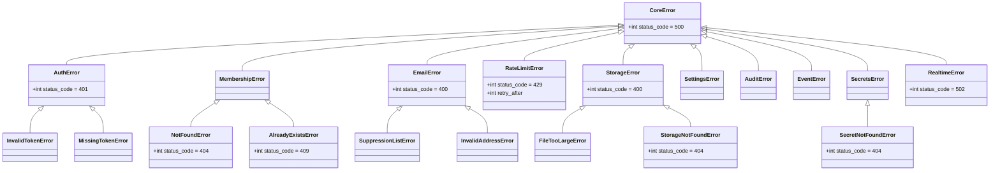

# Shared Infrastructure (`clients.py`, `logging.py`, `exceptions.py`, `_ddb.py`, `config.py`, `aws_resources.py`)

> Part of the [Core module reference](README.md). See also: [architecture overview](../architecture/overview.md).
> **Authority:** _reference_ — describes current code; if the two disagree, the code wins.

These are not independent Core modules with their own API surface — they're
the plumbing every module in [`docs/core/README.md`](README.md) is built on.

## `app/core/clients.py` — the only place clients are constructed

**Purpose**: one module builds every boto3, Redis, and httpx client as a
module-level singleton, so no Core function ever pays client-construction
cost on a hot path, and so LocalStack/test overrides have exactly one place
to intercept.

**Public surface**:

| Function | Returns |
|---|---|
| `dynamodb()`, `s3()`, `ses()`, `sns()`, `eventbridge()`, `secretsmanager()`, `cloudwatch()`, `sqs()` | `@lru_cache(maxsize=1)` boto3 clients, region/endpoint from `Settings`, bounded retries (`max_attempts=3`, `connect_timeout=3s`, `read_timeout=5s`) |
| `redis_client()` | Shared `redis.asyncio` client, `decode_responses=True` |
| `boto3_session()` | Shared `boto3.Session` (used by `core.realtime`'s future AppSync SigV4 signing) |
| `appsync_http_client()`, `http_client()` | Shared `httpx.AsyncClient`s (AppSync calls; outbound calls to channel providers e.g. WhatsApp Graph API) |
| `run_aws(fn, *args, **kwargs)` | `await`s a sync boto3 call via `asyncio.to_thread` — **every** sync AWS call in Core goes through this |
| `reset_clients()` | Clears every `lru_cache`d factory — used by tests between runs |

**Configuration**: `AWS_ENDPOINT_URL` (empty = real AWS, set = LocalStack);
credentials come from the ECS task IAM role in AWS, or dummy `test`/`testing`
values locally (`.env.example`, `tests/conftest.py`).

**Extension point**: adding a new AWS service client means adding one
`@lru_cache` factory function here — never construct a client inline in a
Core or service function.

## `app/core/logging.py` — structured, lean JSON logging

**Purpose**: CloudWatch bills per GB ingested, so logging is deliberately
lean: one compact JSON line per *significant* event (mutations, failures);
hot-path reads do not log (`CLAUDE.md` §4, `docs/cost-notes.md`).

**Usage**:
```python
from app.core.logging import get_logger
log = get_logger(__name__)
log.info("member.added", extra={"org_id": org_id, "actor_id": actor_id})
```

**Behavior**:
- Every line is one JSON object: `ts`, `level`, `event` (the log message),
  `logger`, `request_id` (threaded from `request_id_middleware` via a
  `ContextVar`), plus whatever `extra=` supplies.
- **Redaction**: any `extra` key named `token`, `jwt`, `authorization`,
  `password`, or `secret` (case-insensitive) is replaced with `"***"` — a
  defense against accidentally logging a secret, not a substitute for not
  passing one.
- **Collision safety**: `extra` keys that collide with a reserved
  `LogRecord` attribute (e.g. `message`, `module`) are renamed
  `<key>_` rather than raising, since `logging` itself raises on that
  collision.
- **Level**: `A2Z_LOG_LEVEL` (default `INFO`); `DEBUG` is for active
  debugging only, never a default (`docs/cost-notes.md`).

## Error hierarchy

**`app/core/exceptions.py`** — **purpose**: every Core/service function raises one of these; each carries
its own `status_code` so the router layer needs zero per-endpoint error
mapping (see [request lifecycle](../architecture/request-lifecycle.md)).



**Documented deviation from `A2Z_Core_Design_TestPlan.md` §6**: the design
doc nests `RateLimitError` under `EmailError`. The actual hierarchy makes it
a direct `CoreError` subclass, because the limiter is a general-purpose Core
facility (`email.send` today, `ai.parse` and other future actions
tomorrow) — nesting it under `EmailError` would be wrong for non-email
actions. A caller that wants "anything email-related" must catch
`(EmailError, RateLimitError)` explicitly. The class docstring calls this
out; **do not "fix" it back to the spec hierarchy**.

Omni-Channel's own error hierarchy (`app/services/omnichannel/exceptions.py`)
extends `CoreError` the same way — see
[Omni-Channel's known limitations](../services/omnichannel/known-issues.md)
for its specific subclasses.

## `app/core/_ddb.py` — DynamoDB marshaling

**Purpose**: Core uses the low-level boto3 DynamoDB client (not the
resource API) but works internally in plain Python dicts. This module is
the only place that converts between the two.

| Function | Does |
|---|---|
| `to_item(dict)` | Plain dict → DynamoDB attribute-value item; drops keys whose value is `None` (no attribute written) |
| `to_value(x)` | One Python value → one DynamoDB attribute-value |
| `from_item(item)` | DynamoDB attribute-value item → plain dict, converting `Decimal` back to `int`/`float` |

Floats are sanitized to `Decimal` via `str(value)` first (never a direct
`Decimal(float)`) specifically to avoid binary floating-point artifacts
(`0.1` → `0.1000000000000000055511151231257827021181583404541015625` is what
a direct conversion would produce).

## `app/config.py` — settings and shared registries

**Purpose**: the single `pydantic-settings` `Settings` object
(`settings()`, `@lru_cache`d) plus two registries the design doc requires be
centralized:

- **`Settings.tables`** — logical name → physical DynamoDB table name (so no
  module hardcodes a table name string).
- **`RATE_LIMITS`** — `action -> (limit, window_seconds)` defaults
  (`email.send`: 50/hour; `ai.parse.user`: 30/min; `ai.parse.org`: 500/day;
  `omnichannel.whatsapp.send`: 80/second). Services read this registry
  rather than inventing their own limits (`CLAUDE.md` §7).
- **`DDB_BILLING_MODE`** = `"PAY_PER_REQUEST"` — the on-demand billing
  decision from `CLAUDE.md` §10, applied in one place.
- **`SQS_MAX_RECEIVE_COUNT`** = `5` — shared between the SQS redrive policy
  and Omni-Channel's worker give-up threshold so the two can't drift (see
  [Omni-Channel message flow](../services/omnichannel/message-flow.md)).

See [environment variables reference](../configuration.md) for every field
and its default.

## `app/aws_resources.py` — Core's declarative AWS resource specs

**Purpose**: single source of truth for DynamoDB table/GSI shapes, the S3
bucket name, and the EventBridge bus name — imported by both
`scripts/create_local_resources.py` and the test fixtures, so LocalStack and
tests mirror exactly what Terragrunt provisions in real AWS (`CLAUDE.md`
§12). See [`docs/architecture/data-flow.md`](../architecture/data-flow.md)
for the resulting table shapes, and
[Omni-Channel's `aws_resources.py`](../services/omnichannel/data-model.md#sqs-provisioning)
for the service-owned equivalent covering SQS queues (kept separate — Core
never imports from `services/`, so a service's own declarative resources
can't live in this file).
