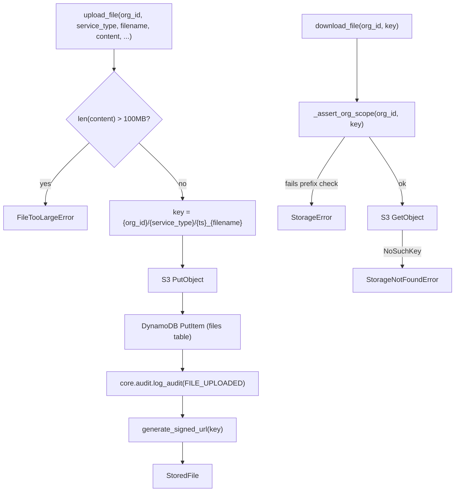

# `core.storage` — Org-Scoped File Storage

> Part of the [Core module reference](README.md). Source: [`app/core/storage.py`](../../app/core/storage.py). See also: [data flow](../architecture/data-flow.md), [retention policy](../retention.md).

## Purpose & responsibilities

Uploads, downloads, lists, and soft-deletes files on S3 with metadata in
DynamoDB. The bucket is private; every read/write is org-scoped by S3 key
prefix.

## Internal architecture



Every function that touches an existing object (`download_file`,
`get_file_metadata`, `delete_file`) calls `_assert_org_scope(org_id, key)`
first, which is a plain string-prefix check
(`key.startswith(f"{org_id}/")`) — this is the single enforcement point for
storage's cross-org isolation guarantee.

## Public API

| Function | Signature | Notes |
|---|---|---|
| `upload_file` | `(org_id, service_type, filename, content: bytes, mime_type, uploaded_by, ttl_days=None) -> StoredFile` | Raises `FileTooLargeError` over 100MB; < 1s target |
| `download_file` | `(org_id, key) -> bytes` | Org-scope checked; `StorageNotFoundError` if missing |
| `get_file_metadata` | `(org_id, key) -> StoredFile` | Metadata only, no S3 read; < 50ms |
| `delete_file` | `(org_id, key, deleted_by) -> None` | Deletes the S3 object, soft-deletes the metadata row (`is_deleted=True`) |
| `list_files` | `(org_id, service_type=None, filename_prefix=None) -> list[StoredFile]` | Filters out soft-deleted rows; < 200ms |
| `generate_signed_url` | `(key, expires_in=3600) -> str` | **Sync** — pure local signing, no network call, and notably **does not check org scope itself** (see security note below) |

S3 key layout: `{org_id}/{service_type}/{YYYYMMDD-HHMMSS-ffffff}_{filename}`.
The timestamp component guarantees uniqueness even for repeated uploads of
the same filename.

## Configuration

| Variable | Default | Meaning |
|---|---|---|
| `S3_BUCKET` | `a2z-ledger` | The one private bucket every service's files live in |
| `DDB_FILES_TABLE` | `a2z-core-files` | Metadata table |

`MAX_FILE_BYTES = 100 * 1024 * 1024` (100MB) is a hardcoded module constant,
not currently configurable per org or service.

## Dependencies

`core.audit` (`FILE_UPLOADED`/`FILE_DELETED` logged), `core.clients`,
`core._ddb`, `core.exceptions`.

## Data model

```python
class StoredFile(BaseModel):
    key: str; filename: str; url: str; signed_url: str
    size_bytes: int; mime_type: str
    uploaded_at: datetime; uploaded_by: str
    service_type: str | None = None
```

(`url` and `signed_url` are currently always identical — both set from the
same `generate_signed_url(key)` call.)

## Error handling

| Error | Status | Raised when |
|---|---|---|
| `FileTooLargeError` | 400 | Upload exceeds 100MB |
| `StorageNotFoundError` | 404 | Key doesn't exist (download/metadata) |
| `StorageError` | 400 | Cross-org key access, or any other S3/DynamoDB failure |

## Security considerations

- **Cross-org isolation via key prefix**, enforced by `_assert_org_scope`
  on every function that accepts an existing `key` — even a guessed key for
  another org's file is rejected before any S3 call is made.
- **`generate_signed_url` itself does NOT check org scope** — it is a pure
  local-signing helper with no `org_id` parameter at all. Every caller that
  hands a signed URL to an end user must ensure the key it signs already
  passed an org-scope check (as `upload_file`/`_to_stored_file` do
  internally). Omni-Channel's `media.py` explicitly re-implements this same
  prefix check before calling `generate_signed_url` directly — see
  [Omni-Channel's data model](../services/omnichannel/data-model.md) — this
  duplication is intentional and documented, not an oversight to "simplify"
  away.
- The bucket itself is private with no public access (enforced at the
  Terraform level — `infra/modules/s3`); every URL a client receives is a
  short-lived signed URL, default 1 hour.
- Deletes are soft (`is_deleted=True`), preserving the audit trail even
  after a file is "gone" from the user's perspective.

## Example usage

```python
from app.core import storage

stored = await storage.upload_file(
    org_id, "invoicing", "invoice-042.pdf", pdf_bytes, "application/pdf", uploaded_by=user_id,
)
print(stored.signed_url)  # valid 1h

data = await storage.download_file(org_id, stored.key)
```

## Extension points

- Per-org file size limits: not currently supported — `MAX_FILE_BYTES` is
  global. Would require a Core change (a deliberate one, given Core is
  frozen) if a per-plan-tier limit is ever needed.
- TTL-based expiry (`ttl_days`) is opt-in per upload — pass it when the
  caller knows the file is transient (e.g. a generated report); omit it for
  files meant to live indefinitely (subject to the org-level S3 lifecycle
  rule — see [retention policy](../retention.md)).

## Known limitations

- No virus/content scanning on upload — this module is a pure
  store-and-retrieve layer; if that's ever required it belongs in front of
  (or as a documented addition to) `upload_file`, not silently assumed.
- No multipart upload support — `upload_file` takes the full `content:
  bytes` in memory, capped at 100MB. Larger files are out of scope as
  designed.
