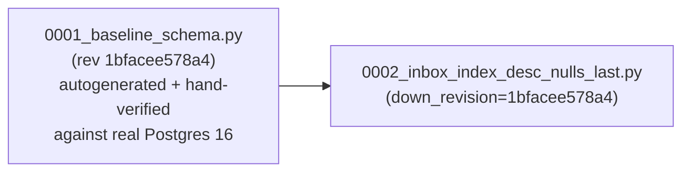

# Migration Strategy

> Part of the [documentation index](README.md). See also: [Omni-Channel data model](services/omnichannel/data-model.md), [Omni-Channel known issues](services/omnichannel/known-issues.md#3-duplicateorphaned-alembic-migration).

Two different stores, two different migration mechanisms — DynamoDB is
schemaless and never runs a formal migration tool; Postgres (Omni-Channel)
uses Alembic.

## DynamoDB (Core) — rules, not tooling

DynamoDB has no schema to migrate in the traditional sense. `CLAUDE.md` §9
establishes four rules for evolving it safely:

| Change type | Rule |
|---|---|
| **Additive** (new optional attribute) | Just start writing it; readers tolerate absence with defaults. No migration needed |
| **New access pattern needing a GSI** | Add the GSI via Terragrunt (`infra/modules/dynamodb`); new items get it automatically; run a one-off backfill script for old items only if the pattern must cover history |
| **Renames / type changes** | Dual-write (old + new) for one release, backfill, then stop writing old. **Never** a destructive rename in one step |
| **Versioning items** | Include a `schema_version` attribute on `METADATA` items so a future reader can branch |

Backfill scripts live in `infra/migrations/` with a dated filename and a
docstring stating intent and rollback. Every script must be **re-runnable**
(idempotent) and support **dry-run**. See
[`infra/migrations/2026-06-18_example_backfill_schema_version.py`](../infra/migrations/2026-06-18_example_backfill_schema_version.py)
for the reference shape: a paginated scan, a conditional
(`attribute_not_exists`) write so re-running skips already-migrated items,
and an `argparse --dry-run` flag.

```bash
python -m infra.migrations.2026-06-18_example_backfill_schema_version --dry-run
python -m infra.migrations.2026-06-18_example_backfill_schema_version
```

## Postgres (Omni-Channel) — Alembic

`app/services/omnichannel/migrations/` is a standard Alembic environment
(`env.py`, `script.py.mako`, `versions/`), scoped to the `omnichannel`
schema (created explicitly by `env.py` before migrations run, since Alembic
can't create tables in a schema that doesn't exist yet). The database URL
always comes from `app.config.settings().database_url` — never duplicated
into `alembic.ini` — so there's exactly one place that knows how to reach
Postgres.



> **⚠ This chain is not the only file in `versions/`.** See
> [Omni-Channel known issues #3](services/omnichannel/known-issues.md#3-duplicateorphaned-alembic-migration)
> for a documented orphaned duplicate (`0001_initial_schema.py`) that gives
> Alembic two heads against a fresh database. Resolve that before treating
> `alembic upgrade head` as safe to run unattended.

The full-text GIN index on `messages.body_text` is hand-added at the end of
migration `0001_baseline_schema.py`'s `upgrade()` — SQLAlchemy's ORM layer
has no first-class column type for a functional `to_tsvector(...)` index,
so `models.py` can't express it and autogenerate can't produce it.

```bash
cd app/services/omnichannel
alembic upgrade head        # apply
alembic downgrade -1        # roll back one revision
alembic history              # inspect the chain
```

In tests, the schema is instead built directly from the SQLAlchemy models
(`Base.metadata.create_all()` in
`tests/integration/omnichannel/conftest.py`) for speed — this means the
Alembic migration files themselves are **not** exercised by the automated
test suite; they were verified manually against a real local Postgres 16 by
actually running upgrade/downgrade/re-upgrade (see
[`docs/omnichannel-decisions.md`](omnichannel-decisions.md)). Keep this in
mind: a broken migration chain (like the orphaned-file issue above) will
not be caught by `pytest`.

## Choosing which mechanism a new service needs

- Need flexible, high-write, single-digit-millisecond org-scoped lookups
  with sparse/evolving attributes? → DynamoDB, following the Core pattern
  (`app/aws_resources.py` + the four rules above).
- Need relational joins, multi-row transactions, or append-only history
  tables with real foreign keys? → Postgres in your own schema on the
  shared instance (never a second instance — cost principle), with Alembic.
