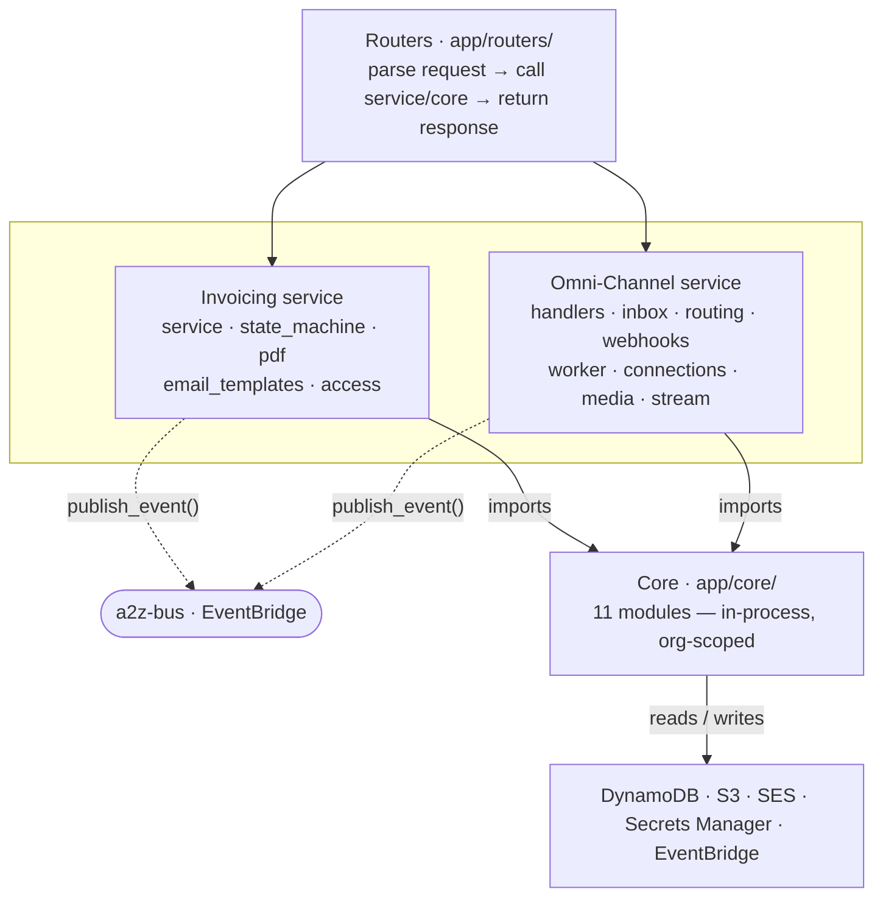

# Module Map

A single-page reference to every public function in the codebase: what
lives in `app/core/`, in each service, and behind each router — plus the
one rule that governs how they're allowed to talk to each other. This
complements the deep-dive docs (start at [`README.md`](README.md) or
[`core/README.md`](core/README.md) for those) rather than replacing them;
this page trades depth for a single scannable view.

If this page and the code disagree, the code wins — file an issue against
this doc.

## How the layers connect

**There is no edge between Invoicing and Omni-Channel above — that's
deliberate, not an omission.** Services never import each other. The only
channel between them is `core.events.publish_event()` onto the shared
`a2z-bus`; everything else in the diagram is a direct in-process call
(same process, one Docker image, one EC2 instance — see
[`architecture/single-box-mvp.md`](architecture/single-box-mvp.md)).

## Core (`app/core/`, frozen after Phase 1)

Pure Python, no HTTP. Every function takes an `org_id` and scopes its data
access to it — there is no code path that reads another org's data. See
[`core/README.md`](core/README.md) for the dependency graph and the
"extending Core" protocol; per-module docs go deeper than the table below.

### `auth` — Cognito JWKS, cached in-process 24h

| Function | What it does |
|---|---|
| `validate_jwt()` | Validate a JWT and return its claims. |
| `get_current_user_from_request()` | Extract and validate the bearer token from a request. |
| `create_test_token()` | Mint a valid HS256 test JWT for local/dev use. |

### `membership` — DynamoDB `a2z-core-membership`

| Function | What it does |
|---|---|
| `get_membership()` | Return a user's membership in an org, or none. |
| `list_user_orgs()` | List every org a user belongs to. |
| `list_org_members()` | List an org's members, owner first. |
| `create_org()` | Create an org and add the creator as OWNER. |
| `add_member()` | Add a user to an org with a role. |
| `change_role()` | Change a member's role. |
| `remove_member()` | Remove a user from an org. |
| `create_user_if_not_exists()` | Idempotently create a user record on first login. |

### `email` — SES + DynamoDB `email-events`/`suppression`

| Function | What it does |
|---|---|
| `send_email()` | Send on an org's behalf — checks suppression + rate limit first. |
| `start_domain_verification()` | Kick off SES domain + DKIM verification. |
| `get_domain_verification_status()` | Check SES's live verification status. |
| `get_email_status()` | Return an email's current delivery status. |
| `resolve_org_for_message()` | Return the org that sent a given message. |
| `get_suppression_list()` | Return an org's bounce/complaint lists. |
| `unsuppress_email()` | Remove an address from the suppression list. |

### `storage` — S3 + DynamoDB `files`

| Function | What it does |
|---|---|
| `generate_signed_url()` | Return a presigned GET URL for an S3 key. |
| `upload_file()` | Upload to S3 and record its metadata. |
| `download_file()` | Download a file's bytes, enforcing org scope. |
| `get_file_metadata()` | Return metadata without downloading it. |
| `delete_file()` | Delete from S3 and soft-delete its metadata. |
| `list_files()` | List an org's non-deleted files. |

### `audit` — DynamoDB `a2z-core-audit` (append-only)

| Function | What it does |
|---|---|
| `log_audit()` | Append an auditable action to the log. |
| `get_audit_events()` | Query an org's audit log, newest first. |

### `settings` — DynamoDB `a2z-core-settings`

| Function | What it does |
|---|---|
| `get_org_settings()` | Return org settings with defaults applied. |
| `set_org_settings()` | Partially update org settings. |
| `get_next_invoice_number()` | Atomically increment and return the next invoice number. |

### `events` — EventBridge `a2z-bus`

| Function | What it does |
|---|---|
| `publish_event()` | Publish a domain event (`member.added`, `invoice.paid`, …) to the bus. |

### `rate_limit` — in-process sliding window (single-box MVP)

| Function | What it does |
|---|---|
| `check_and_increment()` | Record a request; raise if the sliding-window limit is exceeded. |
| `limits_for()` | Return `(limit, window_seconds)` for an action from the config registry. |
| `reset()` | Clear all rate-limit state. Used between tests. |

### `secrets` — Secrets Manager + `core.cache.TTLCache`

| Function | What it does |
|---|---|
| `get_secret()` | Fetch a secret for an org/service pair (e.g. a WhatsApp token). |
| `put_secret()` | Create or update a secret for an org/service pair. |

### `realtime` — in-process broker (single-box MVP)

| Function | What it does |
|---|---|
| `publish_update()` | Push a real-time update to connected clients. |
| `subscribe()` | Subscribe to one or more logical channels for a block's duration. |
| `reset()` | Clear all subscriber state. Used between tests. |

### `cache` — shared in-process TTL primitive

| Function | What it does |
|---|---|
| `register_clearable()` | Register a callable that resets some module's cache state. |
| `clear_all()` | Reset every registered cache. Used between tests. |

*(`clients`, `logging`, `exceptions`, `_ddb`, `config` are supporting
infrastructure, not public business functions — see
[`core/shared-infrastructure.md`](core/shared-infrastructure.md).)*

## Services (`app/services/`, import Core, never each other)

### Invoicing — Postgres (own tables), publishes `invoice.*` events

**`service.py`**

| Function | What it does |
|---|---|
| `create_invoice()` | Create a draft invoice; assigns its number via Core's atomic counter. |
| `get_invoice()` | Fetch a single invoice. |
| `list_invoices()` | List an org's invoices (excl. soft-deleted), newest first. |
| `update_invoice()` | Edit an invoice in place; allowed on any non-void invoice. |
| `soft_delete_invoice()` | Soft-delete an invoice; idempotent. |
| `send_invoice()` | Render a fresh PDF, store it, email it to the customer. |
| `record_payment()` | Record a manual payment; idempotent via an idempotency key. |
| `void_invoice()` | Void an invoice; terminal from any non-void state. |
| `list_payments()` | List payments recorded against an invoice. |
| `signed_pdf_url()` | Return a signed URL to the invoice's stored PDF. |

**`state_machine.py`**

| Function | What it does |
|---|---|
| `assert_can_edit()` | Editing is allowed on any non-void invoice. |
| `assert_can_send()` | Only a draft may be sent. |
| `assert_can_record_payment()` | A payment can only land on a sent invoice. |
| `assert_can_void()` | Void is terminal; re-voiding is illegal. |
| `next_payment_status()` | Derive `payment_status` from the running total paid. |
| `next_invoice_status()` | Derive the invoice's lifecycle status. |
| `compute_line_amount_cents()` | Round quantity × unit price to the nearest cent. |
| `compute_totals()` | Return `(subtotal_cents, total_cents)`. |

**`pdf.py` · `email_templates.py`**

| Function | What it does |
|---|---|
| `render_invoice_pdf()` | Render an invoice to PDF bytes. |
| `render_invoice_email_html()` | Render the HTML body for an invoice email. |
| `render_invoice_email_text()` | Render the plain-text body for an invoice email. |

**`access.py`**

| Function | What it does |
|---|---|
| `require_membership()` | Return the caller's membership or raise 404. |
| `require_mutation_role()` | Require OWNER/ADMIN to mutate an invoice. |

### Omni-Channel — Postgres (own tables), email/SMS/WhatsApp/IG/Messenger

**`inbox.py` · `handlers.py`**

| Function | What it does |
|---|---|
| `list_conversations()` | List an org's conversations, most recently active first. |
| `get_conversation()` | Read one conversation's most recent messages. |
| `mark_read()` | Zero a conversation's unread counter. |
| `send_reply()` | Send an agent's reply in a conversation — the outbound half. |

**`routing.py`**

| Function | What it does |
|---|---|
| `claim()` | An agent claims an unassigned conversation. |
| `reassign()` | Owner/Admin reassigns a conversation to a different member. |
| `apply_single_assignee_if_configured()` | Auto-assign a new conversation under the single-assignee strategy. |
| `set_routing_config()` | Set an org's routing strategy. |

**`webhooks.py` · `worker.py`**

| Function | What it does |
|---|---|
| `handle_webhook()` | Verify and enqueue one inbound webhook call. |
| `verify_subscription()` | Answer a provider's webhook-subscription handshake. |
| `process_inbound_batch()` | Drain queued inbound webhook payloads. |
| `process_outbound_batch()` | Drain queued outbound sends. |
| `run_forever()` | The background worker loop — drains inbound then outbound forever. |

**`connections.py` · `media.py` · `stream.py`**

| Function | What it does |
|---|---|
| `create_connection()` | Register a new channel connection for an org. |
| `list_connections()` / `get_connection()` | List or read an org's channel connections. |
| `disable_connection()` | Soft-disable a channel connection. |
| `resolve_org_by_provider_account()` | Return the org owning a given provider account. |
| `signed_url_for_attachment()` | Return a cached, org-scoped signed URL for an attachment. |
| `stream_events()` | Yield Server-Sent-Event frames for one agent's live inbox. |

**`access.py` · `adapters/registry.py`**

| Function | What it does |
|---|---|
| `require_membership()` / `require_role()` | Membership + role checks, 404/403 on failure. |
| `load_conversation()` | Load a conversation scoped to an org, or raise not-found. |
| `get_adapter()` | Look up the channel adapter for a channel type. |

## Routers (`app/routers/`, HTTP only)

No business logic lives here. Most endpoints just parse the request, call
the service/core function of the same name, and return — `health`,
`ses_notifications`, and `landing` are the exceptions.

| Router | Mount | Endpoints |
|---|---|---|
| `core_admin.py` | `/v1/core` | `create_org`, `list_my_orgs`, `list_members`, `add_member`, `get_settings`, `update_settings`, `send_email`, `get_domain_verification_status` |
| `invoicing.py` | `/v1/invoicing` | `create_invoice`, `list_invoices`, `get_invoice`, `update_invoice`, `delete_invoice`, `send_invoice`, `record_payment`, `void_invoice`, `list_payments` |
| `omnichannel.py` | `/v1/omnichannel` | `receive_webhook`, `verify_webhook_subscription`, `list_conversations`, `get_conversation`, `mark_read`, `send_reply`, `claim_conversation`, `reassign_conversation`, `set_routing_config`, `create_connection`, `list_connections`, `get_connection`, `disable_connection`, `stream_inbox` |
| `health.py` | `/health` | `health()` — 200 when DynamoDB and Postgres are reachable, else 503. |
| `ses_notifications.py` | — | `ses_notifications()` — SNS → HTTPS entry point for SES bounce/complaint notifications. Signature-verified; no Lambda involved. |
| `landing.py` | `/` | `landing_page()` — the one HTML response in the whole API; slated to move to a separate frontend in Phase 2+ (see CLAUDE.md §17). |

---

*Generated from the `app/` tree at time of writing (11 Core modules ·
Invoicing · Omni-Channel · 6 routers). Core is frozen; new needs get added
to it deliberately (see [`core/README.md`](core/README.md)'s "extending
Core" protocol), never worked around in a service.*
