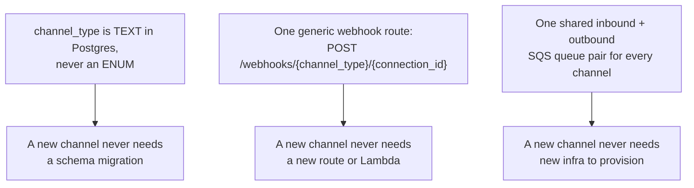

# Channel Adapters

> Part of the [Omni-Channel service docs](README.md). Source: [`app/services/omnichannel/adapters/`](../../../app/services/omnichannel/adapters/).
> **Authority:** _reference_ — describes current code; if the two disagree, the code wins.

## Purpose & responsibilities

Everything channel-specific lives behind one `Protocol`. The rest of the
system (worker, routing, inbox) never knows which channel it's touching.
This is what makes "add a channel" a small, bounded change instead of a
cross-cutting one.

## The `ChannelAdapter` contract

```python
# app/services/omnichannel/adapters/base.py
@runtime_checkable
class ChannelAdapter(Protocol):
    supported_features: SupportedFeatures

    async def verify_inbound_signature(self, raw_body: bytes, headers: dict[str, str], secret: str) -> bool: ...
    async def verify_subscription(self, params: dict[str, str], credentials: dict[str, Any]) -> str: ...
    async def normalize_inbound(self, raw_payload: dict[str, Any]) -> list[NormalizedInboundMessage]: ...
    async def send_outbound(self, to: str, content: OutboundContent, credentials: dict[str, Any]) -> SendResult: ...
    async def interpret_delivery_webhook(self, raw_payload: dict[str, Any]) -> list[DeliveryStatusUpdate]: ...
```

Shared Pydantic types (`adapters/types.py`): `SupportedFeatures` (templates,
rich_media, typing_indicators, read_receipts — callers branch on
*capability*, not channel identity), `OutboundContent`/`OutboundAttachment`,
`SendResult`, `InboundAttachment`/`NormalizedInboundMessage`,
`DeliveryStatusUpdate`.

## Three invariants that keep adding a channel small



Violating any one of these would silently turn "add a channel" into a
migration-plus-infra project — which is why each is guarded by a test (see
[data model](data-model.md#indexes) and
[message flow](message-flow.md)).

## Registry

```python
# app/services/omnichannel/adapters/registry.py
_REGISTRY: dict[str, ChannelAdapter] = {
    "email": EmailAdapter(),
    "whatsapp": WhatsAppAdapter(),
    "messenger": MessengerAdapter(),
    "instagram": InstagramAdapter(),
}
```

`get_adapter(channel_type)` raises `ChannelAdapterError` (502) for an
unregistered type. **`SmsAdapter` exists and is fully implemented
(`adapters/sms.py`) but is not in this registry** — see
[known limitations](known-issues.md) for why that matters.

## The Meta base adapter (`adapters/_meta.py`)

WhatsApp, Facebook Messenger, and Instagram are all Meta Graph API channels
and share two pieces of machinery **byte-for-byte**: `X-Hub-Signature-256`
HMAC-SHA256 inbound signature verification (keyed by the connection's
`app_secret`), and the `hub.mode`/`hub.verify_token`/`hub.challenge`
subscription handshake Meta requires before it will deliver webhooks. Those
two `ChannelAdapter` methods — plus a shared `post_graph_api` helper — live on
`MetaGraphAdapter`, and every Meta channel inherits it:

```
ChannelAdapter (Protocol)
├── EmailAdapter
└── MetaGraphAdapter                 verify_inbound_signature, verify_subscription
    ├── WhatsAppAdapter              changes[].value.messages[] shape
    └── MessengerPlatformAdapter     entry[].messaging[] shape
        ├── MessengerAdapter         account id = page_id
        └── InstagramAdapter         account id = ig_id
```

A leaf provides only what genuinely differs per channel: `supported_features`
and the three shape-specific methods (`normalize_inbound`, `send_outbound`,
`interpret_delivery_webhook`). `MetaGraphAdapter` deliberately does **not**
implement those, so a leaf that forgets one fails the registry's
`isinstance(..., ChannelAdapter)` Protocol guard loudly.

## Email adapter (`adapters/email.py`)

Built first because it validates the pattern with the least new surface —
outbound reuses `core.email.send_email` almost entirely.

| Method | Behavior |
|---|---|
| `verify_inbound_signature` | Always `True` — inbound email never arrives via the generic webhook route (it's SES receipt rule → S3 → the shared inbound SQS queue), so there is no HTTP signature to check. This is a documented no-op, not a shortcut. |
| `normalize_inbound` | Parses raw MIME (`raw_payload = {"raw_mime": bytes, "external_message_id": str}`) via stdlib `email`, extracting the text/HTML body and any attachments |
| `send_outbound` | Calls `core.email.send_email(org_id, ServiceType.OMNICHANNEL, ...)` — **never boto3 SES directly**. `credentials` carries only `org_id` (email has no per-org channel secret) |
| `interpret_delivery_webhook` | Maps `{"message_id", "status"}` (built by a future subscriber from Core's `email.bounced`/`email.complained` events) to `DeliveryStatusUpdate`. Not invoked by an actual per-channel webhook today — Core's own SES/SNS Lambda already handles bounces/complaints independently |

`supported_features = SupportedFeatures(rich_media=True)`.

## WhatsApp adapter (`adapters/whatsapp.py`)

Meta WhatsApp Cloud (Graph) API over `httpx`.

| Method | Behavior |
|---|---|
| `verify_inbound_signature` | HMAC-SHA256 of the raw body against the connection's `app_secret`, compared to the `X-Hub-Signature-256` header via `hmac.compare_digest` (timing-safe) |
| `normalize_inbound` | Flattens Meta's nested `entry[].changes[].value.{messages[],contacts[]}` batch shape into one `NormalizedInboundMessage` per message |
| `send_outbound` | Requires `org_id`, `access_token`, `phone_number_id` in `credentials` (caller resolves via `core.secrets.get_secret` first). **Text-only** — raises `ChannelAdapterError` if `content.body_text` is empty |
| `interpret_delivery_webhook` | Maps Meta's `sent`/`delivered`/`read`/`failed` status webhook directly — no remapping needed, unlike email |

`supported_features = SupportedFeatures(templates=False, rich_media=False, typing_indicators=False, read_receipts=True)`.

**Two accepted v1 gaps, deliberate and documented in the module itself:**

1. **Outbound is text-only.** WhatsApp requires an approved template to
   business-initiate a conversation outside the 24-hour customer-service
   window; templates are deferred, so v1 WhatsApp can only reply within
   that window.
2. **Inbound media is recorded, not downloaded.** A non-text message (image,
   document, audio, video, location) carries only a Graph API *media id* in
   the webhook payload — fetching the actual bytes needs a second,
   credentialed Graph API call that `normalize_inbound`'s Protocol
   signature has no room for (it takes no credentials). v1 persists these
   messages with a placeholder body (`"[unsupported message type: {type}]"`)
   so the customer's message still shows up and idempotency still holds,
   rather than silently dropping it.

## Messenger adapter (`adapters/messenger.py`)

Meta Messenger Platform (Graph API) over `httpx`. Signature verification and
the subscription handshake are inherited from `MetaGraphAdapter`; this module
supplies the Messenger-Platform payload shapes. Instagram DMs run on the
*same* Messenger Platform, so the actual logic lives on
`MessengerPlatformAdapter` and `MessengerAdapter` is the Facebook-Pages leaf.

| Method | Behavior |
|---|---|
| `verify_inbound_signature` | Inherited — `X-Hub-Signature-256` HMAC-SHA256 against the connection's `app_secret` |
| `verify_subscription` | Inherited — echoes Meta's `hub.challenge` when `hub.verify_token` matches the stored `verify_token` |
| `normalize_inbound` | Walks `entry[].messaging[]`; emits **one message per genuine customer message only** — delivery receipts, read receipts, and echoes of the page's own outbound (`message.is_echo`) are skipped. `external_id = sender.id` (PSID), `external_message_id = message.mid` |
| `send_outbound` | Requires `org_id`, `page_access_token`, `page_id` in `credentials`. POSTs `{"messaging_type":"RESPONSE","recipient":{"id":to},"message":{"text":...}}` to `/{page_id}/messages`. **Text-only** — raises if `content.body_text` is empty |
| `interpret_delivery_webhook` | Maps each id in a `delivery.mids[]` event to a `delivered` update; a `read` event is watermark-only (no per-message id) and is intentionally not emitted |

`supported_features = SupportedFeatures(templates=False, rich_media=False, typing_indicators=False, read_receipts=True, requires_credentials=True)`.

**The `messaging[]` array is why `normalize_inbound` must filter.** Unlike
WhatsApp (which separates customer messages from delivery statuses into
different keys), the Messenger Platform mixes messages, delivery receipts,
read receipts, and outbound echoes into one `entry[].messaging[]` array. The
worker persists whatever `normalize_inbound` returns, so returning a receipt
event would create a junk conversation — hence only non-echo `message` events
survive. Guarded by `test_messenger_adapter.py::test_normalize_inbound_skips_delivery_read_and_echo`.

**Same accepted v1 gaps as WhatsApp:** outbound is text-only (message tags /
templates for business-initiated sends outside the 24h window are deferred),
and inbound media persists with a placeholder body rather than being
downloaded. One extra Messenger difference: its webhooks carry **no inline
sender name** (WhatsApp's do, via `contacts[]`), so the customer identity is
created with `display_name=None`.

## Instagram adapter (`adapters/instagram.py`)

Instagram Direct Messages run on the same Messenger Platform, so
`InstagramAdapter` subclasses `MessengerPlatformAdapter` and overrides only
one thing: the Send API account id comes from the `ig_id` credential (the
Instagram professional-account id linked to the connected Page) rather than
`page_id`, so sends go to `/{ig_id}/messages`. Everything else — signature,
handshake, `messaging[]` normalize, delivery interpretation, the text-only /
media / no-sender-name gaps — is inherited unchanged.

## SMS adapter (`adapters/sms.py`) — built, not wired in

Outbound via AWS SNS SMS (a provider decision recorded in
[`docs/omnichannel-decisions.md`](../../omnichannel-decisions.md) — AWS SNS
over Twilio, to stay AWS-native with no new non-AWS credential to manage).

| Method | Behavior |
|---|---|
| `verify_inbound_signature` | Always `True` — inbound SMS arrives via an SNS topic subscription (two-way SMS), triggered only by AWS itself, structurally the same trust model as email's, not a public forgeable webhook |
| `normalize_inbound` | Parses AWS's two-way-SMS inbound-message notification shape (`originationNumber`, `inboundMessageId`, `messageBody`) |
| `send_outbound` | `clients.sns().publish` with optional `origination_number`/`sender_id` message attributes; catches `ClientError` and returns a `SendResult(status=FAILED)` rather than raising |
| `interpret_delivery_webhook` | Parses an SNS delivery-status-logging notification (`SUCCESS`/`FAILURE`) |

Unlike email/WhatsApp, this adapter takes an `org_id` constructor argument
(`SmsAdapter(org_id)`) rather than being a stateless singleton — inconsistent
with the registry's `_REGISTRY: dict[str, ChannelAdapter]` shape, which
holds pre-constructed singletons. This is one of several signs the adapter
was written but never finished being wired in — see
[known limitations](known-issues.md).

> **Note on the field-name shapes**: the module's own docstring flags that
> the AWS two-way-SMS/delivery-status-logging JSON field names follow AWS's
> *documented* shapes as of when it was written but have not been verified
> against a live SNS topic — the most likely part of this adapter to need a
> correction once actually tested end to end.

## Configuration

`app/config.py` registers a per-channel outbound rate limit for each Meta
channel: `RATE_LIMITS["omnichannel.whatsapp.send"] = (80, 1)`,
`["omnichannel.messenger.send"] = (80, 1)`,
`["omnichannel.instagram.send"] = (80, 1)` (all modeled on Meta's pair-rate
ceiling until tuned against the provider contract per tier). SMS has no
registered limit (unregistered — consistent with it not being wired in).
Email needs none — `core.email.send_email` already enforces its own
50/hour/org limit.

## Security considerations

- **Signature verification happens before anything else** in the generic
  webhook route (`webhooks.py::handle_webhook`) — a bad/missing signature
  raises `WebhookSignatureError` (401) before the payload is even
  deserialized past the raw bytes.
- Credentials are resolved by the **caller** (webhook/worker code) via
  `core.secrets.get_secret`, then passed into `send_outbound`/verification
  — no adapter calls `core.secrets` itself. This keeps the adapter layer
  free of any Core coupling beyond the shared Pydantic types.

## Example usage

```python
from app.services.omnichannel.adapters.registry import get_adapter

adapter = get_adapter("whatsapp")
ok = await adapter.verify_inbound_signature(raw_body, headers, app_secret)
messages = await adapter.normalize_inbound(payload)
```

## Extension points

Add a channel: create `adapters/{channel}.py` implementing `ChannelAdapter`,
add one line to `_REGISTRY` in `adapters/registry.py`. Nothing else in the
system (routing, storage, infra) needs to change — see the three invariants
above.

## Known limitations

See [`known-issues.md`](known-issues.md) for the SMS-registration gap and
the AWS SMS payload-shape caveat.
