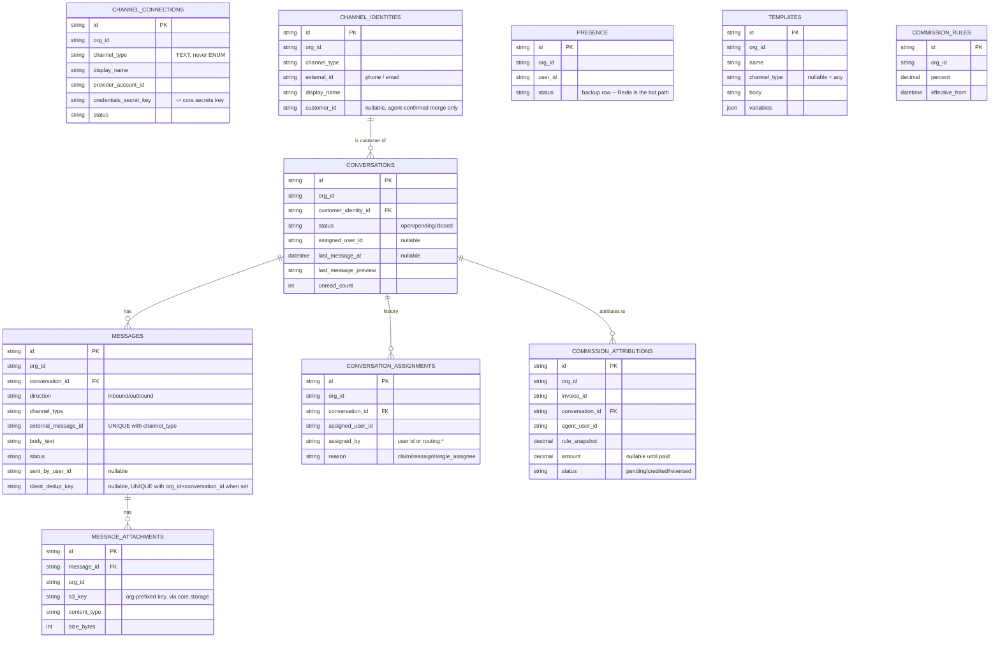
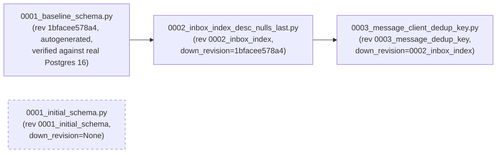

# Omni-Channel Data Model

> Part of the [Omni-Channel service docs](README.md). Source: [`app/services/omnichannel/models.py`](../../../app/services/omnichannel/models.py), [`db.py`](../../../app/services/omnichannel/db.py), [migrations](../../../app/services/omnichannel/migrations/versions/).
> **Authority:** _reference_ — describes current code; if the two disagree, the code wins.

## Overview

Relational data (threads, append-only histories, dashboard joins) lives in
**Postgres**, not DynamoDB — a deliberate departure from Core's storage
choice, in a dedicated `omnichannel` schema on the **shared** Postgres
instance (a container today; RDS at distribution — see
[deployment architecture](../../architecture/deployment.md)). Every table
carries `org_id`; every query filters on it.

## Entity-relationship diagram

## Table-by-table notes

| Table | Purpose | v1 status |
|---|---|---|
| `channel_connections` | An org's live link to one channel account. `credentials_secret_key` points at a `core.secrets` key — **never the secret value itself** | Active |
| `channel_identities` | A customer's handle on a channel. Unique `(org_id, channel_type, external_id)`. `customer_id` links identities across channels **only via agent-confirmed merge** ([decision #2](../../omnichannel-decisions.md)) — never auto-linked | Active |
| `conversations` | The org-scoped thread with one customer | Active |
| `messages` | One inbound/outbound item. `(channel_type, external_message_id)` is **unique** — the webhook-idempotency guarantee. `client_dedup_key` (nullable) is the client-side counterpart for outbound sends — the `Idempotency-Key` header on `POST .../messages`, unique per `(org_id, conversation_id)` when set (migration `0003`, API review 2026-07-18) | Active |
| `message_attachments` | Media stored via `core.storage`, keyed `{org_id}/omnichannel/...` | Active |
| `conversation_assignments` | **Append-only** — never updated or deleted. Load-bearing for future commission replay | Active (written from v1 day one) |
| `presence` | Backup/audit row; **live state is Redis** (`presence.py`), not this table | Table ships; the Redis-backed module (`presence.py`) is fully implemented (see [known limitations](known-issues.md) — the design doc calls presence "deferred with auto-routing," but the code exists) |
| `templates` | Saved replies | Table ships, unused — templates deferred (§15) |
| `commission_rules` / `commission_attributions` | Commission history + snapshot-at-creation attribution | Tables ship, unused — deferred until Invoicing exists (no `invoice.paid` producer) |

`channel_type` is `TEXT` **everywhere**, never a Postgres `ENUM` — a
deliberate extensibility invariant so adding a channel never requires a
schema migration across six tables. Validated only at the Pydantic
(`ChannelType`) / application layer.

## Indexes

| Index | Table | Serves |
|---|---|---|
| `ix_conversations_inbox` | `conversations` | `(org_id, status, last_message_at DESC NULLS LAST)` — the org-wide inbox query, `inbox.list_conversations` |
| `ix_conversations_agent_inbox` | `conversations` | `(org_id, assigned_user_id, status)` — "my conversations" |
| `ix_messages_thread` | `messages` | `(conversation_id, created_at)` — reading one thread |
| `uq_message_client_dedup` | `messages` | Partial unique `(org_id, conversation_id, client_dedup_key) WHERE client_dedup_key IS NOT NULL` — the `Idempotency-Key` guarantee (migration `0003`) |
| `ix_commission_attributions_dashboard` | `commission_attributions` | `(org_id, agent_user_id)` — future commission dashboard |
| full-text GIN | `messages.body_text` | `to_tsvector(...)` functional index — hand-added in the migration; SQLAlchemy's ORM has no first-class column type for it |

### The `DESC NULLS LAST` fix (migration `0002`)

The original schema (and even the design doc itself) specified
`last_message_at DESC` for the inbox index. That's not sufficient: a btree
only serves an `ORDER BY` whose direction **and** null placement it
matches, and Postgres defaults `DESC` to `NULLS FIRST` — which would let a
conversation with no messages yet outrank live ones and forces a sort on
every inbox query. Migration `0002_inbox_index_desc_nulls_last` rebuilds
the index as `DESC NULLS LAST`, verified with `EXPLAIN` against 20k rows
(plain ascending → Sort; `DESC` alone → Sort; `DESC NULLS LAST` → no Sort).
Guarded by `test_inbox.py::test_inbox_query_uses_index_without_sorting`.

## Migrations

> **⚠ Known repository inconsistency.** `app/services/omnichannel/migrations/versions/`
> contains **two independent root migrations**: `0001_initial_schema.py`
> (an earlier hand-written draft — its index names like
> `ix_channel_connections_org_id` don't match the autogenerated naming
> convention the rest of the schema actually uses) and
> `0001_baseline_schema.py` (revision `1bfacee578a4`, the one that was
> actually verified against a real Postgres and is the parent of `0002`).
> Both have `down_revision = None`, so Alembic sees **two heads**
> (`0001_initial_schema` and `0003_message_dedup_key`) — `alembic upgrade head`
> against a fresh database is ambiguous until this is resolved (delete the
> orphaned `0001_initial_schema.py`, or merge the heads; in the meantime,
> target the chain explicitly: `alembic upgrade 0003_message_dedup_key`).
> Tests don't catch this because `tests/integration/omnichannel/conftest.py`
> builds the schema via `Base.metadata.create_all()`, not by running Alembic
> migrations end to end — see [`docs/migrations.md`](../../migrations.md).
> Treat `0001_baseline_schema.py` → `0002_inbox_index_desc_nulls_last.py` →
> `0003_message_client_dedup_key.py` as the authoritative chain.

## SQS provisioning

`app/services/omnichannel/aws_resources.py` is this service's equivalent of
Core's `app/aws_resources.py` — declarative specs for its SQS queues,
consumed by `scripts/create_local_resources.py`. It lives in the service
package (not Core's `aws_resources.py`) because Core never imports from
`services/` (golden rule #3). Every queue gets a DLQ with
`maxReceiveCount = SQS_MAX_RECEIVE_COUNT` (5, from `app/config.py`, shared
with the worker's own give-up threshold so the two can't drift — see
[message flow](message-flow.md)).

## Dependencies

SQLAlchemy 2.0 (async) + `asyncpg` + Alembic. Async engine/session built
once (`db.py::engine()`/`session_factory()`, `@lru_cache`, mirroring
`core.clients`'s singleton pattern).

## Security considerations

- Every table's queries filter on `org_id` — proven per-table by dedicated
  cross-org isolation tests in `tests/integration/omnichannel/test_models.py`.
- `credentials_secret_key` stores a *pointer* to a `core.secrets` entry,
  never a credential value, in Postgres.
- `channel_identities.customer_id` is written only through an
  agent-confirmed merge flow (not yet built as a UI, but the schema and the
  decision are locked) — never inferred automatically from a phone-number
  match, to avoid silently merging two different people's conversation
  history.

## Known limitations

See [`known-issues.md`](known-issues.md) for the migration inconsistency
above plus other data-model-adjacent gaps (e.g. `presence`/commission
tables shipped but unused).
