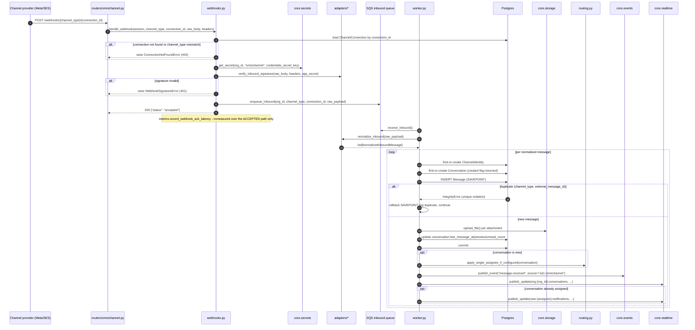

# Message Flow (Inbound & Outbound)

> Part of the [Omni-Channel service docs](README.md). Source: [`webhooks.py`](../../../app/services/omnichannel/webhooks.py), [`queues.py`](../../../app/services/omnichannel/queues.py), [`worker.py`](../../../app/services/omnichannel/worker.py), [`handlers.py`](../../../app/services/omnichannel/handlers.py).

This is the highest-stakes hot path in the service: webhook providers retry
aggressively (Meta's window is ~10s), so at-least-once delivery is the norm
and idempotency is load-bearing, not incidental.

## Inbound: webhook → SQS → worker → visible in inbox



### Idempotency mechanics (the load-bearing detail)

The `(channel_type, external_message_id)` unique constraint on `messages`
is the actual idempotency guarantee. The worker wraps the insert in a
**SAVEPOINT** (`session.begin_nested()`), not the whole transaction — a
duplicate delivery must not roll back the `ChannelIdentity`/`Conversation`
rows this same loop iteration may have just created for a *different*
normalized message in the same webhook batch. On a unique-violation
`IntegrityError`, the worker rolls back to the savepoint and treats it as a
no-op, not an error — Meta retrying a webhook is expected, not exceptional.

One subtlety documented in the code: the failed flush leaves the SQLAlchemy
**Session** itself (not just the DB-level savepoint) marked unusable until
an explicit `session.rollback()` — `begin_nested()`'s automatic
rollback-on-exception only covers the SQL savepoint, not the ORM's own
unit-of-work state. The worker calls `session.rollback()` explicitly for
this reason.

## Outbound: agent reply → SQS → worker → sent

```mermaid
sequenceDiagram
    autonumber
    participant Agent
    participant Router as routers/omnichannel.py
    participant Handlers as handlers.py
    participant Membership as core.membership
    participant RateLimit as core.rate_limit
    participant PG as Postgres
    participant SQSOut as SQS outbound queue
    participant Worker as worker.py
    participant Secrets as core.secrets
    participant Adapter as adapters/*
    participant EB as core.events
    participant RT as core.realtime

    Agent->>Router: POST .../conversations/{id}/messages {body_text}
    Router->>Handlers: send_reply(session, org_id, conversation_id, user_id, body_text)
    Handlers->>Membership: get_membership(user_id, org_id)
    alt not a member
        Handlers-->>Router: raise NotFoundError (404)
    else role == GUEST
        Handlers-->>Router: raise ForbiddenError (403)
    end
    Handlers->>PG: load Conversation + ChannelIdentity (must belong to org_id)
    Handlers->>RateLimit: check_and_increment(org_id, "omnichannel.{channel}.send") if a limit is registered
    Handlers->>PG: INSERT Message(status="queued", external_message_id="pending:{uuid}")
    Handlers->>SQSOut: enqueue_outbound(org_id, message_id)
    Handlers-->>Router: Message (id, status="queued")
    Router-->>Agent: 200 {message_id, status: "queued"}

    Worker->>SQSOut: receive_outbound()
    Worker->>PG: load Message, Conversation, ChannelIdentity, ChannelConnection
    alt any missing
        Worker->>SQSOut: delete (unrecoverable -- nothing to retry)
    else
        opt channel_type != "email"
            Worker->>Secrets: get_secret(org_id, "omnichannel", credentials_secret_key)
        end
        Worker->>Adapter: send_outbound(to, content, credentials)
        alt send succeeds
            Worker->>PG: message.external_message_id = result.id; status = "sent"; commit
            Worker->>EB: publish_event("message.sent")
            Worker->>RT: publish_update(org:{org_id}:conversations, ...)
            Worker->>SQSOut: delete (resolved)
        else ChannelAdapterError
            alt receive_count >= SQS_MAX_RECEIVE_COUNT
                Worker->>PG: message.status = "failed"; commit
            end
            Note over Worker,SQSOut: message is NOT deleted --\nleft for SQS's own visibility-timeout\nretry, eventually redriven to the DLQ
        end
    end
```

### Why a failed send is left in the queue, not deleted

A real bug was found and fixed while wiring the DLQ: an earlier version of
the worker deleted an outbound message once `receive_count` hit the
threshold, which retired it from SQS **before** the redrive policy could
move it to the DLQ — so the DLQ stayed permanently empty and the "DLQ depth
> 0" alarm could never fire. The fix: the worker marks the message `failed`
in Postgres (so the UI reflects it) but leaves the SQS message alone, so
SQS's own redrive policy moves it to the DLQ once `receive_count` exceeds
`SQS_MAX_RECEIVE_COUNT`. That threshold is defined **once**
(`app.config.SQS_MAX_RECEIVE_COUNT = 5`) and read by both the queue's
`RedrivePolicy` (`aws_resources.py::create_queues`,
`scripts/create_local_resources.py`) and the worker's own give-up check —
two independent constants would drift and desync those facts.

## Cross-service events

`message.received`/`message.sent`/`conversation.assigned` are published on
`a2z-bus` with `source="a2z.omnichannel"` — see the full catalog in
[`docs/events.md`](../../events.md) and the mechanism in
[event-driven architecture](../../architecture/event-driven-architecture.md).
An EventBridge rule (`source=a2z.invoicing`, `detail-type=invoice.paid`)
targeting this service's events SQS queue is designed for the eventual
commission subscriber — see [routing & realtime](routing-and-realtime.md#commission-attribution-deferred).

## Rate limits on the outbound path

`handlers.send_reply` looks up `RATE_LIMITS.get(f"omnichannel.{channel_type}.send")`
directly from `app.config` (not via `core.rate_limit.limits_for`, which
raises `KeyError` on an unregistered action) — deliberately, since not
every channel has its own entry: email's outbound limit is already enforced
inside `core.email.send_email` itself, so there's no
`"omnichannel.email.send"` key to look up, and the `None` result is treated
as "no additional limit for this channel," not an error.

## Observability

`metrics.py` (`A2Z/OmniChannel` CloudWatch namespace) instruments this flow
at each stage: `WebhookAckLatencyMs` (accepted path only — a burst of
401s must not mask a real ack-latency breach), `MessageProcessingLatencyMs`
(receipt → realtime publish, i.e. actually visible on an agent's screen),
`SendSuccessRate`/`SendFailureRate`. Every metric emission is fire-and-forget
via a background `asyncio.Task` and swallows its own errors — a CloudWatch
outage must never fail a customer's message. See
[deployment architecture](../../architecture/deployment.md) for the
alarms this feeds (not yet wired — needs a real AWS account).

## Known limitations

- Outbound media (agent-sent attachments) is modeled in
  `OutboundContent.attachments`, but the WhatsApp adapter only sends text
  today (see [adapters.md](adapters.md)).
- No batching of outbound rate-limit checks — one `check_and_increment`
  call per message.
