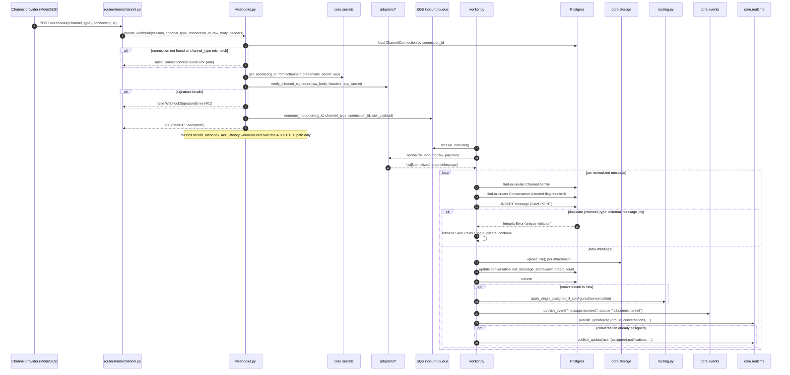

# Message Flow (Inbound & Outbound)

> Part of the [Omni-Channel service docs](README.md). Source: [`webhooks.py`](../../../app/services/omnichannel/webhooks.py), [`queues.py`](../../../app/services/omnichannel/queues.py), [`worker.py`](../../../app/services/omnichannel/worker.py), [`handlers.py`](../../../app/services/omnichannel/handlers.py).
> **Authority:** _reference_ — describes current code; if the two disagree, the code wins.

This is the highest-stakes hot path in the service: webhook providers retry
aggressively (Meta's window is ~10s), so at-least-once delivery is the norm
and idempotency is load-bearing, not incidental.

## Inbound: webhook → SQS → worker → visible in inbox


```mermaid
sequenceDiagram
    autonumber
    participant Meta as Channel provider (Meta/SES)
    participant Router as routers/omnichannel.py
    participant WH as webhooks.py
    participant Secrets as core.secrets
    participant Adapter as adapters/*
    participant SQSIn as SQS inbound queue
    participant Worker as worker.py
    participant PG as Postgres
    participant S3 as core.storage
    participant Routing as routing.py
    participant EB as core.events
    participant RT as core.realtime

    Meta->>Router: POST /webhooks/{channel_type}/{connection_id}
    Router->>WH: handle_webhook(session, channel_type, connection_id, raw_body, headers)
    WH->>PG: load ChannelConnection by connection_id
    alt connection not found or channel_type mismatch
        WH-->>Router: raise ConnectionNotFoundError (404)
    end
    WH->>Secrets: get_secret(org_id, "omnichannel", credentials_secret_key)
    WH->>Adapter: verify_inbound_signature(raw_body, headers, app_secret)
    alt signature invalid
        WH-->>Router: raise WebhookSignatureError (401)
    end
    WH->>SQSIn: enqueue_inbound(org_id, channel_type, connection_id, raw_payload)
    WH-->>Router: 200 {"status": "accepted"}
    Note over WH: metrics.record_webhook_ack_latency --\nmeasured over the ACCEPTED path only

    Worker->>SQSIn: receive_inbound()
    Worker->>Adapter: normalize_inbound(raw_payload)
    Adapter-->>Worker: list[NormalizedInboundMessage]
    loop per normalized message
        Worker->>PG: find-or-create ChannelIdentity
        Worker->>PG: find-or-create Conversation (created flag returned)
        Worker->>PG: INSERT Message (SAVEPOINT)
        alt duplicate (channel_type, external_message_id)
            PG-->>Worker: IntegrityError (unique violation)
            Worker->>Worker: rollback SAVEPOINT, log duplicate, continue
        else new message
            Worker->>S3: upload_file() per attachment
            Worker->>PG: update conversation.last_message_at/preview/unread_count
            Worker->>PG: commit
            opt conversation is new
                Worker->>Routing: apply_single_assignee_if_configured(conversation)
            end
            Worker->>EB: publish_event("message.received", source="a2z.omnichannel")
            Worker->>RT: publish_update(org:{org_id}:conversations, ...)
            opt conversation already assigned
                Worker->>RT: publish_update(user:{assignee}:notifications, ...)
            end
        end
    end
```

### Idempotency mechanics (the load-bearing detail)

The `(channel_type, external_message_id)` unique constraint on `messages`
is the actual idempotency guarantee. The worker wraps the insert in a
**SAVEPOINT** (`session.begin_nested()`), not the whole transaction — a
duplicate delivery must not roll back the `ChannelIdentity`/`Conversation`
rows this same loop iteration may have just created for a *different*
normalized message in the same webhook batch. On a unique-violation
`IntegrityError`, the worker rolls back to the savepoint and treats it as a
no-op, not an error — Meta retrying a webhook is expected, not exceptional.

One subtlety documented in the code: the failed flush leaves the SQLAlchemy
**Session** itself (not just the DB-level savepoint) marked unusable until
an explicit `session.rollback()` — `begin_nested()`'s automatic
rollback-on-exception only covers the SQL savepoint, not the ORM's own
unit-of-work state. The worker calls `session.rollback()` explicitly for
this reason.

## Outbound: agent reply → SQS → worker → sent

```mermaid
sequenceDiagram
    autonumber
    participant Agent
    participant Router as routers/omnichannel.py
    participant Handlers as handlers.py
    participant Membership as core.membership
    participant RateLimit as core.rate_limit
    participant PG as Postgres
    participant SQSOut as SQS outbound queue
    participant Worker as worker.py
    participant Secrets as core.secrets
    participant Adapter as adapters/*
    participant EB as core.events
    participant RT as core.realtime

    Agent->>Router: POST .../conversations/{id}/messages {body_text}
    Router->>Handlers: send_reply(session, org_id, conversation_id, user_id, body_text)
    Handlers->>Membership: get_membership(user_id, org_id)
    alt not a member
        Handlers-->>Router: raise NotFoundError (404)
    else role == GUEST
        Handlers-->>Router: raise ForbiddenError (403)
    end
    Handlers->>PG: load Conversation + ChannelIdentity (must belong to org_id)
    Handlers->>RateLimit: check_and_increment(org_id, "omnichannel.{channel}.send") if a limit is registered
    Handlers->>PG: INSERT Message(status="queued", external_message_id="pending:{uuid}")
    Handlers->>SQSOut: enqueue_outbound(org_id, message_id)
    Handlers-->>Router: Message (id, status="queued")
    Router-->>Agent: 200 {message_id, status: "queued"}

    Worker->>SQSOut: receive_outbound()
    Worker->>PG: load Message, Conversation, ChannelIdentity, ChannelConnection (oldest-active connection for the channel)
    alt any missing
        Worker->>SQSOut: delete (unrecoverable -- nothing to retry)
    else
        opt adapter.supported_features.requires_credentials
            Worker->>Secrets: get_secret(org_id, "omnichannel", credentials_secret_key)
        end
        Worker->>Adapter: send_outbound(to, content, credentials)
        alt send succeeds
            Worker->>PG: message.external_message_id = result.id; status = "sent"; commit
            Worker->>EB: publish_event("message.sent")
            Worker->>RT: publish_update(org:{org_id}:conversations, ...)
            Worker->>SQSOut: delete (resolved)
        else ChannelAdapterError
            alt receive_count >= SQS_MAX_RECEIVE_COUNT
                Worker->>PG: message.status = "failed"; commit
            end
            Note over Worker,SQSOut: message is NOT deleted --\nleft for SQS's own visibility-timeout\nretry, eventually redriven to the DLQ
        end
    end
```

### Why a failed send is left in the queue, not deleted

A real bug was found and fixed while wiring the DLQ: an earlier version of
the worker deleted an outbound message once `receive_count` hit the
threshold, which retired it from SQS **before** the redrive policy could
move it to the DLQ — so the DLQ stayed permanently empty and the "DLQ depth
> 0" alarm could never fire. The fix: the worker marks the message `failed`
in Postgres (so the UI reflects it) but leaves the SQS message alone, so
SQS's own redrive policy moves it to the DLQ once `receive_count` exceeds
`SQS_MAX_RECEIVE_COUNT`. That threshold is defined **once**
(`app.config.SQS_MAX_RECEIVE_COUNT = 5`) and read by both the queue's
`RedrivePolicy` (`aws_resources.py::create_queues`,
`scripts/create_local_resources.py`) and the worker's own give-up check —
two independent constants would drift and desync those facts.

### Connection selection is deterministic

`worker.py::_find_connection` resolves the org's connection for a channel
with `status == "active"` ordered by `created_at` (oldest-active-wins) --
previously an unordered `.first()`, which could nondeterministically pick a
*disabled* connection and send through it. There is still no per-conversation
connection pinning (an org with two active connections on the same channel
gets the older one for every send); that's a deliberate deferral, not this
fix's scope.

### Every channel's send failures follow the same retry path

Every adapter's `send_outbound` raises `ChannelAdapterError` on failure --
including email, which wraps whatever `core.email.send_email` raises
(`SuppressionListError`, `RateLimitError`, `InvalidAddressError`, all
`core.exceptions.CoreError` subclasses) instead of letting it propagate
unrecognized. Before this, an email send failure escaped
`_process_outbound_message`'s `except ChannelAdapterError` entirely and
never reached the mark-failed path.

## Delivery status updates

Every adapter implements `interpret_delivery_webhook`; the worker calls it
on **every** inbound webhook payload, unconditionally, right after the
`normalize_inbound` loop:

```python
delivery_updates = await adapter.interpret_delivery_webhook(raw_payload)
for update in delivery_updates:
    await _apply_delivery_status(session, org_id, channel_type, update)
```

**Why unconditional, not "try normalize, fall back to delivery status":** a
single Meta webhook call can carry customer messages *and* delivery
statuses in the same body (WhatsApp's `value.messages[]` alongside
`value.statuses[]`), so it's not an either/or choice. Both parsers are pure,
side-effect-free dict walks over the same payload -- `normalize_inbound`
already ignores keys it doesn't recognize (WhatsApp skips `statuses[]`,
Messenger/Instagram skip non-`message` events), and `interpret_delivery_webhook`
returns `[]` for a payload that isn't its shape (email's implementation was
fixed to do this instead of raising `KeyError`) -- so calling both against
every payload is always safe, and keeps the worker from needing any
channel-specific payload-shape inspection.

`_apply_delivery_status` looks up the target `Message` by
`(org_id, channel_type, external_message_id)` -- org-scoped, so a status
update can never touch another org's message even if two orgs' connections
happen to reuse the same provider message id. An unresolvable id is logged
and skipped (normal for a retried webhook or a message that predates this
feature, not an error). Status advances **monotonically** along
`queued < sent < delivered < read` and never regresses -- Meta's status
webhooks aren't guaranteed to arrive in order -- except `failed`, which
always applies regardless of the current status. Applying an update
publishes a `realtime.publish_update(org:{org_id}:conversations, {"type":
"message.status", ...})` so an agent's screen reflects delivery/read ticks;
there is deliberately no new EventBridge event for this (`message.delivered`
would be a contract with zero current consumers -- straightforward to add
later if one shows up).

Messenger/Instagram's `read` events remain intentionally unemitted (they're
watermark-only, with no per-message id to attach a status to) --
`supported_features.read_receipts=False` reflects this accurately for both.

## Cross-service events

`message.received`/`message.sent`/`conversation.assigned` are published on
`a2z-bus` with `source="a2z.omnichannel"` — see the full catalog in
[`docs/events.md`](../../events.md) and the mechanism in
[event-driven architecture](../../architecture/event-driven-architecture.md).
An EventBridge rule (`source=a2z.invoicing`, `detail-type=invoice.paid`)
targeting this service's events SQS queue is designed for the eventual
commission subscriber — see [routing & realtime](routing-and-realtime.md#commission-attribution-deferred).

## Rate limits on the outbound path

`handlers.send_reply` looks up `RATE_LIMITS.get(f"omnichannel.{channel_type}.send")`
directly from `app.config` (not via `core.rate_limit.limits_for`, which
raises `KeyError` on an unregistered action) — deliberately, since not
every channel has its own entry: email's outbound limit is already enforced
inside `core.email.send_email` itself, so there's no
`"omnichannel.email.send"` key to look up, and the `None` result is treated
as "no additional limit for this channel," not an error.

## Observability

`metrics.py` (`A2Z/OmniChannel` CloudWatch namespace) instruments this flow
at each stage: `WebhookAckLatencyMs` (accepted path only — a burst of
401s must not mask a real ack-latency breach), `MessageProcessingLatencyMs`
(receipt → realtime publish, i.e. actually visible on an agent's screen),
`SendSuccessRate`/`SendFailureRate`. Every metric emission is fire-and-forget
via a background `asyncio.Task` and swallows its own errors — a CloudWatch
outage must never fail a customer's message. See
[deployment architecture](../../architecture/deployment.md) for the
alarms this feeds (not yet wired — needs a real AWS account).

## Known limitations

- Outbound media (agent-sent attachments) is modeled in
  `OutboundContent.attachments`, but **every** channel's adapter sends
  text-only today (see [adapters.md](adapters.md)) — not just WhatsApp.
  There is also no attachment-upload API for agent replies (`SendReplyRequest`
  is `body_text`/`subject` only).
- Inbound media on WhatsApp/Messenger/Instagram is recorded with a
  placeholder body, not downloaded — a deliberate, documented v1 gap (see
  [adapters.md](adapters.md)), unchanged by this round of hardening.
- No batching of outbound rate-limit checks — one `check_and_increment`
  call per message.
