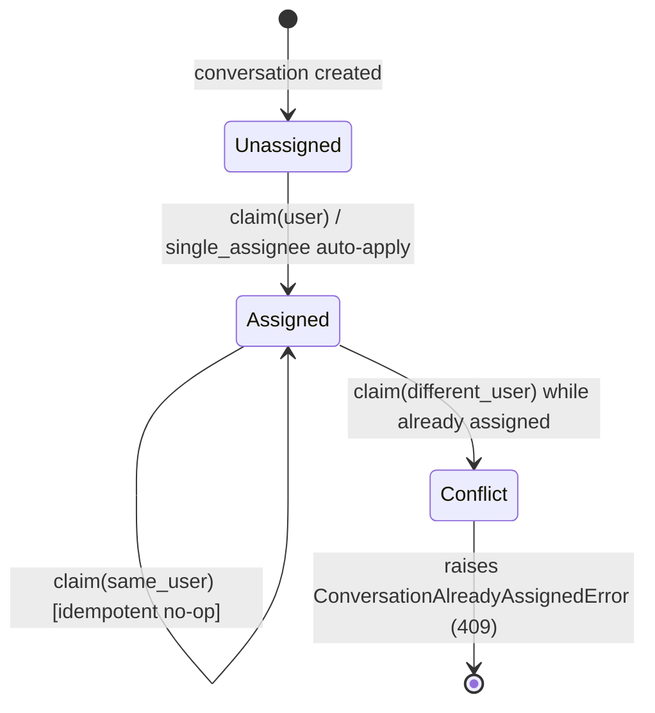
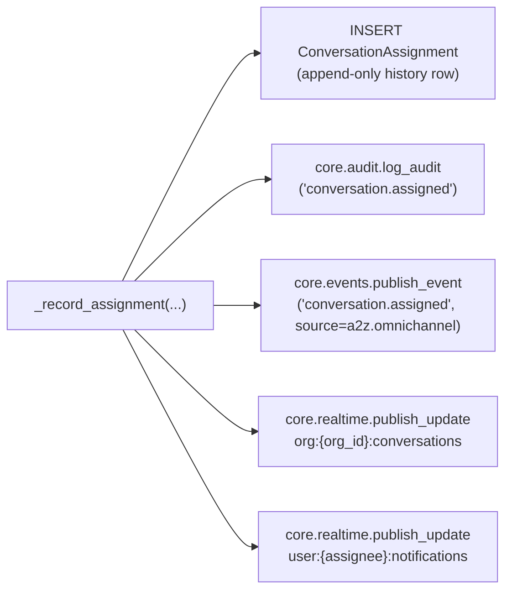
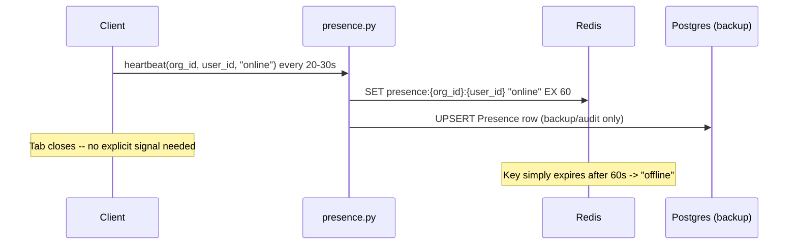
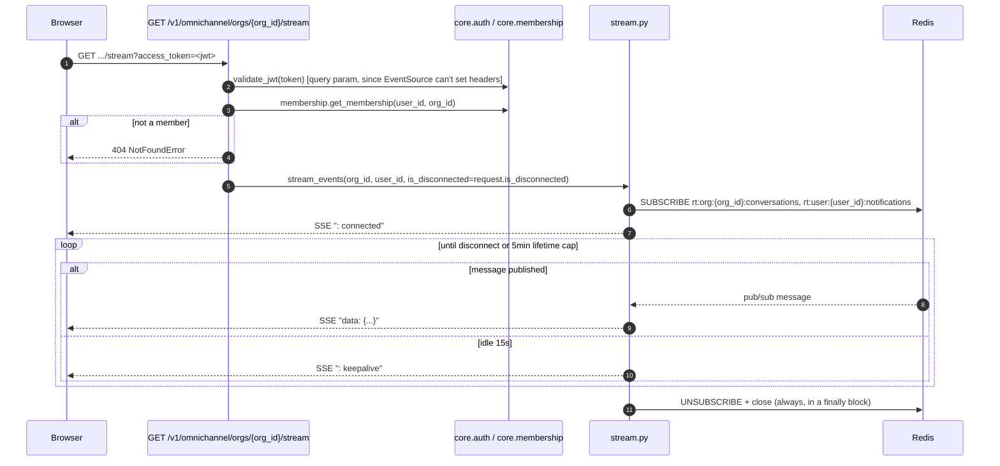

# Routing, Assignment, Presence & Realtime Inbox

> Part of the [Omni-Channel service docs](README.md). Source: [`routing.py`](../../../app/services/omnichannel/routing.py), [`presence.py`](../../../app/services/omnichannel/presence.py), [`stream.py`](../../../app/services/omnichannel/stream.py).

## v1 scope

Manual claim/reassign plus one auto-strategy (single-assignee). Round-robin
and sticky routing are designed but **deferred** — see
[known limitations](known-issues.md) for the gap between "deferred" as
stated in the design doc and what's actually implemented (`presence.py` is
fully built, even though presence/auto-routing are described together as
deferred).

## Assignment state machine

Every transition into "Assigned" writes through one shared internal helper
(`_record_assignment`), which — regardless of whether the trigger was
`claim`, `reassign`, or the single-assignee auto-apply — always does all
four of:

This uniformity is what makes commission attribution replayable later
(§5.5 in the design doc) — the assignment history doesn't care which path
produced a row.

## Public API (`routing.py`)

| Function | Who can call | Behavior |
|---|---|---|
| `claim(session, org_id, conversation_id, user_id)` | Owner/Admin/Agent (not Viewer/GUEST) | Idempotent if caller already owns it; raises `ConversationAlreadyAssignedError` (409) if assigned to someone else |
| `reassign(session, org_id, conversation_id, actor_user_id, assignee_user_id)` | Owner/Admin only | Validates the new assignee is actually an org member first |
| `apply_single_assignee_if_configured(session, conversation)` | Called only by the worker, only for a **brand-new** conversation | No-ops unless the org has opted into `single_assignee` routing |
| `set_routing_config(org_id, actor_user_id, strategy, single_assignee_user_id=None)` | Owner/Admin only | `strategy` must be `"manual"` or `"single_assignee"` — anything else raises `RoutingError` (400 — a request-validation failure, not a 500; see `exceptions.py`) |

### Routing configuration

Stored in `core.settings`' free-form `metadata` field, namespaced
`metadata["omnichannel"] = {"routing_strategy": ..., "single_assignee_user_id": ...}`
— Core's settings schema is fixed, and `metadata` is exactly the escape
hatch it provides for service-specific config (Design §2.6), so this
required **no** Core change.

## Presence (`presence.py`)

`get_status`/`list_online_agents` read **only Redis** — the Postgres
`Presence` row is a backup/audit write an operator can inspect after a
Redis flush ("who was online last"), never read on a hot path.

**This module is fully implemented**, despite the service's own design doc
(`app/services/omnichannel/CLAUDE.md` §5.3, §15) listing presence as
"deferred with auto-routing" — see
[known limitations](known-issues.md) for what this means in practice
(nothing currently calls `heartbeat`/`list_online_agents` from a router or
the worker, so the code is exercised only by its own unit tests today).

## Realtime inbox (SSE)

Key design choices, each deliberate:

1. **The relay is service-owned, not Core.** `core.realtime.publish_update`
   stops at the Redis `PUBLISH`; `stream.py` is Omni-Channel's own
   subscribe-and-relay-to-SSE code. At the AppSync distribution phase this
   entire module disappears — browsers subscribe to AppSync directly — so
   it's deliberately MVP-only glue, not exported as a Core capability.
2. **The `rt:{channel}` prefix is duplicated, not imported**, from
   `core.realtime` — see
   [event-driven architecture](../../architecture/event-driven-architecture.md#redis-pubsub--realtime-ui-fan-out)
   for why, and the round-trip test that guards against drift.
3. **Auth is inline**, not the shared `CurrentUser` FastAPI dependency —
   because a browser `EventSource` cannot set an `Authorization` header.
   The token arrives as the `access_token` query parameter (a header is
   still accepted as a fallback for non-browser/proxied clients).
   Membership is re-checked on **every** (re)connect, so a revoked
   member's stream ends the next time their browser reconnects.
4. **Idle-tab backpressure**: a 15s heartbeat keeps the connection alive
   through proxies and gives the loop a regular tick to notice a
   disconnected client or an elapsed lifetime; a hard 5-minute
   `max_lifetime_seconds` cap bounds server resource use and caps how long
   a revoked member's stream can outlive the revocation even without a
   client-side reconnect.

## Commission attribution (deferred)

**Not built** — `invoice.paid` has no producer yet (Invoicing doesn't
exist). The rule is locked in the design doc so it isn't "simplified" once
implemented: **snapshot the assigned agent at invoice-creation time, not
payment time** — the agent who did the selling gets credit even if the
conversation is later reassigned or payment arrives weeks later. The
`commission_rules`/`commission_attributions` tables already ship in the
schema (see [data model](data-model.md)) precisely so this becomes
subscriber-only work once Phase 2 lands.

## Security considerations

- `claim`/`reassign`/`set_routing_config` all check membership and role
  before touching a conversation — see
  [auth & authorization](../../architecture/auth-and-authorization.md#role-mapping-gap-documented-not-silently-resolved)
  for the Owner/Admin/Agent/Viewer ↔ OWNER/ADMIN/MEMBER/GUEST mapping this
  module relies on.
- The SSE endpoint re-checks membership on every reconnect specifically so
  a revoked member can't keep an old stream open indefinitely.

## Known limitations

See [`known-issues.md`](known-issues.md) — presence and single-assignee
routing are real and tested, but round-robin/sticky routing are not built,
and nothing in the current codebase calls `presence.heartbeat` from a
router (it's reachable only by direct call or test today).
