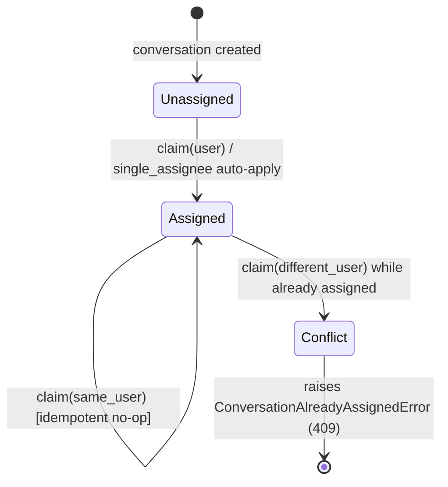
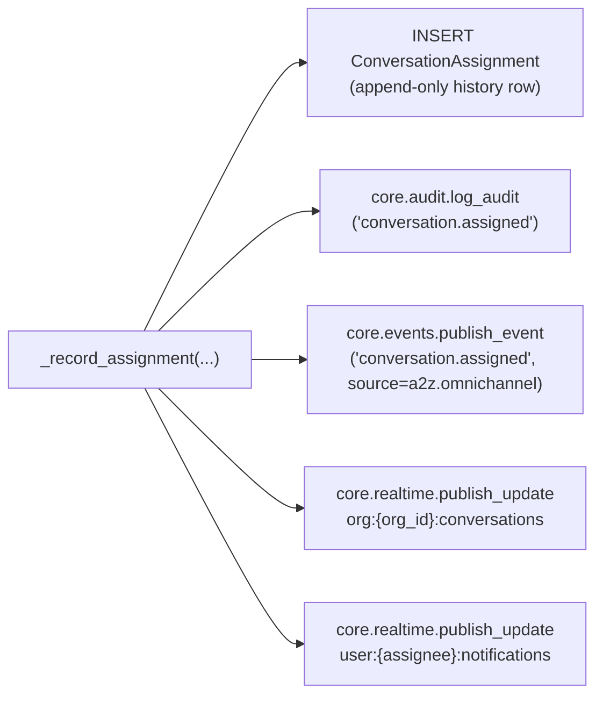
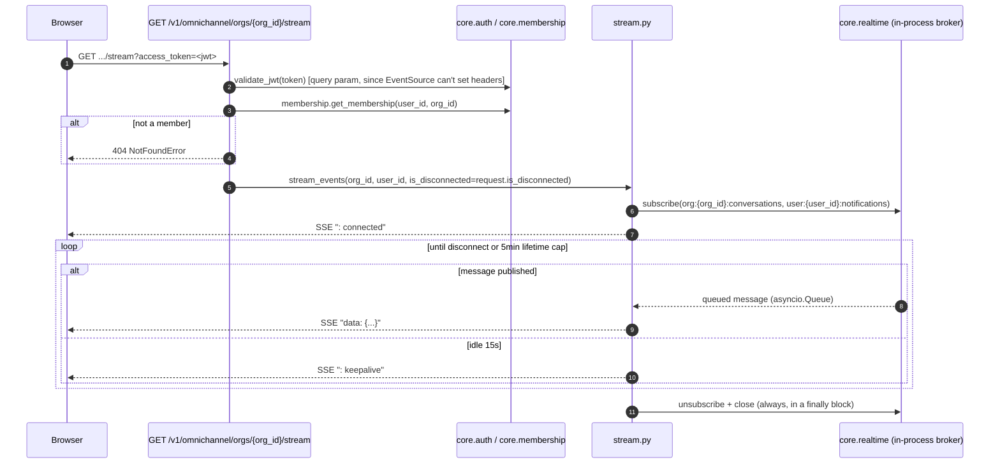

# Routing, Assignment & Realtime Inbox

> Part of the [Omni-Channel service docs](README.md). Source: [`routing.py`](../../../app/services/omnichannel/routing.py), [`stream.py`](../../../app/services/omnichannel/stream.py).
> **Authority:** _reference_ — describes current code; if the two disagree, the code wins.

## v1 scope

Manual claim/reassign plus one auto-strategy (single-assignee). Round-robin
and sticky routing — and presence, which they depend on — are designed but
**deferred**; see [Presence](#presence-deferred-deleted) below for what that
means in practice today.

## Assignment state machine

```mermaid
stateDiagram-v2
    [*] --> Unassigned: conversation created
    Unassigned --> Assigned: claim(user) / single_assignee auto-apply
    Assigned --> Assigned: reassign(new_user) [Owner/Admin only]
    Assigned --> Assigned: claim(same_user) [idempotent no-op]
    Assigned --> Conflict: claim(different_user) while already assigned
    Conflict --> [*]: raises ConversationAlreadyAssignedError (409)
```

Every transition into "Assigned" writes through one shared internal helper
(`_record_assignment`), which — regardless of whether the trigger was
`claim`, `reassign`, or the single-assignee auto-apply — always does all
four of:

```mermaid
flowchart LR
    Assign["_record_assignment(...)"] --> Row["INSERT ConversationAssignment\n(append-only history row)"]
    Assign --> Audit["core.audit.log_audit\n('conversation.assigned')"]
    Assign --> Event["core.events.publish_event\n('conversation.assigned', source=a2z.omnichannel)"]
    Assign --> RT1["core.realtime.publish_update\norg:{org_id}:conversations"]
    Assign --> RT2["core.realtime.publish_update\nuser:{assignee}:notifications"]
```

This uniformity is what makes commission attribution replayable later
(§5.5 in the design doc) — the assignment history doesn't care which path
produced a row.

## Public API (`routing.py`)

| Function | Who can call | Behavior |
|---|---|---|
| `claim(session, org_id, conversation_id, user_id)` | Owner/Admin/Agent (not Viewer/GUEST) | Idempotent if caller already owns it; raises `ConversationAlreadyAssignedError` (409) if assigned to someone else |
| `reassign(session, org_id, conversation_id, actor_user_id, assignee_user_id)` | Owner/Admin only | Validates the new assignee is actually an org member first |
| `apply_single_assignee_if_configured(session, conversation)` | Called only by the worker, only for a **brand-new** conversation | No-ops unless the org has opted into `single_assignee` routing |
| `set_routing_config(org_id, actor_user_id, strategy, single_assignee_user_id=None)` | Owner/Admin only | `strategy` must be `"manual"` or `"single_assignee"` — anything else raises `RoutingError` (400 — a request-validation failure, not a 500; see `exceptions.py`) |

### Routing configuration

Stored in `core.settings`' free-form `metadata` field, namespaced
`metadata["omnichannel"] = {"routing_strategy": ..., "single_assignee_user_id": ...}`
— Core's settings schema is fixed, and `metadata` is exactly the escape
hatch it provides for service-specific config (Design §2.6), so this
required **no** Core change.

## Presence (deferred, deleted)

`presence.py` — a Redis-backed heartbeat module — existed for a while with
**zero production callers** (nothing in a router or the worker ever called
`heartbeat`/`list_online_agents`; only its own unit tests exercised it).
When the platform collapsed to the single-box MVP and Redis was removed
entirely (see [single-box-mvp.md](../../architecture/single-box-mvp.md)),
that module was deleted outright rather than ported — auto-routing/presence
is genuinely deferred (§15 of the service's design doc), so there was no
live behavior to preserve.

The Postgres `presence` table and `Presence` model **stay** — they're in
the Alembic baseline and cost nothing to leave — for when auto-routing is
built. A future implementation should read/write that table directly (it
becomes the live state, not a "backup" of a Redis key) with a freshness
window on `updated_at` standing in for the old TTL, rather than
reintroducing Redis for one module.

## Realtime inbox (SSE)

```mermaid
sequenceDiagram
    autonumber
    participant Browser
    participant Router as GET /v1/omnichannel/orgs/{org_id}/stream
    participant Auth as core.auth / core.membership
    participant Stream as stream.py
    participant RT as core.realtime (in-process broker)

    Browser->>Router: GET .../stream?access_token=<jwt>
    Router->>Auth: validate_jwt(token) [query param, since EventSource can't set headers]
    Router->>Auth: membership.get_membership(user_id, org_id)
    alt not a member
        Router-->>Browser: 404 NotFoundError
    end
    Router->>Stream: stream_events(org_id, user_id, is_disconnected=request.is_disconnected)
    Stream->>RT: subscribe(org:{org_id}:conversations, user:{user_id}:notifications)
    Stream-->>Browser: SSE ": connected"
    loop until disconnect or 5min lifetime cap
        alt message published
            RT-->>Stream: queued message (asyncio.Queue)
            Stream-->>Browser: SSE "data: {...}"
        else idle 15s
            Stream-->>Browser: SSE ": keepalive"
        end
    end
    Stream->>RT: unsubscribe + close (always, in a finally block)
```

Key design choices, each deliberate:

1. **The relay is service-owned, not Core.** `core.realtime.publish_update`
   stops at the in-process broker; `stream.py` is Omni-Channel's own
   subscribe-and-relay-to-SSE code. At the AppSync distribution phase this
   entire module disappears — browsers subscribe to AppSync directly — so
   it's deliberately MVP-only glue, not exported as a Core capability.
2. **The transport is entirely Core's concern.** `stream.py` only ever
   deals in logical channel names (`org:{org_id}:conversations`); the `rt:`
   prefix and everything below `core.realtime.subscribe` is a private Core
   implementation detail — see
   [single-box-mvp.md](../../architecture/single-box-mvp.md) for what that
   broker actually is (an `asyncio.Queue` per subscriber, no Redis, no
   cross-process transport — which is exactly why this whole platform runs
   as a single process; see that doc's "Single-process is load-bearing"
   section before ever changing that).
3. **Auth is inline**, not the shared `CurrentUser` FastAPI dependency —
   because a browser `EventSource` cannot set an `Authorization` header.
   The token arrives as the `access_token` query parameter (a header is
   still accepted as a fallback for non-browser/proxied clients).
   Membership is re-checked on **every** (re)connect, so a revoked
   member's stream ends the next time their browser reconnects.
4. **Idle-tab backpressure**: a 15s heartbeat keeps the connection alive
   through proxies and gives the loop a regular tick to notice a
   disconnected client or an elapsed lifetime; a hard 5-minute
   `max_lifetime_seconds` cap bounds server resource use and caps how long
   a revoked member's stream can outlive the revocation even without a
   client-side reconnect.

## Commission attribution (deferred)

**Not built** — `invoice.paid` has no producer yet (Invoicing doesn't
exist). The rule is locked in the design doc so it isn't "simplified" once
implemented: **snapshot the assigned agent at invoice-creation time, not
payment time** — the agent who did the selling gets credit even if the
conversation is later reassigned or payment arrives weeks later. The
`commission_rules`/`commission_attributions` tables already ship in the
schema (see [data model](data-model.md)) precisely so this becomes
subscriber-only work once Phase 2 lands.

## Security considerations

- `claim`/`reassign`/`set_routing_config` all check membership and role
  before touching a conversation — see
  [auth & authorization](../../architecture/auth-and-authorization.md#role-mapping-gap-documented-not-silently-resolved)
  for the Owner/Admin/Agent/Viewer ↔ OWNER/ADMIN/MEMBER/GUEST mapping this
  module relies on.
- The SSE endpoint re-checks membership on every reconnect specifically so
  a revoked member can't keep an old stream open indefinitely.

## Known limitations

See [`known-issues.md`](known-issues.md) — single-assignee routing is real
and tested, but round-robin/sticky routing (and presence, which they'd
depend on) are not built; see [Presence](#presence-deferred-deleted) above.
