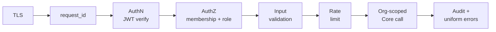

# Zero Trust for A2Z APIs

> **Authority:** _spec_ — normative; code is expected to conform to this.

**Status:** Adopted policy. Applies to the entire HTTP surface — `/health`,
`/v1/core/*`, `/v1/omnichannel/*` (including webhooks and the SSE stream) —
and to every router any future service (Invoicing, Appointments, …) mounts.
**Audience:** anyone adding, changing, or reviewing an API endpoint.
**Related:** [API reference](api-reference.md) ·
[request lifecycle](architecture/request-lifecycle.md) ·
[auth & authorization](architecture/auth-and-authorization.md) ·
Design doc §7 (Security Model).

---

## 1. The principle

**Every API call is hostile until it proves otherwise.** No request earns
trust from where it came from (IP, VPC, ALB), from a previous request on the
same connection, from being "internal", or from looking well-formed. Each
call must independently pass authentication, authorization, input
validation, and rate limiting before any business logic runs — and the
default for anything that skips a step is **deny**, not allow.

Concretely, an A2Z endpoint that lacks an auth dependency is a bug, not a
convenience. The only deliberate exceptions are enumerated in §4, each with
its own verification mechanism.

## 2. The per-request verification pipeline

Every API call passes through these gates, in order. Each gate is a
**policy enforcement point** that already exists in the codebase — new
endpoints compose them; they never reimplement them.

| # | Gate | Enforced by | Failure |
|---|---|---|---|
| 1 | **Transport** — HTTPS only; plaintext never reaches a router | ALB / infra | connection refused |
| 2 | **Correlation** — every request gets an `X-Request-Id`, threaded through all logs | `request_id_middleware` (`app/main.py`) | n/a (always applied) |
| 3 | **Authentication** — bearer JWT signature verified against Cognito JWKS on *this* request; claims come only from the verified token | `CurrentUser` dependency → `core.auth.get_current_user_from_request` | 401 |
| 4 | **Authorization** — caller's membership in the *path's* `org_id` is resolved fresh; role gates on mutations | `require_member` / `require_admin` (`app/dependencies.py`) | 404 / 403 |
| 5 | **Input validation** — Pydantic v2 models define the contract; anything that doesn't parse is rejected before logic runs | typed request models per route | 422 |
| 6 | **Rate limiting** — abusable actions are limited per org/action via the config-driven registry | `core.rate_limit.check_and_increment` | 429 + `Retry-After` |
| 7 | **Scoped execution** — the handler calls typed Core/service functions that require `org_id`; there is no raw-table escape hatch | `core/` API design | — |
| 8 | **Evidence** — mutations write to the append-only audit log; errors return the uniform `{detail, error}` shape with no stack traces or internals leaked | `core.audit.log_audit`, single `CoreError` handler | — |

Two properties make this Zero Trust rather than perimeter security:

- **No ambient authority.** Gate 3 runs on every request — there are no
  sessions, no "already authenticated" connections, no trusted source IPs.
  A token is the only thing that establishes identity, and it is
  cryptographically verified each time.
- **Authorization binds to the verified identity and the requested
  resource.** Gate 4 checks *this* user against *this* `org_id` from the
  path. An `org_id` appearing in a request body is never used for an
  authorization decision unless it's the same one the membership check ran
  against — a valid token for org A grants exactly nothing in org B, and
  non-membership returns 404 (the org's existence is not confirmed to
  outsiders).

## 3. Token policy

- **RS256 Cognito JWTs** in every real environment; signature verified
  against the JWKS (cached 24h — key material, not auth decisions, is what's
  cached). HS256 test tokens (`core.auth.create_test_token`) exist only for
  local/test environments and must never validate in production
  configuration.
- Tokens are **short-lived access tokens**. Services never handle refresh
  tokens, never mint tokens, and never persist tokens anywhere (logs
  included — logging a JWT is a policy violation, see `CLAUDE.md` §4).
- Claims used downstream (`sub`, `email`) come exclusively from the verified
  token. No identity from headers, cookies, query params, or body fields.
- **No API keys.** There is no long-lived static credential that grants API
  access. When machine-to-machine callers arrive (partner integrations,
  service accounts), they get short-lived tokens via Cognito
  client-credentials/OAuth scopes — not a `X-Api-Key` header (§7).

## 4. Endpoint classes and how each proves itself

Different API classes have different callers, but none is exempt — each has
a verification mechanism suited to its caller.

### 4.1 Interactive user APIs (`/v1/core/*`, most of `/v1/omnichannel/*`)

The standard pipeline (§2), end to end. Per-route authorization is explicit
in the [API reference](api-reference.md) tables — every route documents *who*
may call it (any authenticated user / member / OWNER-ADMIN). A route whose
auth column can't be filled in isn't ready to merge.

### 4.2 Inbound webhooks (`/v1/omnichannel/webhooks/{channel_type}/{connection_id}`)

Webhooks can't carry a user JWT, so they prove themselves differently — and
the bar is the same height:

- **Per-connection cryptographic verification.** The raw body's signature is
  verified against the connection's signing secret, fetched org-scoped from
  Secrets Manager (`core/secrets.py`) via the adapter registry
  (`webhooks.py`). An unverifiable payload is rejected before parsing —
  never "best-effort processed".
- **The route grants nothing by itself.** A webhook only does anything if a
  *live, org-owned connection* exists for that `connection_id`; deactivating
  the connection kills its webhook. The URL being guessable is irrelevant —
  possession of the URL is not a credential.
- **Idempotent handlers.** Providers redeliver; a replayed webhook must not
  produce duplicate state changes.
- Subscription handshakes (`GET`) verify the provider's challenge against
  the same org-scoped secret bundle.

**Rule for future services:** any new machine ingress (payment provider
callbacks for Invoicing, calendar webhooks for Appointments) follows this
exact pattern — signature verification against an org-scoped secret, before
parsing, idempotent, with the rejected path tested.

### 4.3 Streaming (`/v1/omnichannel/orgs/{org_id}/stream`)

Long-lived connections don't get long-lived trust: the SSE stream
authenticates and authorizes at connect time through the same gates 3–4, and
the subscription itself is org-scoped — the fan-out layer can only deliver
events for the org the membership check admitted. A revoked user's stream
dies with their next connect; event payloads carry `org_id` so nothing
cross-tenant can be pushed even by a buggy publisher.

### 4.4 Health (`/health`)

The one deliberately unauthenticated endpoint, and it's built to be safe
that way: read-only, side-effect-free, and **zero-information** — it returns
liveness (200/503), not versions, config, table names, or anything an
attacker can use for reconnaissance. Keep it that way; anything richer
(dependency diagnostics, build info) goes behind auth.

## 5. Never-trust rules (API anti-patterns)

These are the shortcuts that quietly reintroduce perimeter thinking. Each is
a review-blocking finding:

1. **No unauthenticated endpoints** beyond `/health`. "It's only for
   testing" and "it's not linked anywhere" are not auth mechanisms.
2. **No trust by network origin.** No IP allowlists, no
   `X-Forwarded-For` checks, no "requests from the VPC are internal" —
   the ALB and the process boundary are availability infrastructure, not
   identity.
3. **No magic headers.** No `X-Internal: true`, no shared static header
   secrets between components. If a caller needs machine identity, it gets
   a verifiable token or signature (§3, §4.2).
4. **No authorization from client-supplied org context.** The `org_id` that
   gates the request is the one `require_member` verified; a second copy in
   the body must either match it or not exist.
5. **No auth-decision caching.** Cache key material (JWKS) and reference
   data (settings), never the outcome of "is this user allowed" across
   requests.
6. **No fail-open.** If Secrets Manager, Redis, or DynamoDB is unreachable
   during a verification step, the request fails closed (5xx), it does not
   skip the check. A rate limiter outage is the one documented judgment
   call — if limiting is ever made best-effort, that decision is written
   down here, not made silently in a handler.
7. **No error-shape leaks.** All failures return the uniform
   `{detail, error}` body; 404-for-non-membership hides tenant topology;
   stack traces and internal identifiers never leave the process.

## 6. How this scales to every future service

The model scales because **an endpoint's security is composition, not
implementation**. A new service's router imports the same dependencies
(`CurrentUser`, `require_member`, `require_admin`), declares Pydantic
models, registers its rate-limited actions in the config registry, and
calls org-scoped Core functions — at which point gates 1–8 hold with zero
service-specific security code. The router stays thin (`CLAUDE.md` §2), so
there's nowhere for a bypass to hide.

**Per-endpoint checklist** — every new or changed route, in the PR
description:

- [ ] Auth dependency present (`CurrentUser` at minimum), or the endpoint is
      listed in §4 as a documented exception with its own verification.
- [ ] Org-scoped routes resolve membership via `require_member` on the
      path's `org_id`; mutations gate on role.
- [ ] Request/response bodies are typed Pydantic models; no `dict` request
      bodies.
- [ ] Abusable/expensive actions call `rate_limit.check_and_increment` with
      a registry-defined limit.
- [ ] Mutations audit-log; nothing sensitive (tokens, secrets, message
      bodies) is logged.
- [ ] The route's row in the [API reference](api-reference.md) states its
      auth requirement.
- [ ] **Negative tests exist:** no token → 401; wrong-org member → 404/403;
      malformed body → 422; over the limit → 429. Cross-org denial is the
      non-negotiable one — it's the API-level face of the platform's
      org-scoping invariant and runs in CI like any other test.

**Versioning is part of the trust contract:** breaking changes mint a new
`/vN` rather than mutating `/v1` under integrated callers
([API reference — versioning](api-reference.md#versioning)). A client that
validated against a contract keeps the contract.

## 7. Maturity roadmap (trigger-driven)

Adopt each hardening step when its trigger fires — the pipeline in §2 is the
constant; these strengthen individual gates:

| Step | Trigger | What changes |
|---|---|---|
| **WAF on the ALB** | Public launch / first abuse | Managed + rate-based rules in front of gate 1; complements, never replaces, app-level auth and rate limiting |
| **OAuth scopes / fine-grained claims** | First M2M or partner API consumer | Cognito client-credentials flow; gate 3 additionally checks `scope`; still short-lived tokens, still no API keys |
| **Per-endpoint rate limits keyed by user** | First per-user abuse pattern | Registry gains `user_id`-keyed actions (the `ai.parse` limits already planned for Invoicing are the template) |
| **mTLS / SigV4 between components** | Any component leaves the process (see the [distribution plan](architecture/microservices-distribution.md)) | The moment an API call crosses a network hop between A2Z components, that hop gets authenticated service identity *before* it ships — "it used to be in-process" is not a trust argument |
| **API Gateway in front of Fargate** | Need for per-client quotas, usage plans, or request signing at the edge | Gains edge throttling/validation; every gate in §2 still runs in-app — the gateway is defense in depth, never the sole check |
| **Token binding / DPoP** | Compliance or high-value API surface demands proof-of-possession | Tokens bound to client keys; replay of a stolen bearer token stops working |

---

**The one-line summary:** every API call — user, webhook, or stream —
independently proves identity cryptographically, is authorized against the
exact org and role it targets, is schema-validated and rate-limited before
logic runs, fails closed, and leaves an audit trail; new services inherit
all of it by composing the shared dependencies, so the policy's cost per
endpoint is a checklist, not an implementation.
